# 最小クラウドとTerraform Provider

[構成案トップ](index.md)へ戻る。更新日: 2026-09-10。状態: **Proxmox・NetBox側の土台、API の Phase 1（ログイン・アクセスキー・監査ログ）、Phase 2（VM の作成・電源操作・削除）は実装済み。Provider・ポータルは未実装**。

実際に手を動かす順番と、コードにできない作業は[クラウドAPIの構築](../operations/cloud.md)にあります。

## クラウドの提供機能

| 機能 | 利用者へ提供するもの | 実装先 |
| --- | --- | --- |
| VM | イメージ、CPU、RAM、ディスク、ネットワーク、起動状態 | Proxmox API |
| サーバレス | コンテナイメージ、環境変数／Secret参照、HTTP URL、最小／最大レプリカ | Knative Serving |
| S3 | バケット、S3アクセスキー、バケットへの読み書き権限 | Garage管理API・S3 API |
| DBアプライアンス | PostgreSQLインスタンス、容量、接続先、DB資格情報、バックアップ | CloudNativePG |

自作するのはこれらを一つのAPIで扱う部分です。仮想化、スケジューラ、オブジェクト保存、PostgreSQLの監視・起動制御は既存基盤へ任せます。ユーザー、プロジェクト、組織、課金を初期APIへ追加しません。

## サーバレス: Knative Serving + Kourier

初期仕様は「HTTPリクエストを受けるOCIコンテナを配備し、未使用時はゼロまで縮退する」です。Knative Servingはリビジョン、HTTPルーティング、オートスケールを提供します。[Knative autoscaling](https://knative.dev/docs/serving/autoscaling/)

- ソースコードは開発VMまたはGitHub Actionsでイメージ化し、GHCRなどへ置く。クラウドAPIにソースのビルドまで持たせない。
- イメージのdigestを指定して再現性を確保する。private registryにはimagePullSecretなどの認証設定を用意する。
- `min_scale=0`、`max_scale=1` を初期既定とし、必要なサービスだけ増やす。
- 最大同時処理数、CPU／メモリ、タイムアウトを設定する。重い実行をゲームと競合させない。
- スケールゼロからの初回はコールドスタートがある。起動遅延を避けるサービスだけ最小1にする。
- 関数の一時ファイルは消える前提とし、永続データはS3やDBに保存する。
- 定期バッチはKubernetes Job/CronJobで始める。イベント配信が必要になった時点でKnative Eventingやキューを検討する。

KourierはKnative向けのネットワーク実装です。既存の内部HTTPS入口から、正しいHost情報を保ってKourierへ転送します。通常アプリ用Gatewayとは転送先・IPの担当を分けます。[ネットワークプラグイン](https://knative.dev/docs/install/)

Knative ServingだけではAWS Lambda API、ZIPアップロード、AWSの実行ロールは提供しません。Discord Gatewayへ常時接続するBotなどは、通常のDeploymentとして常駐させます。

## S3: Garageを第一候補にする

Garageは、バケット・キーの管理APIがあり、自作クラウドへ接続しやすい候補です。管理APIのトークンにはスコープと期限を設定できます。[Garage管理API](https://garagehq.deuxfleurs.fr/documentation/reference-manual/admin-api/)

初期配置はKubernetes外の小型VMとし、専用のデータ用仮想ディスクを渡します。メタデータ・オブジェクト・設定・鍵をバックアップ対象にします。Kubernetes復旧時に、バックアップ格納先まで同じクラスタの起動待ちになる依存を減らせます。

当初は単一ノード・replication factor 1なので、**データの冗長性はありません**。Garage公式も単一ノード手順を冗長性のない構成として説明しています。ホームラボでこの制約を受け入れる場合も、唯一の保存先や唯一のバックアップにはしません。[Garage Quick Start](https://garagehq.deuxfleurs.fr/documentation/quick-start/)

GarageはS3の全機能を実装しているわけではありません。公式互換表では署名v4、presigned URLなどに対応する一方、バケットバージョニングは未対応です。AWS IAM互換の任意ポリシーをそのまま適用できる前提にもせず、初期APIはバケット単位の許可に絞ります。[S3互換表](https://garagehq.deuxfleurs.fr/documentation/reference-manual/s3-compatibility/)

バージョニングなどが必須ならSeaweedFSも比較し、採用バージョンと実際のクライアントで確認してから選定を変更します。SeaweedFSには単一ノード向けの `weed mini` があり、S3エンドポイントを提供できます。[SeaweedFS公式](https://github.com/seaweedfs/seaweedfs)

S3 APIにはブラウザ用Forward Authを挟まず、S3署名で認証します。管理APIはクラウドAPIからだけ到達できるようにします。クラウドを作成するTerraform stateは、まず管理PCなどクラウド停止中も使える場所へ保持し、別途暗号化バックアップします。

## DBアプライアンス: CloudNativePG

初期エンジンはPostgreSQLだけに絞ります。1つのアプライアンスをCloudNativePGの `Cluster` に対応させ、最初はプライマリ1台で提供します。「アプライアンス」は利用者から見た提供単位であり、必ずしも専用VMを意味しません。

| 提供項目 | 初期案 |
| --- | --- |
| エンジン | PostgreSQL、採用メジャー版を固定 |
| サイズ | 小型のCPU／RAMプロファイルから選択 |
| ストレージ | ローカルSSDのPVC。自動フェイルオーバーを保証しない |
| 接続 | Kubernetes内用Serviceと、開発VMから届くVPN内のTCP接続先を区別 |
| 認証 | アプリ用DBロール。管理者パスワードを利用者へ配らない |
| 拡張 | pgvectorなど、検証済みの拡張だけを許可 |
| 保護 | 削除保護、バックアップ、復元方法をリソース仕様へ含める |

同じPostgreSQLインスタンス内に論理DB・ロールを作る軽量運用も可能です。これは専用インスタンスとは分離単位が異なるため、APIでは明示します。最初は専用インスタンスのライフサイクルを実装し、追加の軽量DB作成は必要になってから拡張します。

CloudNativePGは `Database` CRDで論理DBや拡張の管理ができます。ただしpgvectorの宣言だけではバイナリは導入されないため、使用するイメージ／拡張配布方法とPostgreSQL版を揃えます。[CloudNativePGのDB管理](https://cloudnative-pg.io/docs/1.30/declarative_database_management/)

DBバックアップはS3へ保存できますが、同じK11内のGarageだけでは筐体・SSD故障へのバックアップになりません。外部コピーを確保します。クラウドAPI自身の管理DBは通常の利用者向けリソース一覧から除き、自己削除できないようにします。

## 認証: Authentik SSO とアクセスキー

**この節は方針を変更しました。** 以前は「利用者アカウントを作らず、用途別のキーだけを発行する」と書いていました。それではクォータも所有権（どのVMが誰のものか）も成立せず、利用者が自分でキーを発行する経路もありません。homelab統合認証アカウントへ寄せます。

- **ブラウザは Authentik の OIDC** でポータルへログインします。identity VM の `stacks/identity/configure.py` がクライアント `cloud` を作ります（メディア系が使う検証用の `stacks/hub` とは別に新規構築）。
- **Terraform と CLI はアクセスキー**を使います。ポータルで発行し、`Authorization: Bearer sca_<キーID>.<秘密値>` で送ります。AWSのIAMアクセスキーと同じモデルです。

キーをSSOと分けるのは、依存を一方向にするためです。**Authentik が停止していても Terraform は動きます。**逆にすると、認証基盤の障害が復旧作業そのものを止めます。

- Authentikユーザー1人が1アカウントです。自分の作ったリソースだけが見え、消せます。`cloud-admins` グループだけが全体を見られます。
- 秘密値は発行時に一度だけ表示し、保存するのは検証用ハッシュ・キーID・期限・失効状態だけです。
- キーIDごとに操作履歴を残します。
- クラウドのアクセスキー、S3 access key/secret、DBパスワードは別のものです。混ぜません。

Authentik の `sub` は `sub_mode='user_uuid'` にします。既定の `hashed_user_id` はプロバイダごとに導出されるので、**Authentik側でプロバイダを作り直すと全アカウントの `sub` が変わる**からです。それでもアカウント表には `sub` と併せてメールアドレスを保存し、既知のメールに未知の `sub` が来たときに気づけるようにします。

ワイヤ互換（SigV4 + EC2 Query API）は実装しません。得たいのは「他のクラウドと同じ作り方が通じる」ことであって、バイナリ互換ではありません。本物の `aws` CLI や `hashicorp/aws` プロバイダは動きません。代わりに、語彙・状態遷移・フィールド名をAWSへ厳密に揃えます（`image_id` / `instance_type` / `client_token` / `pending→running→stopping→stopped→shutting-down→terminated`）。

## VMを作るときのProxmox側の制約

**素直に実装すると動かない箇所が4つあります。**いずれも「`/pool/cloud` だけに絞ったトークンでは、その操作に要る権限がプールの外にある」ことが原因です。

以下の対策は **2026-09-10 に実機（PVE 9.2.2 / apextox）で `cloudapi@pve` のトークンを使って検証済み**です。4つとも成立しました。検証は `tools/verify-cloud.py` が機械判定するので、PVEを上げたあとも同じ形で確かめられます。

### イメージの取得APIは使えない

`download-url`（`query-url-metadata`）は `/` に対する `Sys.Audit`/`Sys.Modify` を要求します。絞ったトークンでは 403 です。

→ 利用者のイメージは **API へ直接アップロード**し、APIが `POST /nodes/<node>/storage/<store>/upload`（`content=import`）へ中継します。管理者が用意する公式イメージは今まで通り `00-bootstrap` が取得し、APIは**共有イメージ**として一覧に混ぜます。

### 任意の user-data は snippets 経由で渡せない

同じ upload API は `content` に `iso | vztmpl | import` しか受け付けず、**`snippets` を受け付けません**。`cicustom` 方式は成立しません。

→ APIが `CIDATA` ラベルの **NoCloud seed ISO**（`meta-data` / `user-data` / `network-config`）をインスタンスごとに作り、`content=iso` で上げて CD-ROM として接続します。Proxmox内蔵の cloud-init ドライブは**使いません**。

その結果、**IPアドレスは ISO 内の `network-config` に書きます**。内蔵ドライブを使わない以上 `ipconfig0` は無効で、ここを間違えると「起動したがネットワークが無い」になります。また user-data はISOに平文で入りゲストから読めるので、秘密の置き場としては案内しません（AWSのIMDSと同じ性質です）。

ISOはディレクトリ型ストレージにしか置けず、VMディスク（LVM-thin）とは別の容量枠になります。クォータとGCも別に持ちます。

### クラスタ全体のファイアウォールグループは使えない

`/cluster/firewall/groups` は `/` の `Sys.Modify` を要求します。

→ セキュリティグループは**APIの論理オブジェクト**として持ち、適用時に `/nodes/<node>/qemu/<vmid>/firewall/rules` へVM単位のルールとして展開します。SGを編集したら、そのSGが付いた全インスタンスのルールを描き直します。ルールは位置指定なので、部分更新せず毎回全書き換えします。

VM単位のルールは**3つ揃って初めて効きます**。(1) `firewall/options` の `enable=1`、(2) **NICの設定の `firewall=1`**、(3) ルール本体。2番目を忘れると、ルールを入れたのに素通りします。

### 空き容量が読めない

`GET /nodes/<node>/status` は `/nodes/<node>` に対する `Sys.Audit` を要求します。`/pool/cloud` だけでは 403 になり、**容量を見ないまま作成を通してしまいます**。

→ 読み取り専用のロール `CloudApiNodeAudit` を `/nodes/<node>` に与えます。これが `/pool/cloud` の外へ出る唯一のACLで、書き込みは含みません。実機で確認済み。

### Webコンソールは追加の資格情報を要らない（検証済み）

`vncwebsocket` は歴史的に `PVEAuthCookie` を要求し、APIトークンを拒否するという報告がありました。もしそうなら `cloudapi@pve` にパスワードを与えてチケット認証へ切り替える必要がありました。

**PVE 9.2.2 で実機検証した結果、APIトークンで WebSocket の昇格（101）が通りました。**したがってパスワードは不要で、`VM.Console` だけで noVNC を中継できます。`platform/ansible/roles/pve_users` を `cloudapi@pve` へ広げる必要もありません。

### 権限の割り当て

| ロール | 与えるもの | パス |
| --- | --- | --- |
| `CloudApiOperator` | VM系（`VM.Clone`・`VM.Migrate`・`VM.Config.Cloudinit` を除く）＋Pool | `/pool/cloud` のみ |
| `CloudApiStorage` | `Datastore.Audit` / `AllocateSpace` | 利用者VMのディスク置き場 |
| `CloudApiImages` | 上記＋`AllocateTemplate` / `Allocate` | イメージと seed ISO の専用ストレージ |
| `CloudApiNodeAudit` | `Sys.Audit` のみ | `/nodes/<node>` |
| `TerraformNetwork` | `SDN.Use` | SDNゾーン |

`Datastore.Allocate` は**イメージ専用ストレージにだけ**与えます。アップロードしたISOはVMの持ち物にならないため `VM.Config.Disk` では消せず、この権限が無いと seed ISO が消えずに溜まります。一方でストレージ定義そのものも触れる強い権限なので、利用者VMのディスク置き場からは外します。

`VM.Config.Cloudinit` を持たせないのは、seed ISO方式では要らないうえ、持たせなければ `cicustom` への誤書き込みも起きないためです。

## 自作APIとProviderの境界

[](diagrams/cloud.svg)

図を開くと拡大できます。

[編集用Mermaid](diagrams/cloud.mmd)

自作APIは小さな単一サービスから開始します。GoのHTTP API、OpenAPI、永続化されたジョブ／バックエンドIDを用意し、当初は専用メッセージブローカを増やしません。必要なワーカー処理は同じコードベースで実行できます。

Providerの名前は `shakecloud` です。**設計案の `homelab_*` から変更しました。**リポジトリ名・CLI名（`shakecloud`）・キーの接頭辞（`sca_`）と揃えるためです。リソース名はAWSの対応物と1対1にし、`aws_instance` を書ける人がそのまま書けるようにします。

| Terraformリソース | AWSの対応物 | バックエンド | 主な入出力 |
| --- | --- | --- | --- |
| `shakecloud_instance` | `aws_instance` | Proxmox VM | image_id、instance_type、disk、user_data → ID、IP、状態 |
| `shakecloud_volume` | `aws_ebs_volume` | Proxmox の追加ディスク | size → volume ID |
| `shakecloud_volume_attachment` | `aws_volume_attachment` | `qm set` の virtioN | instance、volume、device |
| `shakecloud_security_group` | `aws_security_group` | VM単位のFWルール | ingress／egress ルール |
| `shakecloud_key_pair` | `aws_key_pair` | 台帳のみ | 公開鍵 → fingerprint |
| `shakecloud_image` | `aws_ami` | アップロード済みイメージ | ファイル → image_id |
| `shakecloud_bucket` | `aws_s3_bucket` | Garage bucket | name → bucket名、S3 endpoint |
| `shakecloud_function` | — | Knative Service | image digest、env、limits、scale → URL、revision |
| `shakecloud_database` | `aws_db_instance` | CloudNativePG Cluster | version、size、storage → endpoint、資格情報参照 |

S3キーやDB資格情報の作成は関連APIとして扱います。Terraformへ秘密値を返す場合はstateに保存され得ます。`sensitive` 指定は暗号化ではありません。可能ならSecret参照を返し、秘密値を取得する経路を分離します。

```hcl
# 未実装のProviderに対する利用イメージ
provider "shakecloud" {
  endpoint = "https://api.cloud.example.net"
  # アクセスキーは SHAKECLOUD_ACCESS_KEY から取得する設計
}

resource "shakecloud_key_pair" "me" {
  name       = "me"
  public_key = file("~/.ssh/id_ed25519.pub")
}

resource "shakecloud_instance" "dev" {
  name              = "dev"
  image_id          = "img-debian-13"
  instance_type     = "small"
  root_disk_gib     = 20
  key_pair          = shakecloud_key_pair.me.name
  security_groups   = [shakecloud_security_group.ssh.id]
  user_data         = file("cloud-init.yaml")

  tags = {
    Name = "dev"
  }
}

resource "shakecloud_security_group" "ssh" {
  name = "ssh"

  ingress {
    protocol    = "tcp"
    from_port   = 22
    to_port     = 22
    cidr_blocks = ["192.168.10.0/24"]
  }
}

resource "shakecloud_volume" "data" {
  size_gib = 20
}

resource "shakecloud_volume_attachment" "data" {
  instance_id = shakecloud_instance.dev.id
  volume_id   = shakecloud_volume.data.id
  device      = "virtio1"
}
```

ProviderはCreate/Read/Update/Delete/importを備え、非同期作成が完了するまで待機します。APIは再試行しても重複作成しない識別子を扱い、作成途中の失敗から再照会・回収できるようにします。Readでバックエンドの実状態を取得し、権限エラーを「削除済み」と誤認しないようにします。[Terraform Plugin Framework](https://developer.hashicorp.com/terraform/plugin/framework/resources/read)

APIキーの利用量課金は不要ですが、ホストの空きRAM、ディスク上限、関数の最大並列数は保護します。物理容量不足の場合は作成を断ります。DBメジャー変更・ディスク縮小などは通常Updateで自動実行せず、対応範囲を明示します。

## 土台の実装状況

API は Phase 1（Authentik ログイン、アクセスキー、監査ログ）まで実装し、VM を作る部分（Phase 2）は未実装です。手順は[クラウドAPIの構築](../operations/cloud.md)の 3-8 にあります。Proxmox・NetBox側の土台は宣言済みです。詳細は[IaCの所有境界](iac.md)、手順は[クラウドAPIの構築](../operations/cloud.md)を参照してください。

| もの | 値 | 状態 |
| --- | --- | --- |
| Proxmoxプール | `cloud` | 作成済み・空 |
| VMID範囲 | 5000–5999 | 未使用 |
| ロール | `CloudApiOperator` / `CloudApiStorage` / `CloudApiImages` / `CloudApiNodeAudit` | **適用済み** |
| 実行アカウント | `cloudapi@pve` とAPIトークン | **適用済み**・実機プローブ4つとも PASS |
| NetBoxのIP Range | クラウド用 192.168.10.100–180（管理用 .201–.249 と分離） | **適用済み** |
| NetBoxの書き込みアイデンティティ | `cloudapi`（`virtualization`+`ipam` のみ書ける） | **作成済み**・権限を実測済み |
| APIを載せるVM | `cloud-01`（VMID 140、2c/2GiB、192.168.10.205） | **作成・起動済み** |
| イメージ置き場 | `cloud-images` ストレージ | **適用済み**（Terraform が作成。手作業ではない） |
| API（Phase 1・2） | `https://cloud.apextox.dpdns.org`（cloud-01。API 自身の `:8080` は 127.0.0.1 に閉じた）。管理DBは同居の PostgreSQL 18 | **配備済み**。Authentik ログイン、アクセスキー、監査ログ、ブートストラップ管理キー、**インスタンスの作成・電源操作・削除**（2026-09-10 に実機で確認） |

`terraform@pve` は `/pool/cloud` に権限を持たず、`cloudapi@pve` は `/pool/platform` に権限を持ちません。利用者向けの削除APIが基盤VMへ届かないことを、運用規約ではなくACLで保証します。この枠の存在は、APIやProviderが動くことを意味しません。

## 既にあるVMをクラウド管理下へ移す

すべてのインスタンスがAPIで生まれるとは限りません。手で作った既存VMを、後から利用者のアカウントへ紐づけたい場合があります（現に `game1` がその予定です）。

**鍵になる性質: ACLは `/pool/cloud` に付いていて、VMIDには付いていません。** `cloudapi@pve` は `cloud` プールに属するVMなら**VMIDが5000番台でなくても届きます**。VMID範囲はこのリポジトリの採番規約であって、Proxmoxの制約ではありません。

したがって移行は「VMを作り直す」ではなく「プールへ入れて台帳へ登録する」で済みます。

1. VMを `cloud` プールへ入れる。この時点で `terraform@pve` の到達範囲から外れ、`cloudapi@pve` の到達範囲に入る。所有者が管理者から利用者へ移ったことが、ACLの形で表れる。
2. APIの管理DBへ、**作成したのではなく引き取った**インスタンスとして登録し、アカウントへ紐づける。
3. 以後は他のインスタンスと同じく、電源・コンソール・タグ・セキュリティグループが効く。

実装側の制約は3つです。

- **VMIDの採番器は 5000–5999 しか払い出さない。** 引き取ったVMのVMIDがその外にあっても衝突しない。逆に、引き取ったVMのVMIDを採番器の管理表へ入れてはいけない。
- **台帳は「引き取った」ことを覚える。** 作成時の記録（元イメージ、user-data、seed ISO）が無いインスタンスがあり得るので、それらを必須にしない。
- **差分リコンサイラが引き取ったVMを孤児と誤認しない。** APIが作った覚えのないVMが `cloud` プールに居ること自体は、この経路では正常。

引き取りは利用者アカウントが要るので、Authentik と管理DBが動いてから（Phase 5以降）です。それまでは `platform/terraform/pools.yaml` の `reserved_vmids` に記録して、**VMIDを別の用途に取られないようにしてあります**。

## メモリとストレージの既定

| | 既定 | 理由 |
| --- | --- | --- |
| メモリ | **バルーニング**（`memory_mib` が上限、`memory_min_mib` が下限） | 1台あたりの上限を大きく取りつつ、遊んでいるVMから回収する |
| ストレージ | **シンプロビジョニング**（`local-lvm` は lvmthin、`discard=on`） | 宣言した容量を先に確保しない。削除した分をホストへ返す |

**ただしどちらも「空き容量」を増やしません。**

- バルーニングで回収できる分をアドミッション制御の余剰に数えません。ゲストが実際に使っていれば返ってきませんし、回収には時間がかかります。**クォータと枠の判断は `memory_mib`（上限）の合計で行います。**ただし**上限の合計が物理メモリを超えることは許します**（それがバルーニングを使う理由なので）。物理を見ているのは「作成後もノードの `available` が指定量残るか」の検査だけで、これは上限を無制限にしても残ります。したがって「配った合計」と「実際の空き」は別の数字で、`GET /v1/capacity` は両方を返します。
- シンプロビジョニングは合計宣言容量が物理容量を超えることを許します。超えた状態で全員が書き込むと、**ゲスト側からは「ディスクはまだ空いている」ように見えたまま書き込みが失敗します。**APIはプール全体の実使用率も見て、閾値を超えたら新規作成を断ります。

## v1に入れるものと入れないもの

Kubernetesクラスタが未構築なので、**サーバレスとDBアプライアンスはK8s構築後**です。v1はVMとS3に絞ります。

| 入れる | 入れない |
| --- | --- |
| インスタンスのCRUDと電源操作 | スナップショット |
| flavor（`flavors.yaml` と共用） | IMDS（169.254.169.254） |
| イメージの一覧・アップロード | 削除保護・ソフトデリート |
| 任意の user-data、SSH鍵、タグ | オートスケーリング |
| Webコンソール（noVNC） | ロードバランサ |
| 追加ボリューム（attach/detach/拡張） | VPC・サブネット・ルーティングのAPI化 |
| セキュリティグループ | 冗長性・ライブマイグレーション |
| クォータと空き容量検査 | 課金 |
| 差分リコンサイラ | IAMポリシー言語（ロールは admin/user の2つ） |
| 監査ログ | EC2ワイヤ互換シム |
| S3バケットとキー（Garage） | サーバレス・DBアプライアンス（K8s後） |

**空き容量検査は省けません。**上限が無ければ1人がホストを埋めて基盤VM（認証・API・台帳）ごと倒せます。

**ただしクォータの数値は固定しません。**当初は[初期リソース配分](operations.md#resource-budget)の「余白は約7GiB」に合わせて 8GiB に絞っていましたが、それでは 16GiB のゲームVMをクラウドの管轄に置けませんでした。いまは**既定値を `cloud.yaml` に置き、`cloud-admins` が実行中に変更できます**（0 で無制限）。ホストを守るのは、無制限にしても残る2つの検査（ノードの実際の空き、ディスクの実使用率）です。実測と代償は[配備台帳](operations.md#measured-budget)にあります。

## 最初の実装順

1. **実機プローブ。**ISOを上げて消せるか、ノードの空き容量が読めるか、Webコンソールがトークンで通るか。ここで結果が違えば設計を変える。
2. Proxmox・NetBoxの土台を実機へ適用し、境界（`cloud` は 200、`platform` は 403）を確認する。
3. Goの足場、アクセスキー認証、管理DB、監査ログ。
4. **VMが1台できる縦串**: 冪等性 → VMID採番 → NetBoxのIP採番 → seed ISO生成と配置 → VM作成 → 起動。Terminate で採番・IP・ISO・ディスクが残らないこと。
5. クォータ、空き容量検査、差分リコンサイラ。
6. イメージ、SSH鍵、Webコンソール。
7. ポータル。
8. ボリュームとセキュリティグループ。
9. Terraform Provider と CLI。
10. Garageのバケットと用途別S3キー。実クライアントでPUT/GET/削除を確認。

**4が「実際にVMができる」地点**です。全体の3分の1あたりに来るようにし、最後に回しません。

**1〜4は 2026-09-10 に完了しました。**次は6（イメージのアップロード、SSH鍵、Webコンソール）です。5（クォータ・空き容量・差分リコンサイラ）は4と一緒に入れました。

VM、通常の関数HTTP呼出し、S3オブジェクト転送、SQL通信は利用先へ直接接続します。自作クラウドAPIにデータ転送を集約せず、APIはリソース管理を担当します。
