# ゲームと開発環境

[構成案トップ](index.md)へ戻る。以下は実機検証前の構成案です。

## ゲームVMで利用者ごとに分離する

ゲームVMへ780MをPCIパススルーし、そのVM内でWolfとDockerを動かします。ユーザーA・Bに別プロフィールとAzaharコンテナを用意し、各自のMoonlightへ異なる画面・音声を配信します。

図を開くと拡大できます。

[編集用Mermaid](diagrams/gaming.mmd)

Wolfは複数ユーザーの同時セッションとオンデマンドの仮想画面を想定しています。プロフィール別にアプリの永続ディレクトリを分けられます。[Wolf概要](https://games-on-whales.github.io/wolf/stable/index.html)、[設定とプロフィール](https://games-on-whales.github.io/wolf/stable/user/configuration.html)

| 要素 | 役割 |
| --- | --- |
| Wolf | 2人分のセッション、入力、画面、配信 |
| Moonlight×2 | スマホ／PCでの映像受信と操作 |
| Azahar×2 | それぞれ独立した仮想3DS |
| 非公開ルーム | Azahar間の仮想ローカル通信 |
| RomM | ライブラリ管理。エミュレータ起動や通信設定との連携は別途検証 |
| Sunshine | 別途共用デスクトップ配信が必要になったときに検討 |
| Proton | Windows用PCゲームで使用。Linux版Azaharには不要 |
| Dolphin | 対応する別のエミュレーション用途に追加。Azaharと同じセッション設計を検証 |

ポケモンの交換・対戦では、同じ画面を共有するWolfロビーではなく、独立したAzaharを2つ起動します。同じ画面の協力プレイが必要な別ゲームにはWolfロビーを使い分けます。[Wolfロビー](https://games-on-whales.github.io/wolf/stable/user/wolf-ui.html)

## データと入力の分離

- セーブ、設定、エミュレータのユーザーデータ、キャッシュをプロフィール別の永続ディレクトリへ配置する。
- 共通のゲームファイルは読み取り専用で共有できる範囲を確認する。書き込みが必要なデータは分離する。
- 各Moonlightのコントローラが自分のセッションだけへ届くことを確認する。
- Wolfが生成するデータ・ペアリング情報を、固定設定の再配備で消さないようにする。
- セーブのバックアップはゲーム終了後など、書き込み中でないタイミングで取得する。

## 通信プレイ

Azaharの対応版ではLinux実行ファイルの `--room` でルーム機能を起動できます。ゲームVM内に常設する非公開ルームへ両方のAzaharを接続します。コンテナ間で到達できるアドレスを使い、VM内の通信を外部公開する必要はありません。[Azaharのルーム起動](https://github.com/azahar-emu/azahar/discussions/1010)

これによりエミュレータ間通信は同じVM内で完結し、スマホへは映像と入力を転送します。Nintendoのオンラインサービスへの接続を提供する構成ではありません。作品、更新データ、Azahar版を揃え、交換・対戦を実際に検証します。公式FAQも作品別の互換性確認を案内しています。[Azahar FAQ](https://azahar-emu.org/pages/faq/)

## 初期性能設定

| 項目 | 開始時の目安 |
| --- | --- |
| ゲームVM | 8vCPU、CPU type host、RAM 12GiB固定から。必要なら16GiB |
| 内部解像度 | 1倍で確認し、余裕があれば2倍 |
| 描画 | Vulkanから確認し、不具合があればOpenGLと比較 |
| 実行速度 | 本来の100%。最初はFPS変更チートを使わない |
| 配信 | 720p／60fps程度から。ゲーム本来のFPSとは別 |
| 音声・シェーダー | キャッシュを永続化。初回生成による停止と継続的な性能不足を区別 |
| CPU競合 | ゲームVMを優先し、関数実行・AWX・大量走査・バックアップを制限 |
| AI | ゲーム中はOllamaの推論を停止／モデルを解放 |

CPUの優先度は予約と同義ではありません。vCPUを8個割り当てても他VMと競合します。実測で問題があれば物理コアとSMTの対応を確認し、CPU affinityやバックグラウンド処理の上限を調整します。

Wolfの仮想画面機能をまず検証し、Sway＋VKMSの追加が必要かを判断します。VKMS単体はソフトウェアによるKMS実装であり、GPU描画・画面取得・ハードウェアエンコードまで一括して保証しません。[Linux VKMS](https://docs.kernel.org/gpu/vkms.html)

## 実機確認の合格条件

1. GPUパススルー後、ゲストで780Mによる描画・エンコードを確認する。
2. ゲストを停止・再起動しても、ホストの再起動なしにGPUを再利用できるか確認する。
3. Azaharを2つ起動し、各Moonlightから独立した画面・音声・入力を確認する。
4. 移動、戦闘、交換・対戦を含めて30〜60分実行する。
5. エミュレーション速度、音切れ、フレーム時間、配信のフレーム落ち、温度を確認する。
6. 常用Kubernetesアプリも動かし、許容した関数負荷を加えて再確認する。
7. 再接続・VM再起動後もプロフィールとセーブが保持されることを確認する。

この結果が出るまで「必ずカクつかない」「780Mのパススルーが確実に動く」とは扱いません。

## MusicBrainz Picard

自動タグ付けはまず利用者PC上のPicardを使います。サーバー側GUIが必要ならgame-01へ同居し、ゲーム利用中の音響指紋スキャンを避けます。専用VMは追加せず、作業コピーとPicard設定をユーザー別に保持します。[音楽の具体的な手順](../services/music.md)を参照してください。

## OpenHomeの同居候補

OpenHomeもgame-01へ入れる希望として管理します。製品／リポジトリが未特定のため、実行方式・Linux対応・音声／GPU要件・常駐要否を確認後に追加します。現時点では動作保証や追加RAMの確定値を置きません。Wolf・Azahar・Ollamaと合計12GiB（増枠時16GiB）の中で収め、設定・データを専用ディレクトリへ分離します。家電自動化とポケモンRDBは別配置です。[全サービス配置](operations.md)

## 軽量な開発VM

各自にGUIなしのDebian／Ubuntu cloud imageを用意します。初期値は2vCPU、RAM 2GiB、ディスク32〜40GiB。SSHやVS Code Remote SSHで使い、ビルド負荷に応じてRAMを増やします。

SSH鍵、ホームディレクトリ、APIキー、Terraform stateは個別に保持します。普段はCLI中心とし、必要なときだけDev Containersを使います。インフラ開発でDockerやネットワーク設定を触るため、特権やネストを増やしたLXCより小型VMを優先します。

Providerの受入テストで作るVM・DBは識別できる名前とラベルを付け、終了時に片付けます。ゲームVMやクラスタ基盤をテスト対象と取り違えないようにします。
