# ホームラボ／最小プライベートクラウド構成案

更新日: 2026-09-08。状態: **設計案・未構築部分を含む**。

この文書は、現在のメディアスタックを、2人で利用するホームラボと小規模なプライベートクラウドへ発展させる構成案です。現在稼働しているComposeサービスの使い方は[既存の運用手順](../overview.md)を参照してください。この文書の追加は、Proxmox・Kubernetes・クラウドAPIの構築やサービス移行を実行したことを意味しません。

## 前提と合意した範囲

- K11（Ryzen 9 8945HS、8コア16スレッド、Radeon 780M、RAM 64GB、SSD 1TB）を主ホストとする。
- 新しいルータ・スイッチは購入しない。既存のルータ、マネージドスイッチ、監視用ラズパイを利用する。
- サービスは原則VPNからアクセスする。将来統合する既存の公開Webだけを明示的にグローバル公開する。
- Kubernetesはkubeadmで構築し、常用サービス・自作API・サーバレス実行・DBを実際に運用する。
- ゲームは1つのVMへ2人が接続し、Wolfで画面と入力を分ける。3DSのポケモンを各自のAzaharで遊び、対応作品で交換・対戦を行う。画質よりカクつきの少なさを優先する。
- 自分ともう一人に、軽量なインフラ開発用VMを1台ずつ用意する。
- 自作Terraform Providerが扱うクラウド機能は、**VM、サーバレス実行、S3互換オブジェクトストレージ、DBアプライアンス**の4つを最小範囲とする。
- クラウドのユーザー・組織・プロジェクト管理、課金、利用者ポータルは初期範囲に含めない。APIキーの権限と失効を用意する。
- Authentikは普段使うWebアプリのSSOに使う。クラウドAPIの利用にブラウザSSOを必須としない。

## 読む順序

| 文書 | 内容 |
| --- | --- |
| [最小クラウドとTerraform Provider](cloud.md) | 4機能、採用候補、APIキー、リソース設計、実装境界 |
| [ネットワーク・公開範囲・SSO](network-auth.md) | 既存機器、VPN、公開Web、スマホ、認証の使い分け |
| [2人用ゲーム・開発VM](gaming.md) | WolfとAzahar、通信プレイ、性能確認、軽量開発環境 |
| [配備・Git管理・ストレージ・復旧](operations.md) | VM配分、Kubernetes運用、永続データ、段階的移行 |

## 採用候補

以下はこの条件に対する推奨案です。導入バージョンや実機互換性は構築時に固定・検証します。

| 用途 | 推奨案 | 配置 |
| --- | --- | --- |
| 仮想化・VM提供 | Proxmox VE | K11 |
| アプリ基盤 | kubeadm + containerd + Cilium | control plane VM×1、worker VM×2 |
| API・アプリの配備 | Flux + Helm/Kustomize | Kubernetes |
| サーバレスHTTP実行 | Knative Serving + Kourier | Kubernetes |
| S3互換ストレージ | Garage（当初は単一ノード） | 小型ストレージVM |
| DBアプライアンス | CloudNativePG + PostgreSQL、必要時pgvector | Kubernetes |
| 自作クラウド | 小さなGo API + ジョブ処理、Go製Terraform Provider | APIはKubernetes、Providerは管理端末／開発VM |
| ブラウザ認証 | Authentik + 専用PostgreSQL | Kubernetes外の認証VM |
| VPN・宅外からの監視 | Tailscale、既存監視 | ラズパイ。性能が必要なら対象VMへTailscaleを直接導入 |
| DNS | AdGuard Home | ラズパイの余力に応じて配置 |
| 公開入口 | Caddy | 公開用VM |
| ゲーム | Wolf + Azahar×2 + 非公開ルーム | 780Mを割り当てるゲームVM |

KnativeのKourierは、通常アプリ用のCilium Gatewayとは別の役割です。Cilium Gatewayを設定しただけでKnativeのルーティングまで動くとは扱いません。[Knativeのネットワーク構成](https://knative.dev/docs/install/)

## 論理構成図

実線は主な通信、点線は設定・管理・認証・バックアップです。線の存在は任意のポートへのアクセス許可を意味しません。

図を開くと拡大できます。クラウドの内部経路は[最小クラウドの図](cloud.md)、ゲーム内の分離は[ゲームの図](gaming.md)を参照してください。

[編集用Mermaid](diagrams/overview.mmd)

## ホスト性能の見立て

64GBで常用サービス、軽量な開発VM×2、3DSゲーム×2、小規模なクラウド機能を始めることは可能と見込みます。ただし同じCPU・RAM・SSDを共有するため、サーバレスの最大同時実行数、VM作成時の空き容量、バックアップ時間帯を制御します。[初期リソース配分](operations.md#resource-budget)は実測値ではありません。

780MのVRAMはシステムRAMとの共有です。「RAM 64GBにVRAM 16GBが追加される」計算はできません。最初から16GBをBIOSで固定予約せず、実際にProxmoxから利用できるRAMとゲストから使えるGPUメモリを確認します。GPUパススルー時のAPUメモリの見え方も実機検証対象です。

Ollama公式のROCm対応一覧だけでは8945HS／780Mの動作を保証できません。まずCPU、次にVulkanを検証し、2人でゲームをするときは推論を止めます。[Ollamaのハードウェア対応](https://docs.ollama.com/gpu)

SSD 1TBは開始用として使い、使用率80%程度を増設・整理判断の目安にします。ゲーム、モデル、S3、VMイメージ、スナップショットをすべて無制限に置きません。単一SSDの故障への復旧には別ディスク・別機器のバックアップが必要です。

## 現在の実装との差

| 項目 | 文書作成時点 |
| --- | --- |
| メディア・認証・ハブ | 既存Compose構成と運用手順あり。詳細は既存ドキュメントを参照 |
| localhost:8090 | MkDocsをnginxで配信する既存サイト |
| Proxmoxへの移行 | この文書では設計のみ |
| 常用Kubernetes・Knative・Garage・CloudNativePG | この文書では採用候補と配置を整理。未構築 |
| 自作クラウドAPI・Terraform Provider | APIとリソースの提案。サンプルは未実装 |
| Wolf・Azahar×2・780Mパススルー | 未検証 |
| 公開Web統合・NAS移行 | 将来作業 |

## 構築前に確認する項目

1. ラズパイの型番・RAM・NIC・現在の監視負荷、既存ネットワークのサブネットとVLAN。
2. K11のIOMMUグループ、BIOSのGPUメモリ設定、ゲスト再起動後の780M再利用。
3. 対象のポケモン作品と更新版、Azaharの固定版での2人プレイと交換・対戦。
4. サーバレスで必要な言語・最大実行時間。初期案はHTTPコンテナ実行で、Lambda互換ではない。
5. S3の利用クライアントと必要API。特にバージョニング・Object Lock・イベント通知の要否。
6. 所有ドメイン、公開Webの転送経路、バックアップ保存先と容量。

## この文書の管理

Gitの `docs/architecture/` に設計資料を保存します。既存サイトの配備後の入力は `LIBRARY_ROOT/docs` なので、今回の資料もその `architecture/` へ配置します。既存のNextcloud編集済み手順をまとめて上書きしません。更新・公開方法は[運用文書](operations.md#document-publishing)を参照してください。
