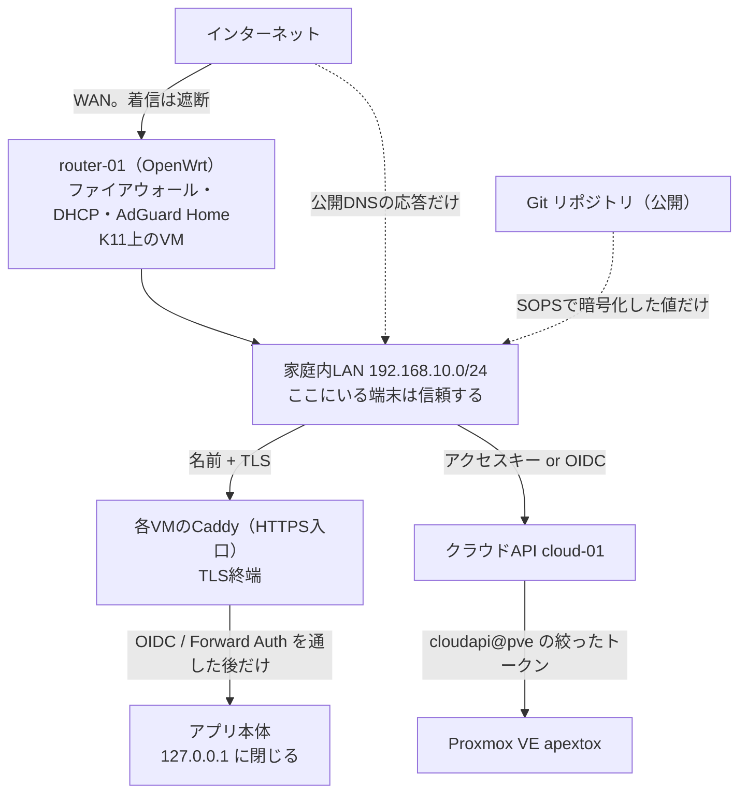

# 信頼境界とセキュリティ方針

> **更新日** 2026-09-23 ・ **区分** 設計 ・ **読む人** 管理者・開発者

**何を信頼していて、何を信頼していないか**を1枚にまとめます。個々の決定の理由は[決定ログ](decisions.md)、手順は[秘密値の管理](../operations/secrets.md)と[認証基盤](../operations/identity.md)にあります。

**家庭内の2人運用が前提です。** 組織の監査要件、内部犯行への耐性、規制対応は想定していません。「守らないと決めたこと」を §5 に明記します。

## 1. 公開範囲

**インターネットには何も公開していません。** グローバルIPも使いません。

| 外から見えるもの | 中身 |
| --- | --- |
| `apextox.dpdns.org` のDNS応答 | Cloudflareの公開DNSに**内部IPをそのまま**書いている。名前は誰でも引けるが、応答は `192.168.10.x` なので外からは届かない |
| それ以外 | 無い。ポート転送もリバースプロキシも置いていない |

**2026-09-20 から、インターネットとの境界は自作です。** 家庭内ルータを市販機（Aterm）から K11 上の OpenWrt VM `router-01` へ移しました（[N06](../development/N06-router.md)・[router-01](../operations/router.md)）。WANは `vmbr1`、LANは `vmbr0` で、**`vmbr1` にホストのIPを与えていません**。ファイアウォール・DHCP・DNSの設定は Git（`platform/openwrt/`）が正本で、実機へ `uci` で入れた変更はイメージに焼くまで再作成で消えます。

内部IPを公開DNSに書いているのは、**証明書をDNS-01で取るためだけ**です。`home.arpa` と自前CAにしなかったのは、全端末へCAを登録する手間と、スマートフォンのアプリが自前CAを信用しない問題を避けるためです。代償として、名前の一覧と内部IPの割り当ては外から推測できます（[決定ログ](decisions.md)）。

LANの外から使うにはVPNが要ります。未構築です（[VPNの比較と併用](vpn.md)）。復旧経路として `net-01` の subnet router だけがあります（[net-01](../operations/net.md)）。

## 2. 信頼境界

| 境界 | 通すもの | 止めるもの |
| --- | --- | --- |
| インターネット → LAN | DNSの応答のみ | 通信そのもの。`router-01` のファイアウォールが遮断し、ポート転送も置いていない |
| 端末 → 名前解決 | `router-01` の AdGuard Home が応答（広告・トラッカーのブロックリスト付き） | ブロックリストに載った名前。**DNSは全端末の単一経路**（[AdGuard Home](../operations/adguard.md)） |
| LAN → HTTPS入口 | 名前が一致するTLS接続 | 証明書の名前に無いホスト。identityのCaddyだけはcatch-allでAuthentikへ渡す |
| HTTPS入口 → アプリ | 認証を通したリクエスト | アプリ本体は `127.0.0.1` に閉じており、入口を経由しないと触れない |
| 利用者 → 他人のVM | 一覧の閲覧（所有者名・イメージ・割り当て・状態） | 電源・削除・サイズ変更は403。他人の `client_token` は返さない。`user_data` は一覧に出さない |
| クラウドAPI → Proxmox | `cloudapi@pve` に割り当てたロールの範囲 | それ以外。APIが唯一の経路で、利用者はProxmoxの資格情報を持たない |
| 実行環境 → Git | コード・設定例・Markdown・digestロック・SOPS暗号文 | `.env`、Cookie、CA秘密鍵、実データ、state |

**ルータの管理画面（LuCI）にだけSSOを付けていません。** `https://router.apextox.dpdns.org` は LuCI 自身の root パスワードで守り、Authentik を通しません。**ルータは復旧経路だから**で、identity が止まっているときに開けなくなると詰みます。AdGuard の管理画面（`https://adguard.apextox.dpdns.org`）は復旧に必須ではないので Forward Auth を通します。

**入口を1台に集めていません。** 各VMが自分のCaddyでTLSを終端します。認証基盤（identity）を他ホストの障害に巻き込まないためです。代償として、Cloudflare の DNS 編集トークンが各ホストに載ります。

## 3. 認証と資格情報

**ブラウザと機械を別系統にしています。**

| 経路 | 使うもの | 止まったときの影響 |
| --- | --- | --- |
| ブラウザ | Authentik の OIDC | identityが落ちるとブラウザから入れない |
| Terraform・CLI・スクリプト | アクセスキー `sca_<キーID>.<秘密値>` を `Authorization: Bearer` で | **identityが落ちても動く。** これが分けている理由 |
| OIDC非対応のアプリ | 入口での Forward Auth（Navidrome・MeTube・CUPS） | 入口が落ちるとアプリにも届かない |

アクセスキーの扱い:

- **発行はポータルのログインからだけ。** アクセスキーで別のアクセスキーは作れません。漏れたキーが自分の複製を作って居座れないようにするためです。
- 1アカウント5本まで。削除は行を残して無効化します。
- 表示は発行時の一度だけ。
- ブートストラップ管理キーは2026-09-11に無効化済みです。緊急時は cloud-01 で `manage.py rotate-bootstrap-key`。

アカウントの同一性:

- Authentik の `sub` は `user_uuid` を使います。プロバイダを作り直しても変わらないためです。
- **知らない `sub` で既知のメールアドレスが来たらログインを拒否します**（`AccountConflict`）。黙って別アカウントを作ると、その人のリソースが2つに分かれるためです。

**SSOは権限の統合ではありません。** Vaultwardenは共通ログインを通しても保管庫を開くマスターパスワードが別に要ります。Nextcloudの共有設定はKavita・Navidromeへ継承されません。

## 4. 実装側で決めていること

| 対象 | 決めていること |
| --- | --- |
| SSH鍵 | 公開鍵だけを保存する。`user-data` には触らず、NoCloud の `meta-data` の `public-keys` で渡す（`user-data` は自由書式なので他人の文書を書き換えない） |
| `user-data` | seed ISO に平文で入りゲストから読める。**秘密の置き場としては案内しない** |
| Webコンソール | 5分有効・アカウントに結び付いたURL。ページを開くたびにProxmoxのチケットと使い捨てパスワードを発行。WebSocketは1ページ表示につき1本 |
| コンソールの防御 | Cookieで認証されたWebSocketはOriginが自サイトでなければ断る。URLのトークンはアクセスログに出さず、メモリ上もハッシュで持つ。ページは `Cache-Control: no-store` |
| noVNC | 同梱する（`web/static/novnc/`）。**CDNは使わない。** CSPの `script-src 'self'` に収まる |
| CSRF | Goの `http.CrossOriginProtection`。GETは見ないので、WebSocketのOrigin検査を別に置いている |
| 送信元IP | Caddyの後ろに置くので `SHAKECLOUD_TRUSTED_PROXIES` が要る。広げすぎると直接つないだ人が送信元を偽れる |
| ネットワーク絞り | セキュリティグループ（VM単位のFW）。効かせるには VM の有効化・NICの `firewall=1`・ルール本体の3つが揃う必要がある |
| 中継コンテナ | `eufy-security-ws` は `172.31.254.1:3000` にだけbindし、LANへは出さない |
| 監査ログ | APIの操作を記録する。削除保護は作らない |

## 5. 守らないと決めたこと

正直に書きます。**ここに書いてあることは弱点であって、対策済みではありません。**

| 守らないもの | 理由と、成立する前提 |
| --- | --- |
| LAN内の端末 | LANに入れた時点で、名前解決とHTTPS入口には届く。アプリの認証が最後の壁。**LANに知らない端末を入れないことが前提** |
| 物理ホストのroot | 取られたら全部が終わる。Proxmoxホストの鍵は人が管理し、コードで配らない |
| 内部構成の秘匿 | 名前と内部IPは公開DNSから引ける。証明書をDNS-01で取る代償として受け入れている |
| 内部犯行 | 2人とも `admins` に入りうる運用。操作は監査ログに残るが、権限で止めていない |
| VLANによる分離 | 宣言と手順は用意済みだが、**実機は未切替**。いまは管理面と利用者VMが同じL2にいる（[VLAN 分離への切替](../operations/vlan.md)） |
| ルータと被保護資産の分離 | `router-01` は守る対象と同じ物理ホストに載っている。ルータVMを破られるとホスト内部へ近い。分離するには別筐体が要る |
| 外部依存の停止 | Cloudflare（DNS）・DigitalPlat（ドメイン）・外部SMTPが止まると、証明書更新と招待・復旧メールが止まる（[障害モード](failure-modes.md)） |
| S3の冗長性 | Garageは単一ノード。**stateやバックアップの唯一の保管先にしない** |

## 6. 秘密値の置き場所

| 場所 | 入るもの |
| --- | --- |
| Git（`platform/sops/*.sops.yaml`） | 配備の**前に**必要な資格情報。SOPS + age で暗号化。キー名と構造は平文なので差分レビューができる |
| 各VMの `/opt/<stack>/secrets/` | 配備時に自動生成する値。Gitへは入らない。人に鍵を作らせない・変えさせない |
| identity VM の `oidc-cloud.json` | OIDCクライアントの秘密値の**正本**。SOPSへ複製しない（2か所に持つと作り直したとき食い違う） |
| 手元だけ | `pve.ini`・`seed.ini`・`.local/pve-readonly.env`。`.example` から作る |

一覧と作り方は[秘密値の管理](../operations/secrets.md)、どのファイルに何が入っているかは[配備台帳 §7](../operations/handover.md)にあります。

公開前の検査は `python3 tools/check-publication.py` です。既知の秘密値と禁止パス（`storage` `library` `backups` `runtime` `secrets` `trust` `.terraform`、`.env`、state）を検出しますが、**補助であって保証ではありません。** ステージした差分の目視確認も行ってください。

## 関連

- [決定ログ](decisions.md) — ここに書いた方針の元になった決定
- [障害モードと単一障害点](failure-modes.md) — 止まったときに何が起きるか
- [ネットワーク・公開範囲・SSO](network-auth.md) — 機器と経路の設計
- [秘密値の管理](../operations/secrets.md) — SOPS と age の手順
