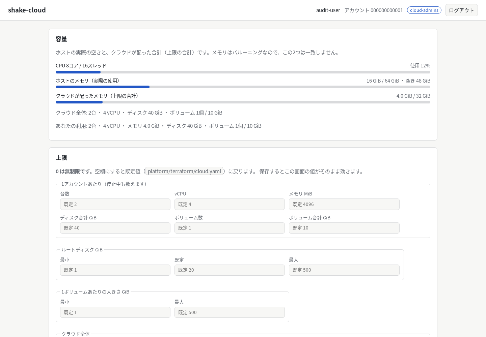
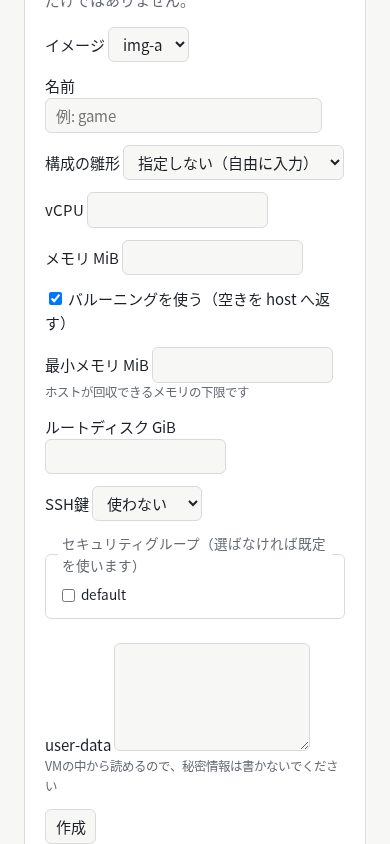
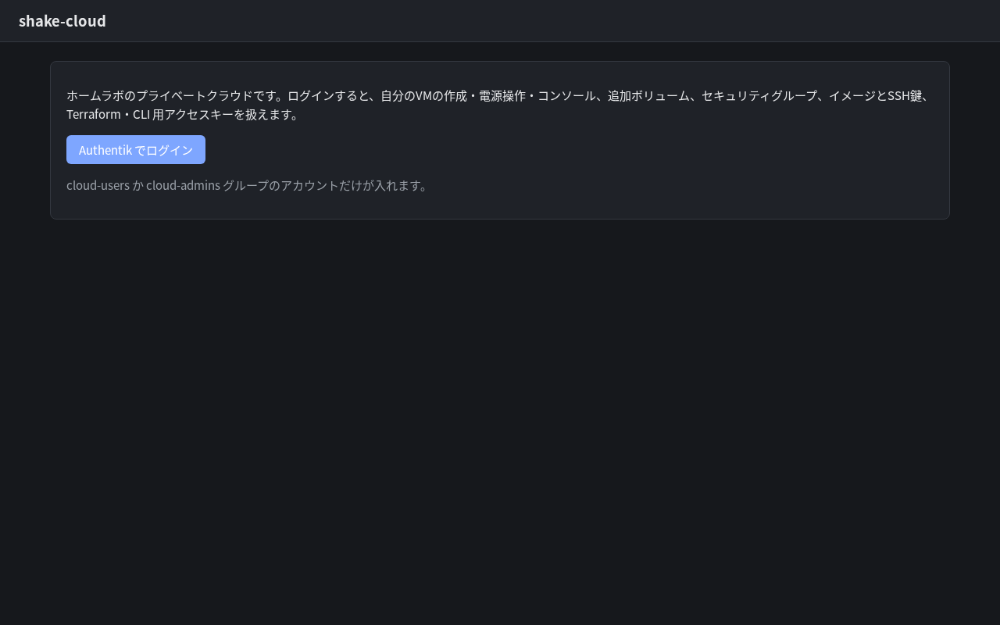
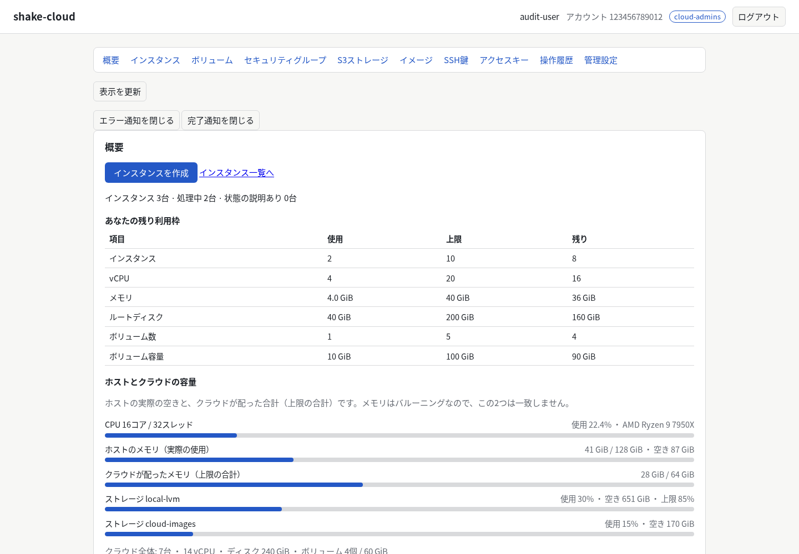
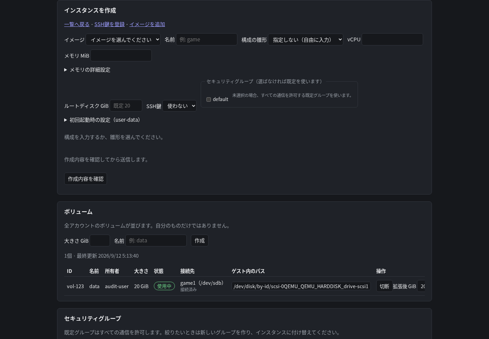
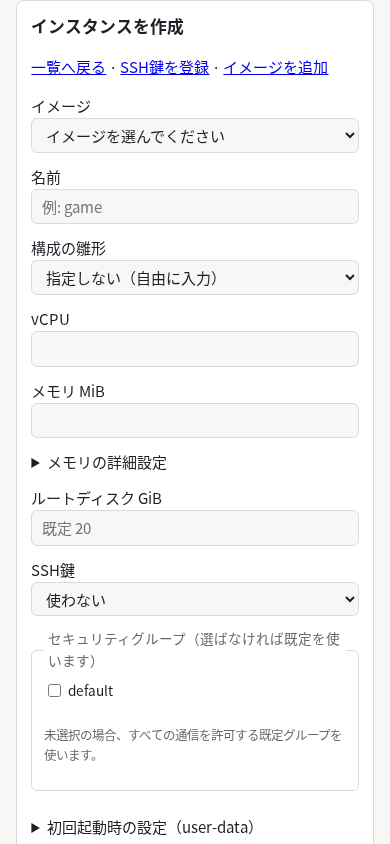

# Shakecloud Web GUI監査・改善案

監査日: 2026-09-12。対象ソース: `15d491b`。対象: `https://cloud.apextox.dpdns.org/` と `cloud/api/internal/server/web/`。

## 1. 結論

VM・ボリューム・セキュリティグループ・S3・認証用キーを扱う機能は揃っている。一方、**二重送信、更新による入力消失、見つけにくいエラー**があり、日常運用を安心して任せられる操作体験には改善が必要である。まず操作の確実性を直し、その後に画面の分割と一覧の改善を進める。

指摘は **16件（P1: 6件、P2: 10件）**。P1は意図しない作成・設定変更・入力消失につながるため最初に扱う。P2は操作の理解、状態確認、アクセシビリティを改善する。P0相当の障害は今回の確認範囲では確認していない。これは本番全体の安全性保証ではない。

## 2. 確認範囲と証拠の読み方

| 確認方法 | 実施範囲 | 限界 |
| --- | --- | --- |
| 本番の未認証HTTP・ブラウザ確認 | ログイン画面、HTTPS応答、配信JS/CSS、応答ヘッダー | Authentikでのログイン、認証後の本番データ・操作は未実施 |
| ソース監査 | ポータルHTML/JS/CSS、コンソール、関係するAPI実装と開発方針 | バックエンド全体のセキュリティ監査ではない |
| ローカルブラウザ再現 | テンプレートを一般利用者／管理者として展開し、実際のJS/CSSに模擬API応答を供給 | 実VM・実S3を作成しない。認証やバックエンドの成否を検証するものではない |
| 基準照合 | WCAG 2.2の関連達成基準 | 全基準の適合判定、スクリーンリーダー実機検査は未実施 |

公開中の `portal.js` と `portal.css` は、ローカルのSHA-256と一致した。ログイン後HTMLの本番一致は未確認。ローカル再現ではHTMLの条件分岐とアカウント表示を模擬値に置換した。

```text
portal.js  8928a26d95ac3842f28a761d93da1a2f083a1a50e5a33937c33b39062e8fa25c
portal.css 93d8474134b807ec03780194a6ef26d2f05c1790afcc7f33e97b06d8b7d42dc1
```

本書の「再現」はローカルのブラウザ再現、「ソース」は実装上の確認、「提案」は設計判断を示す。[計測結果JSON](webgui-2026-09-12/results.json)にはリクエスト数、DOM状態、表示幅などを残した。画像内の認証後リソースはすべて架空データである。

Chromium `151.0.7922.34` で確認した主な結果は次のとおり。

| 再現項目 | 計測結果 |
| --- | --- |
| VM作成のダブルクリック | 400msの応答遅延下で同一内容のPOSTが2本 |
| 別VMがpendingの間の編集 | 編集行数が1→0。未保存のvCPU入力が消失 |
| キー発行後の全体更新 | 選択画像がimg-b→img-a、SSH鍵が空、SGが未選択へ戻る |
| 作成エラーの位置 | 表示高さ1000pxに対し、エラーは表示領域上端から約3333px下 |
| running＋FW applying | 約5.4秒の待機前後でVM取得回数が2→2。追加取得なし |
| 狭幅表示 | 390pxではページ幅390px。320pxではページ幅339pxへ超過 |
| 本番未認証画面 | HTTP 200、ログイン導線あり |

### 維持する良い点

- `lang="ja"`、多くのフォームのラベル、状態の日本語表示、状態による電源ボタンの無効化がある。
- 所有者と管理者に操作を絞り、全員で容量とVMを見られる既存方針が実装されている。
- イメージ・SSH鍵の削除やボリューム切断には、既存VMへの影響やアンマウントの説明がある。
- 秘密値は発行時のみ表示し、閉じたときに表示領域を消去する。HTMLは `no-store`、CSPは外部スクリプトなどを制限している。
- APIにVM作成の `client_token`、監査履歴の絞り込みとページ送りがあり、GUI改善に再利用できる。

## 3. 指摘一覧

| ID | 優先度 | 問題 | 根拠 | 改善の中心 |
| --- | --- | --- | --- | --- |
| F01 | P1 | 作成・キー発行などを二重送信できる | 再現・ソース | 送信ロック、VMの冪等トークン、秘密値保存まで再発行を抑止 |
| F02 | P1 | 自動更新で編集中の行が消える | 再現・ソース | リソースID単位の更新と編集状態保持 |
| F03 | P1 | 関連データ更新でVM作成の選択値が戻る | 再現・ソース | 選択IDを保持し、消えた候補を明示 |
| F04 | P1 | エラーが操作場所から遠く、復旧方法も不足 | 再現・ソース | フォーム内エラーと共通通知、応答形式に依存しないエラー処理 |
| F05 | P1 | 削除対象の識別と影響の説明が弱い | ソース | 名前・ID・所有者・データへの影響を確認画面に表示 |
| F06 | P1 | S3権限でownerだけが初期選択される | 再現・ソース | 用途別の明示選択、日本語説明 |
| F07 | P2 | FW反映だけが進行中のとき更新されない | 再現・ソース | FW状態も更新条件へ、通信失敗から復帰 |
| F08 | P2 | 全機能が長い1ページで、日常操作が埋もれる | ソース・画面 | 用途別ナビゲーション、一覧と作成の分離 |
| F09 | P2 | 狭い画面でフォームがページ幅を超える | 再現・CSS | 入力幅、折り返し、フォームの1列化 |
| F10 | P2 | 動的通知・ラベル・ダークモードの可読性に不足 | 再現・ソース・色計算 | live region、名前付け、配色修正 |
| F11 | P2 | 操作履歴が最新20件に固定され、対象を追えない | ソース | APIの検索・ページ送りと詳細表示を接続 |
| F12 | P2 | アップロードの転送完了と処理完了が区別できない | ソース | 転送／検証の段階表示、上限と中断状態の説明 |
| F13 | P2 | VM構成の雛形・入力制約が実際の送信内容とずれる | ソース | 雛形状態の明示、事前検証、変更可能な項目だけ編集 |
| F14 | P2 | 空・読込中・取得失敗と、利用可能な残枠が分かりにくい | ソース | 状態の描き分け、個人クォータの残量表示 |
| F15 | P2 | コンソールのポップアップ拒否が無反応になる | ソース | 拒否の説明、利用者操作で開く代替導線 |
| F16 | P2 | 管理上限の保存が全体置換であることが分かりにくい | ソース | 実効値と既定値の分離、変更差分の確認 |

## 4. 優先修正の詳細

### F01 — 二重送信と一度きりの秘密値の上書き

**現象:** VM作成の送信ハンドラーには処理中のロックがなく、送信本文に `client_token` も含めていない。キー発行も連続送信でき、各成功応答が同じ秘密値表示領域を上書きする。

**根拠:** `portal.js:664`、`:693`、`:1378`、`:1463`。API側は `compute/service.go:367` で、トークンが指定された場合に既存の作成結果を返す。ローカルでは応答を400ms遅延させ、作成ボタンのダブルクリックから同一本文のPOSTが2本発生することを確認した。実VMが2台作られたという検証ではない。

**改善:** ハンドラー入口で送信中フラグを確認し、対象フォームの送信操作をロックする。VM作成では論理的な1回の作成ごとに `client_token` を生成し、通信結果が不明な同一本文の再試行では同じ値を使う。本文を変更して新しい作成を始めるときは新しい値を使う。キー発行は秘密値の保存確認が済むまで次の発行を抑止し、成功と一覧再読込の失敗を別々に伝える。

**受け入れ条件:** 連打・Enter連打でもPOSTが1本。応答喪失後のVM再試行が同じインスタンスIDを返す。秘密値表示中の再発行で前の値が消えない。APIが冪等性を提供しないキー発行は自動再試行しない。

### F02 — ポーリングによる編集内容の消失

**現象:** いずれかのVMが起動準備中などの場合、5秒ごとに `tbody` 全体を作り直す。管理者が別の停止VMのvCPUを編集していても、その編集行が削除される。ボリューム一覧にも同じ更新方式があり、接続先や拡張値の入力を失う可能性がある。

**根拠:** `portal.js:383`、`:623`、`:639`、`:898`、`:917`。停止VMの編集行を開いてvCPUを7に変更し、別VMをpendingとした再現で、約5秒後に編集行が消失した。

**改善:** 一覧のデータと編集中の値を分け、IDをキーに表示差分を更新する。短期対応では編集中の行を保持して状態セルだけ更新する。編集対象の状態が変わったら保存前に再検証し、説明を表示する。

**受け入れ条件:** 別VM／別ボリュームの非同期処理中でも入力値・フォーカス・選択位置が保持される。対象が削除された場合は入力を黙って捨てず、その理由を通知する。

### F03 — 更新によるイメージ・SSH鍵・SG選択の初期化

**現象:** `loadImages()`、`loadKeyPairs()`、`updateCreateInstanceGroupOptions()` は候補を作り直すときに選択を復元しない。VM作成を入力途中にアクセスキーを発行すると、全体の `refresh()` でイメージが先頭、SSH鍵が「使わない」、SGが未選択に戻る。

**根拠:** `portal.js:224`、`:267`、`:1145`、`:1458`、`:1477`。模擬データの2番目のイメージ、SSH鍵、SGを選択後、アクセスキー発行からの更新で選択が戻ることを再現した。

**改善:** 候補更新の前後で選択IDを保持する。選択対象が削除・失効した場合は明示的に再選択を要求する。SGが未選択になったとき、全許可の既定SGへ黙って戻さない。

**受け入れ条件:** 他セクションの作成・削除・再読込で入力中の構成が変化しない。選択中の候補が消えたときは送信を止め、該当項目へ案内する。

### F04 — エラー発見と復旧が難しい

**現象:** 共通エラーは全セクションより後ろにある。`showError()` は文字と表示状態だけを変え、操作箇所への表示やフォーカス移動を行わない。APIエラーの英語本文を直接表示し、HTML形式の502等ではJSON解析エラーになり得る。401ではただちにページ移動し、未保存入力が失われる。

**根拠:** `index.html:271`、`portal.js:15`、`:34`。VM作成を失敗させた再現では、エラー要素が操作中の表示範囲外にあった。

**改善:** 各フォーム直下に日本語のエラー要約と修正箇所を置き、`aria-describedby` で入力に結び付ける。共通通知に `role="alert"` を使用する。JSON以外・ネットワーク切断・401・403・競合を区別し、request IDは詳細欄へ出す。再認証前に未保存状態を知らせ、秘密値やuser-dataをブラウザ永続領域へ自動保存しない。

**受け入れ条件:** 400/401/403/409/502/ネットワーク切断を模擬し、操作位置から理由と次の行動を理解できる。JSON解析例外が利用者向けの主メッセージにならない。

### F05 — 削除対象と影響の識別不足

**現象:** VM削除確認は原則として名前だけ。同名VMを管理者が扱う際に、IDと所有者で見分けられない。ルートディスクの削除、追加ボリュームの扱いも確認文にない。通常の電源操作と削除のボタンに視覚的な強弱がない。

**根拠:** `portal.js:351`、`:598`、`:821`。追加ボリュームは `compute/worker.go:467` でVM削除前に返却する処理があるため、「接続済みディスクがすべて消える」という説明も不正確である。

**改善:** 削除確認に「名前・ID・所有者・現在状態」を表示し、ルートディスクの削除と追加ボリュームの切り離し／保持を区別する。管理者による他人の資源の削除は特に明示する。主要操作と危険操作の配置・文言を分ける。既存方針で対象外の削除保護機能は、この提案には追加しない。

**受け入れ条件:** 同名で所有者が異なるVMを誤認しない。キャンセルは初期フォーカスで操作でき、閉じたら元のボタンへ戻る。削除の影響説明がAPIの実挙動と一致する。

### F06 — S3のowner権限が初期選択

**現象:** 権限フォームは `read=false, write=false, owner=true` で開く。表示は英語のチェックボックスのみで、既存許可もR/W/Oと略記する。利用者が必要な読書き権限とownerの違いを判断しづらい。

**根拠:** `portal.js:1203`、`:1230`、`:1243`。ブラウザDOMで初期選択を確認した。ownerで可能になる個別S3操作は、配備版Garageを使った今回の実地検査範囲外である。

**改善:** 「読み取り」「読み書き」「詳細指定」の用途選択を設け、ownerは既定で付けない。詳細欄で各権限の意味と変更対象のバケット／キーを表示する。保存前に送信する権限を確認できるようにする。

**受け入れ条件:** 明示的にownerを選んだ場合だけ `owner=true` が送信される。読み取り用途でwriteが付かない。既存権限は日本語で確認できる。

## 5. 続けて改善する項目

| ID | 具体的な根拠と影響 | 改善案と受け入れ条件 |
| --- | --- | --- |
| F07 | `portal.js:571` はFW反映中を表示するが、`:628` のポーリング条件はVMの電源状態だけ。running＋applyingの模擬応答では5秒以上経過しても取得回数が増えない。`:649` は取得失敗で更新を停止する | FW反映中も更新対象とする。失敗後は状態を「不明／再取得中」とし、間隔を延ばした再試行と手動更新を用意。FW反映完了と一時的な取得障害の復帰を画面で確認できること |
| F08 | `index.html:24` から容量→管理上限→VM作成→一覧→その他すべての機能が続く。検索、所有者／状態フィルター、セクション移動がない | §6の構成へ分割。既定は全員のVMを表示し、「自分のみ」へ切替可能にする。全員のVMの可視性という方針を保持しつつ、名前・ID・IPで目的のVMを探せること |
| F09 | `portal.css:31`、`:32` の余白に対して `:38` の入力最小幅16remが大きい。表は横スクロール可能だが、フォームもページ全体の横幅を押し広げる | `box-sizing`、`min-width:0`、`max-width:100%` と狭幅時の1列配置。320 CSS pxで本文とフォームは横スクロール不要、必要な表の横スクロールは表の領域内だけになること |
| F10 | `index.html:271` の通知にrole/liveがない。`portal.js:798` の接続先と `:1233` のS3キーselectにラベルがない。ダークモードのログインボタンは白文字／背景`#7ea6ff`で約2.39:1 | 通知領域、動的操作の名前、編集開始／終了時のフォーカスを整備。ログインボタンの配色を通常文字4.5:1以上へ。キーボードとスクリーンリーダーで対象・結果が把握できること |
| F11 | `portal.js:72` は `max_results=20` 固定で、request ID・resource ID・詳細・next tokenを表示しない。`server/handlers.go:202` 以降のAPIは操作名、アカウント、キーで絞り込み、ページ送りに対応 | 既存APIへフィルターと「さらに表示」を接続し、対象ID・request ID・詳細を展開表示。21件目以降と、失敗した操作の対象を追えること。日時範囲や結果フィルターはAPI追加が必要な別工程として扱う |
| F12 | `portal.js:1523` はブラウザ→APIの転送率のみ。APIの後続検証中も100%表示が続く。再送信ロック・中断導線・ファイルサイズの事前判定がない。`index.html:197` の説明と`:200`の拡張子指定も一致していない | 「転送中」「サーバー処理中」「完了」を区別し、実効上限を表示。拡張子の説明はサーバーの許容範囲と一致させる。中断時はブラウザ転送停止とサーバー処理停止を同一視しない。大きすぎるファイルを送信前に指摘し、サーバーでも上限検査を維持 |
| F13 | `portal.js:654` で雛形選択が数値欄を埋める一方、`:674` は数値が空の場合だけ型名を送る。数値の手動変更後も雛形名が残る。`:397` 以降の編集欄は稼働中もCPU等を編集でき、`:435` は変更なしでも空PATCHを送る | 仕様上は数値指定が正しいので、雛形を近道として扱いカスタム状態を明示する。最小メモリ≤最大メモリ、実効ディスク上限を検証。稼働中は変更不可の項目に理由を添え、変更なしでは保存しない |
| F14 | 多くの一覧が空配列をそのまま描画し、読込中や0件を示さない。`portal.js:145` は個人の利用量を示すが残クォータは示さない | 一覧ごとに読込中／0件／失敗を描き分け、0件時に最初の操作へ案内。「自分の残枠」と「ホスト実空き」を別表示し、無制限・不明を0と混同しない。前提情報が取得できない場合の操作可否を明示 |
| F15 | `portal.js:337` の `window.open()` がnullの場合、API成功後も画面を開けず説明がない。コンソールには再読込の説明はあるが、期限切れ時の戻り方が弱い | ポップアップ拒否を表示し、利用者が押して開くリンクを提供。期限切れならポータルへ戻って接続URLを再発行する導線を用意。URL・チケット・秘密値は永続保存や一般ログに追加しない。拒否、接続失敗、期限切れを確認 |
| F16 | `index.html:42` は空欄＝既定と説明しているが、実効値がplaceholder頼み。`portal.js:1440` は全フォームを集めてPUTし、空欄を省略する。取得失敗時に空のまま保存すると意図しない既定値復帰の懸念がある | 読込成功まで保存不可にする。「現在有効な値」「既定値」「上書き」を区別し、保存前に変更とリセット対象を表示。安全余白を0へ変える際は具体的な影響を示す。古い画面からの同時編集検知はAPIの版管理追加を別途検討 |

## 6. 改善後の画面構成案

対象は既存のプライベートクラウドのセルフサービス範囲とする。`html/template` と素のJavaScriptを継続し、最初はアンカー移動と折り畳み、その後にセクション単位のURL／表示切替を導入できる。

| 画面 | 最初に見せるもの | 主な操作 |
| --- | --- | --- |
| 概要 | 自分の使用量／残枠、ホスト実空き、処理中／失敗の件数、最終更新 | VM一覧へ、インスタンス作成へ |
| インスタンス | 検索、全員／自分の切替、状態、名前＋ID＋所有者、IP、構成 | 詳細、起動、停止、コンソール。削除は危険操作として別配置 |
| インスタンス作成 | イメージ・名前・構成、SSH接続方法、通信範囲、作成内容の確認 | 作成。バルーニング詳細とuser-dataは追加設定として展開 |
| ボリューム | 名前＋ID、容量、状態、接続先、処理状況 | 作成、接続、切断、拡張、削除 |
| セキュリティグループ | 許可する通信と対象VM、反映状況 | ルール変更。変更前後と影響対象を表示 |
| S3 | バケット一覧、使用量、エンドポイント、キー権限 | バケット作成、キー発行、権限設定、接続設定のコピー |
| イメージ・SSH鍵 | 登録済み資源、所有者、利用方法 | アップロード／公開鍵登録。作成画面から戻れる導線 |
| アクセスキー | 有効期限、最終使用、状態、本数 | 発行、無効化。一度きりの秘密値は専用領域で保存確認 |
| 操作履歴 | 操作・結果・対象・時刻、絞り込み | 詳細、次ページ、request IDのコピー |
| 管理設定 | 実効上限、既定値、最終変更者 | 差分を確認して上限変更、既定値復帰 |

全体のナビゲーションと各画面の見出しを連動させ、戻る操作で検索条件とスクロール位置を復元する。操作可否はAPIの権限制御を維持する。画面で隠すことを認可の代替にはしない。

### 代表的な操作フロー

1. **VM作成:** 一覧の「インスタンスを作成」→基本構成→SSH鍵・SG→確認→送信中→対象VMの起動準備中表示→稼働中→接続。APIで作成受付が成功した時点とVM起動完了を分けて表示する。
2. **削除:** 行の危険操作→名前・ID・所有者・消えるデータと残るボリュームを確認→削除中→削除済み。状態取得に失敗した場合は削除成功と断定しない。
3. **S3利用開始:** バケット作成→キーを選択／発行→用途に応じた権限付与→接続先とregionをコピー。オブジェクトの操作は既存方針どおりS3クライアントから行う。
4. **失敗から復旧:** 操作箇所の日本語エラー→修正項目または再認証／再取得→必要ならrequest IDから履歴を確認→結果不明な作成は同一トークンで再照会・再試行。

### 表示文言の例

| 場面 | 提案する文言 |
| --- | --- |
| VM作成受付 | 「作成を受け付けました。起動を準備しています。」＋対象名／ID |
| 状態の取得失敗 | 「状態を更新できませんでした。最後に取得した情報を表示しています。」＋最終更新／再取得 |
| SGの既定設定 | 「既定のグループはすべての通信を許可します。」＋選択したグループと適用先 |
| VM削除確認 | 「このVMとルートディスクを削除します。追加ボリュームは切り離して保持します。」＋名前／ID／所有者 |
| アップロード100%後 | 「転送が完了しました。サーバーで検証・登録しています。」 |
| セッション切れ | 「ログインの有効期限が切れました。再ログインが必要です。」＋未保存入力への注意 |

## 7. 実装の順番と完了判定

以下は着手順の提案で、納期の確約ではない。S＝1つの共通部品または局所変更、M＝複数画面と状態管理、L＝画面構成全体。各工程は対応する再現シナリオを確認してから次へ進める。

| 順 | まとまり | 対象 | 規模 | 完了条件 |
| --- | --- | --- | --- | --- |
| 1 | 操作の重複・入力消失を止める | F01–F04 | M | 連打、応答喪失、ポーリング、別セクション更新で意図と入力が保持される |
| 2 | 削除と権限付与を分かりやすくする | F05–F06、F16 | M | 対象と影響、実際に送る権限・上限差分が確認できる |
| 3 | 状態と失敗からの復旧を揃える | F07、F12–F15 | M | 非同期処理完了、部分障害、再認証、コンソール拒否を説明できる |
| 4 | 可読性とアクセシビリティの局所修正 | F09–F10 | S–M | 320px、ダークモード、キーボード操作、動的通知の確認を通す。配色修正は工程1と同時に先行可能 |
| 5 | 日常操作の導線を整理する | F08、F11、F14 | L | 目的のVMを検索して操作でき、履歴から対象と失敗を追える |

共通実装はAPI応答処理、通知、送信中状態、ID別の一覧更新を先に整える。新しいビルド基盤の導入やAPI全面刷新は前提にしない。キー発行の冪等性、日時範囲による監査検索、上限の競合検知は追加API設計が必要になり得るため、GUIだけで保証したと記載しない。

### 改修後の検証シナリオ

| シナリオ | 確認する結果 |
| --- | --- |
| 一般利用者／管理者、本人／他人の資源 | 可視性・操作範囲が既存仕様と一致。APIの403も維持 |
| 連打・Enter連打、遅い応答、成功応答だけ喪失 | 二重作成しない。結果不明と失敗を区別する |
| 別VM起動中の編集、別画面からの候補追加／削除 | 入力とフォーカスを保持。消えた候補だけ再選択を求める |
| SG反映中、一時通信断、APIがHTMLの502を返す | 自動／手動で復帰し、状態が不明なことを表示 |
| 同名のVM削除、接続ボリュームありの削除 | 所有者・ID・データへの影響を正しく説明 |
| S3読み取り用キー、ownerの明示指定 | 送信権限が選んだ用途と一致 |
| 0件、長い名前、VM100件、履歴21件以上 | 空状態、折り返し、検索、次ページを利用できる |
| 320/390/768/1440 CSS px、明暗テーマ | フォームがページ外へ出ず、文字を読める |
| Tab／Shift+Tab／Enter／Escape、スクリーンリーダー | 操作対象・エラー・完了を認識でき、フォーカスが失われない |
| 大容量アップロード、接続断、ポップアップ拒否、コンソール期限切れ | 処理段階と次の行動が表示される |

今回、100件表示、全ブラウザ、スクリーンリーダー、本番認証後、実VM／S3操作、アップロード中断のサーバー側挙動は未検証。実装後の検証で補完する。

## 8. 画面証拠

### 管理者の先頭画面（模擬データ、1440×1000）

容量と上限編集がVM操作より先に並ぶ。日常的に使う一覧へ到達するためにスクロールが必要な構成である。



### 一般利用者の狭幅画面（模擬データ、390×844）



### 本番ログイン画面（ダークモード、未認証）



## 9. 参照基準

動的なエラー・完了・進捗は、フォーカスを移さずとも支援技術へ伝わるようにする。[W3C: Status Messages 4.1.3](https://www.w3.org/WAI/WCAG22/Understanding/status-messages.html)

320 CSS px相当の表示で本文・フォームを利用できるようにする。表など二次元の配置を必要とする部分には例外があるため、表の横スクロールだけで直ちに不適合とは判断しない。[W3C: Reflow 1.4.10](https://www.w3.org/WAI/WCAG22/Understanding/reflow.html)

入力には何を選ぶか分かるラベル・説明を付ける。[W3C: Labels or Instructions 3.3.2](https://www.w3.org/WAI/WCAG22/Understanding/labels-or-instructions.html)

通常サイズの文字は背景とのコントラスト比4.5:1以上を基準とする。ログインボタンの約2.39:1はCSSの2色から相対輝度で算出した値である。[W3C: Contrast Minimum 1.4.3](https://www.w3.org/WAI/WCAG22/Understanding/contrast-minimum.html)

## 10. 改修後の確認（2026-09-12）

§7の順に実装した後、dev-b 上で再確認した。フロントは模擬APIと実ブラウザ（Chrome Headless Shell 153.0.8010.12）、バックエンドは dev-b の PostgreSQL を使った `go vet ./...` と `go test ./...`（cloud/api の全パッケージ）である。結果は[確認結果JSON](webgui-2026-09-12/after-results.json)に残した。機能28項目が通り、実行時例外はない。axe-coreによる自動アクセシビリティ検査も、管理者ライト／ダークと一般利用者狭幅の3画面で違反0件だった。

| 確認 | 結果 |
| --- | --- |
| VM作成・電源操作の連打 | 同一内容のPOSTは1本。再送信ロックが効く（F01） |
| 全体更新中の編集行 | 入力値とフォーカスを保持（F02） |
| 選択の保持 | 全体更新後もイメージの選択が残る（F03） |
| 320 / 390 CSS px | 横スクロールなし。`scrollWidth` は表示幅と一致（F09） |
| ダークモードの主要ボタン | コントラスト比 約7.8:1（F10） |
| 空の列見出し | 操作列に見えない見出しを付け、axeの`empty-table-header`を解消（F10） |
| キーボード | 最初のTabでスキップリンクが表示。確認ダイアログはTab／Shift+Tabで循環し、閉じると起動ボタンへ戻る（F05・F10） |
| 削除確認 | 名前・ID・所有者・状態を表示。キャンセルはEscapeで戻る（F05） |
| JSON以外の502 | 解析例外を出さず日本語で案内（F04） |
| 401 | 再ログイン導線と未保存入力の注意を表示（F04） |
| S3権限 | ownerは既定で選ばれず、選んだ用途だけを送る（F06） |
| 上限変更 | 変更差分を確認してから保存。変更なしは保存しない（F16） |
| 構成の雛形 | 数値を変更するとカスタムへ戻る（F13） |
| アップロード | 転送完了とサーバー処理中を区別。中断も案内し、サーバー側でも接続断を確認（F12） |

改修後の画面（模擬データ）は次のとおり。

### 管理者の概要（1440×1000、ライト）



### インスタンス作成（1440×1000、ダーク）



### 一般利用者のインスタンス作成（390×844）



この節の数値と画像は dev-b 上のローカル確認である。フロントは模擬API、バックエンドは dev-b の PostgreSQL を使っており、実VM／実S3や本番環境は操作していない。確認対象に含めていないのは、Authentik のログインで確立する認証済みポータルの画面操作、実VM／実S3の作成・変更、実機のスクリーンリーダーである。
