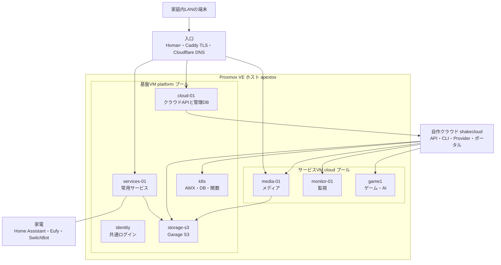

# Shake Lab Docs

更新日: 2026-09-13

Proxmox VE の1台に役割ごとのVMを分け、本・音楽・ファイル・パスワード・家電から自作のプライベートクラウドまでを、家庭内LANの一つの入口から使えるようにしています。このページは全体像だけの簡潔版です。詳しい運用は[運用ドキュメント](overview.md)にあります。

## 全体像

## 何をどこに分けているか

| 用途 | 置き場所 | 代表サービス |
| --- | --- | --- |
| 仮想化の土台 | Proxmox ホスト `apextox` | Proxmox VE |
| 共通ログイン | identity | Authentik（招待・復旧・パスキー） |
| 自作クラウド | cloud-01 | shakecloud API・CLI・Provider・ポータル・管理DB |
| 常用サービス | services-01 | Homarr・NetBox・Shake Lab Docs・Vaultwarden・CUPS |
| 家電 | services-01 | Home Assistant・Eufy中継・SwitchBot Cloud |
| クラスタ | k8s-cp-01・k8s-worker-01 | Kubernetes・AWX・CloudNativePG・Knative |
| S3ストレージ | storage-s3 | Garage |
| メディア | media-01（クラウドVM） | Nextcloud・Kavita・Navidrome・FreshRSS |
| 監視 | monitor-01（クラウドVM） | Prometheus・Alertmanager・Grafana |
| ゲーム・AI | game1（クラウドVM） | ゲームサーバ・GPUパススルー |
| 開発 | dev-a・dev-b | 開発VM（Terraform・Docker・Go） |
| 入口 | 各VMのCaddy＋Cloudflare DNS | `*.apextox.dpdns.org` |

## 自作している部分

- **shakecloud**（`cloud/`）: VM・S3・DB・関数を扱うAPI、CLI、Terraform Provider、セルフサービスポータル
- **identity**（`stacks/identity/`）: Authentikの招待フロー、メール復旧、パスキー
- **Home AssistantのSSO**（`stacks/home-assistant/`）: `hass-oidc-auth`でAuthentik OIDCを併設
- **Eufy中継**（`stacks/eufy-security-ws/`）: イベント・push・スナップショットをHAへ連携
- **ドキュメント検証**（`platform/ansible/roles/docs_site/`・`tools/check-publication.py`）: `mkdocs --strict`のリンク検査と、公開前の秘密・禁止パス検査

## 入口と詳しい資料

- サービス一覧の入口: [Homarr](https://homarr.apextox.dpdns.org)（家庭内LANから。閲覧は全員、編集は `admins`）
- 接続先: [接続先一覧（URL・アドレス）](operations/urls.md)
- 使い方: [利用者向け：全サービスの使い方](services/usage.md)
- 詳細版: [運用ドキュメント](overview.md)（管理者向けの構成・運用手順）

**既知の制約**: LANの外からはVPNが要ります（未構築）。Eufyのライブ映像は新WebRTC方式のため当面未対応です。
