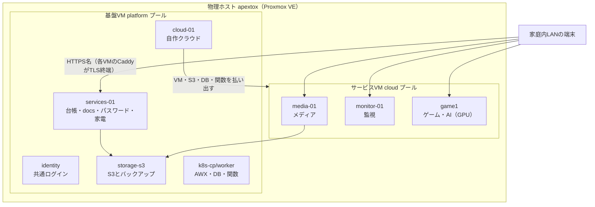

# Shake Lab Docs

更新日: 2026-09-13

正本リポジトリ: <https://github.com/rurutheGeek/shake-cloud>

Proxmox VE の1台に役割ごとのVMを分け、メディア・家電・パスワードから自作のプライベートクラウドまでを、家庭内LANのHTTPS名から使えるようにしています。このページは全体像だけの簡潔版です。

## 全体像（役割とVM）

## 何をどこに分けているか

| 役割 | VM | 中身 |
| --- | --- | --- |
| 共通ログイン | identity | Authentik。招待・メール復旧・パスキー |
| 自作クラウド | cloud-01 | shakecloud API・CLI・Provider・ポータル・管理DB |
| 台帳・docs・パスワード | services-01 | NetBox・Shake Lab Docs・Homarr・Vaultwarden |
| 家電 | services-01 | Home Assistant・eufy-security-ws中継・CUPS |
| S3・バックアップ | storage-s3 | Garage（S3互換） |
| クラスタ | k8s-cp-01・k8s-worker-01・k8s-worker-02 | Kubernetes・AWX・CloudNativePG（DB）・Knative（関数） |
| メディア | media-01 | Nextcloud・Kavita・Navidrome・FreshRSS・LocalSend |
| 監視 | monitor-01 | Prometheus・Alertmanager・Grafana |
| ゲーム・AI | game1（GPUパススルー） | Wolf・RomM・SFTPGo。将来OllamaとRAG（[詳細](overview.md)） |
| 開発 | dev-a・dev-b | Terraform・Docker・Go |

VMの管理方法はプールで揃えています。**基盤VMはTerraform**、**cloudプールのVMは自作API・Provider** が作り、IPはどちらもNetBoxから採番します（配分は[全体像（詳細）](overview.md)）。

## 自作している部分

- **shakecloud**（`cloud/`）: VM・S3・DB・関数を扱うAPI、CLI、Terraform Provider、ポータル
- **identityの運用**（`stacks/identity/`）: OIDCクライアント、招待フロー、メール復旧、Email OTP、パスキー
- **Nextcloud連携**（`stacks/media/nextcloud/apps/`・`stacks/print-api/`・`stacks/localsend-send/`）: 印刷・送信・タグ編集のアプリと、CUPS・LocalSendへの橋渡し
- **FreshRSSの共有タイムライン**（`stacks/media/freshrss/`）: 購読を全員へ同報する `SharedFeeds` 拡張
- **家電連携**（`stacks/home-assistant/`・`stacks/eufy-security-ws/`）: SSO・逆プロキシ設定、Eufy中継の運用
- **監視設定**（`stacks/monitoring/`）: スクレイプ・アラート・blackbox・UPS連携
- **検証ツール**（`tools/`・`tests/`・`.github/workflows/`）: 実機プローブ、公開前検査、テスト

## 資料

- サービス一覧の入口: [Homarr](https://homarr.apextox.dpdns.org)（閲覧は全員、編集は `admins`）
- 接続先: [接続先一覧](operations/urls.md)
- 使い方: [利用者向け：全サービスの使い方](services/usage.md)
- 全体像（詳細）: [ホームラボの全体像](overview.md)

**既知の制約**: LANの外からはVPNが要ります（未構築）。Eufyのライブ映像は新WebRTC方式のため当面未対応です。
