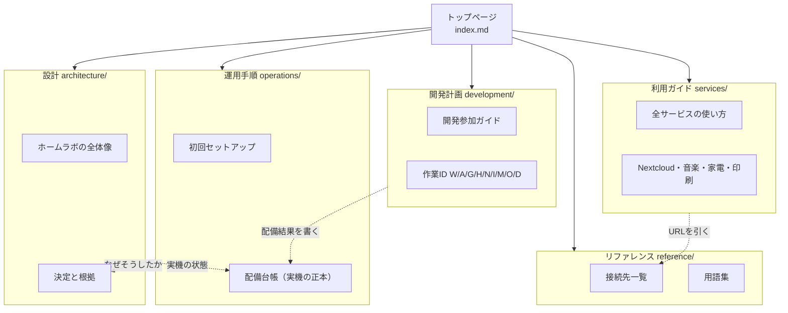

# ドキュメント地図

> **更新日** 2026-09-18 ・ **区分** 入口 ・ **読む人** 全員

どこに何が書いてあるかの一覧です。目的から探すときは[トップページ](index.md)、名前から探すときはこのページを使ってください。

## セクションの関係

## 迷ったときの正本

同じ事実を2か所に書きません。食い違いを見つけたら、次の表の「正本」に合わせて他方を直してください。

| 知りたいこと | 正本 |
| --- | --- |
| サービスのURL・IP・ポート | [接続先一覧](reference/urls.md)（名前の生成元は `platform/terraform/dns.yaml`） |
| 実機のVM・電源・配備の状態 | [配備台帳](operations/handover.md) |
| すでに決まっていること | [決定ログ](architecture/decisions.md) |
| ドキュメント自体の書き方 | [ドキュメントの書き方](contributing-docs.md) |
| 作業ごとの仕様・進捗・完了条件 | [各作業IDの計画書](development/index.md) |
| クラウドAPIのエンドポイントとフィールド | `cloud/openapi/shakecloud.yaml` |
| ホスト固有の値（ノード名・ストレージ名） | `platform/terraform/site.yaml`（`tools/site-yaml.py` が生成） |
| 設計をなぜそう決めたか | [設計の入口](architecture/index.md)と[決定ログ](architecture/decisions.md) |
| 言葉の意味 | [用語集](reference/glossary.md) |

## Obsidian で読む

`docs/` フォルダーをそのまま Vault として開けます。ページ間のリンクは相対パスの Markdown リンクなので、追加の設定なしでグラフビューに出ます。

- 各ページの front matter に `title`・`updated`・`section`・`audience`・`tags` を入れています。プロパティ検索やフィルターに使えます。
- タグは `guide`・`ops`・`design`・`plan`・`reference`・`record`・`hub` がセクション、そのあとに `nextcloud`・`network`・`cloud` などの話題が付きます。`tag:#network` で横断できます。
- このページと[トップページ](index.md)が地図の中心（MOC）です。グラフビューで孤立したページが出たら、どちらかから辿れるようにしてください。
- 図は Mermaid のコードブロックです。Obsidian でもドキュメントサイトでもそのまま描画されます。

## 全ページ一覧

<!-- pages:start -->

### 入口

| ページ | 更新日 | タグ |
| --- | --- | --- |
| [ドキュメントの書き方](contributing-docs.md) | 2026-09-19 | `hub` `rules` |
| [Shake Lab Docs](index.md) | 2026-09-18 | `hub` |
| [開発参加ガイド](onboarding.md) | 2026-09-12 | `hub` `onboarding` |

### 利用ガイド

| ページ | 更新日 | タグ |
| --- | --- | --- |
| [クラウドの使い方（ポータル・CLI・Terraform）](services/cloud.md) | 2026-09-12 | `guide` `cloud` |
| [開発VMの使い方](services/devvm.md) | 2026-09-13 | `guide` `vm` |
| [Homarrの使い方](services/homarr.md) | 2026-09-12 | `guide` `homarr` |
| [Home Assistantと家電の使い方（利用者向け）](services/home-assistant.md) | 2026-09-13 | `guide` `home-assistant` |
| [共通ログインの使い方](services/identity.md) | 2026-09-13 | `guide` `identity` |
| [利用ガイドの入口](services/index.md) | 2026-09-18 | `guide` `usage` |
| [日本語に切り替える](services/language.md) | 2026-09-08 | `guide` `usage` |
| [音楽の取り込み・タグ編集・BCSTM](services/music.md) | 2026-09-16 | `guide` `music` |
| [Nextcloudの使い方（利用者向け）](services/nextcloud-guide.md) | 2026-09-16 | `guide` `nextcloud` `cloud` |
| [プリンター（Canon TS8430シリーズ）](services/printer.md) | 2026-09-13 | `guide` `print` |
| [共通RSSタイムライン（FreshRSS）](services/rss.md) | 2026-09-16 | `guide` `rss` |
| [タグ管理（MP3）](services/tags.md) | 2026-09-16 | `guide` `music` |
| [利用者向け：全サービスの使い方](services/usage.md) | 2026-09-13 | `guide` `usage` |

### 開発計画

| ページ | 更新日 | タグ |
| --- | --- | --- |
| [A01 ポケモンDB・WebUI・agentのgame1移行](development/A01-pokemon-ai.md) | 2026-09-12 | `plan` `ai` |
| [A02 Ollamaのgame1導入](development/A02-ollama.md) | 2026-09-13 | `plan` `ai` |
| [A03 汎用RAGの構築](development/A03-rag.md) | 2026-09-12 | `plan` `ai` |
| [A04 Discord Botの構築](development/A04-discord-bot.md) | 2026-09-12 | `plan` `ai` |
| [A05 OpenHomeの製品・要件調査](development/A05-openhome.md) | 2026-09-12 | `plan` `ai` |
| [D01 開発参加ガイドの更新](development/D01-onboarding.md) | 2026-09-12 | `plan` `onboarding` |
| [D02 配置・配分表・構成図の更新](development/D02-placement.md) | 2026-09-12 | `plan` `placement` |
| [D03 サービス配置とIaC所有境界の更新](development/D03-service-boundaries.md) | 2026-09-12 | `plan` `placement` |
| [D04 実装状況の訂正と未完了一覧の整備](development/D04-status.md) | 2026-09-13 | `plan` `handover` |
| [D05 Picardのメディア統合](development/D05-picard.md) | 2026-09-13 | `plan` `music` |
| [D06 LocalSendの受信機と端末間転送資料](development/D06-localsend.md) | 2026-09-13 | `plan` `transfer` |
| [D07 Tailcatの一時接続資料](development/D07-tailcat.md) | 2026-09-12 | `plan` `network` |
| [D08 Nextcloudからの印刷（shake_print）](development/D08-nextcloud-print.md) | 2026-09-13 | `plan` `nextcloud` `print` |
| [G01 Wolfの構成管理と実機確認](development/G01-wolf.md) | 2026-09-12 | `plan` `game` |
| [G02 Azahar二人利用・非公開ルーム](development/G02-azahar.md) | 2026-09-12 | `plan` `game` |
| [G03 ゲームとAIの負荷調整](development/G03-game-ai-resources.md) | 2026-09-12 | `plan` `game` `placement` |
| [H01 Home Assistant Containerの導入](development/H01-home-assistant.md) | 2026-09-13 | `plan` `home-assistant` |
| [H02 SwitchBot連携](development/H02-switchbot.md) | 2026-09-13 | `plan` `home-assistant` |
| [H03 Echo・Alexa連携](development/H03-echo.md) | 2026-09-12 | `plan` `home-assistant` |
| [H04 EufyCam連携の検証](development/H04-eufy.md) | 2026-09-13 | `plan` `home-assistant` |
| [I01 容量測定・軽量化](development/I01-resources.md) | 2026-09-13 | `plan` `placement` |
| [I02 media-01のVM宣言](development/I02-media-vm.md) | 2026-09-12 | `plan` `media` |
| [I03 クラウドVMのAnsible連携](development/I03-cloud-inventory.md) | 2026-09-12 | `plan` `cloud` `ansible` |
| [I04 クラウドVMのDNS登録](development/I04-cloud-dns.md) | 2026-09-12 | `plan` `cloud` `network` |
| [I05 サービス用state管理](development/I05-service-state.md) | 2026-09-12 | `plan` `terraform` |
| [I06 AWXのジョブ整備](development/I06-awx.md) | 2026-09-12 | `plan` `awx` |
| [M01 監視（Prometheus・Grafana）](development/M01-monitoring.md) | 2026-09-13 | `plan` `monitoring` |
| [N01 セルフホストVPN](development/N01-vpn.md) | 2026-09-13 | `plan` `network` |
| [N02 Tailscaleの復旧経路・DNS](development/N02-tailscale.md) | 2026-09-16 | `plan` `network` |
| [N03 VLAN切替](development/N03-vlan.md) | 2026-09-12 | `plan` `network` |
| [N04 公開Web入口](development/N04-public-edge.md) | 2026-09-12 | `plan` |
| [N05 既存サービスのHTTPS移行完了](development/N05-https.md) | 2026-09-13 | `plan` `network` |
| [O01 管理DBの外部バックアップ](development/O01-cloud-backup.md) | 2026-09-12 | `plan` `cloud` `backup` |
| [O02 CNPGバックアップ](development/O02-cnpg-backup.md) | 2026-09-12 | `plan` `backup` |
| [O03 VM・アプリ状態の復元](development/O03-restore.md) | 2026-09-12 | `plan` `backup` |
| [W01 Homarrのservices-01移行](development/W01-homarr.md) | 2026-09-13 | `plan` `homarr` |
| [W02 Vaultwardenのservices-01移行](development/W02-vaultwarden.md) | 2026-09-16 | `plan` `vaultwarden` |
| [W03 Nextcloud・Calendar・Tasksのmedia-01移行](development/W03-nextcloud.md) | 2026-09-13 | `plan` `nextcloud` `cloud` |
| [W04 Kavitaのmedia-01移行](development/W04-kavita.md) | 2026-09-13 | `plan` `kavita` |
| [W05 Navidromeのmedia-01移行](development/W05-navidrome.md) | 2026-09-13 | `plan` `navidrome` |
| [W06 MeTube・音楽変換・タグ編集のmedia-01移行](development/W06-music-tools.md) | 2026-09-16 | `plan` `music` |
| [W07 RomMの新規導入](development/W07-romm.md) | 2026-09-13 | `plan` `game` |
| [機能別VMと並列開発計画](development/index.md) | 2026-09-13 | `plan` |
| [Navidrome改造予定](development/navidrome-ideas.md) | 2026-09-18 | `plan` `navidrome` |

### 運用手順

| ページ | 更新日 | タグ |
| --- | --- | --- |
| [AWX の使い方](operations/awx.md) | 2026-09-12 | `ops` `awx` |
| [初回セットアップの順番](operations/bootstrap.md) | 2026-09-12 | `ops` `bootstrap` |
| [shakecloud CLI](operations/cli.md) | 2026-09-13 | `ops` `cloud` |
| [クラウドAPI本体とインスタンス](operations/cloud-api.md) | 2026-09-19 | `ops` `cloud` |
| [ボリューム・S3・DB・関数](operations/cloud-resources.md) | 2026-09-19 | `ops` `cloud` |
| [クラウドの実機プローブと切り戻し](operations/cloud-verify.md) | 2026-09-19 | `ops` `cloud` `verify` |
| [クラウドAPIの構築](operations/cloud.md) | 2026-09-13 | `ops` `cloud` |
| [ディスク増設](operations/disk.md) | 2026-09-13 | `ops` `storage` |
| [Flux にアプリを足す手順](operations/flux-apps.md) | 2026-09-13 | `ops` `kubernetes` |
| [Garage（S3互換オブジェクトストア）](operations/garage.md) | 2026-09-11 | `ops` `storage` `ai` |
| [クラウド開発の引き継ぎとTODO](operations/handover.md) | 2026-09-16 | `ops` `handover` |
| [認証基盤（identity サービス・Authentik）](operations/identity.md) | 2026-09-13 | `ops` `identity` |
| [運用手順の入口](operations/index.md) | 2026-09-18 | `ops` |
| [Kubernetes クラスタ](operations/kubernetes.md) | 2026-09-13 | `ops` `kubernetes` `network` |
| [net-01（Tailscale subnet router）](operations/net.md) | 2026-09-16 | `ops` `network` |
| [NetBox の使い方（台帳）](operations/netbox.md) | 2026-09-13 | `ops` `netbox` `network` |
| [Nextcloudの共有ライブラリのアクセス権限](operations/nextcloud-permissions.md) | 2026-09-13 | `ops` `nextcloud` `cloud` |
| [Nextcloudと追加アプリ](operations/nextcloud.md) | 2026-09-18 | `ops` `nextcloud` `cloud` |
| [電源と UPS](operations/power.md) | 2026-09-13 | `ops` `power` |
| [秘密値の管理（SOPS + age）](operations/secrets.md) | 2026-09-13 | `ops` `secrets` |
| [サービスの置き場所とクラウドVMでの作り方](operations/services.md) | 2026-09-13 | `ops` `placement` |
| [SMTPとメール送信](operations/smtp.md) | 2026-09-13 | `ops` `mail` |
| [shakecloud Terraform Provider](operations/terraform-provider.md) | 2026-09-12 | `ops` `terraform` `cloud` |
| [Terraformの実行手順](operations/terraform.md) | 2026-09-13 | `ops` `terraform` |
| [Vaultwarden](operations/vaultwarden.md) | 2026-09-18 | `ops` `vaultwarden` |
| [確認と、はまりどころ](operations/verify.md) | 2026-09-19 | `ops` `verify` |
| [VLAN 分離への切替](operations/vlan.md) | 2026-09-12 | `ops` `network` |
| [Windows 11 Pro の VM をポータルから作る](operations/windows.md) | 2026-09-12 | `ops` `vm` |

### 設計

| ページ | 更新日 | タグ |
| --- | --- | --- |
| [最小クラウドとTerraform Provider](architecture/cloud.md) | 2026-09-13 | `design` `cloud` |
| [決定ログ](architecture/decisions.md) | 2026-09-19 | `design` `decisions` |
| [障害モードと単一障害点](architecture/failure-modes.md) | 2026-09-19 | `design` `failure` |
| [ゲームと開発環境](architecture/gaming.md) | 2026-09-13 | `design` `game` |
| [IaCの所有境界](architecture/iac.md) | 2026-09-13 | `design` `iac` |
| [設計と決定の入口](architecture/index.md) | 2026-09-18 | `design` |
| [ネットワーク・公開範囲・SSO](architecture/network-auth.md) | 2026-09-16 | `design` `network` |
| [配備・Git管理・ストレージ・復旧](architecture/operations.md) | 2026-09-13 | `design` `placement` |
| [ホームラボの全体像（詳細）](architecture/overview.md) | 2026-09-18 | `design` `overview` |
| [信頼境界とセキュリティ方針](architecture/security.md) | 2026-09-19 | `design` `security` |
| [セルフホストVPNとTailscaleの併用](architecture/vpn.md) | 2026-09-16 | `design` `network` |
| [K11到着後・Proxmox VE導入後の進め方](operations/bring-up.md) | 2026-09-13 | `design` `bootstrap` |

### リファレンス

| ページ | 更新日 | タグ |
| --- | --- | --- |
| [用語集](reference/glossary.md) | 2026-09-18 | `reference` `glossary` |
| [リファレンスの入口](reference/index.md) | 2026-09-18 | `reference` |
| [接続先一覧（URL・アドレス）](reference/urls.md) | 2026-09-18 | `reference` `network` |

### 記録

| ページ | 更新日 | タグ |
| --- | --- | --- |
| [記録の入口](audits/index.md) | 2026-09-18 | `record` |
| [Shakecloud Web GUI監査・改善案](audits/webgui-2026-09-12.md) | 2026-09-12 | `record` `cloud` |

全 105 ページ。この表は `tools/docs-map.py` が各ページの front matter から生成します。

<!-- pages:end -->
