# ホームラボの全体像（詳細）

更新日: 2026-09-17

正本リポジトリ: <https://github.com/rurutheGeek/shake-cloud>

このページは「このホームラボで何をしているのか」を1枚で伝える詳細版です。**Proxmox VE の1台に役割ごとのVMを分け、自作のプライベートクラウド `shakecloud` でVM・S3・DB・関数を払い出し、共通ログインを Authentik に集約し、メディア・家電・監視を家庭内LANのHTTPS名から使っています。自作部分はクラウドだけではありません（§2）。**

- VMの配分・電源・状態の正本: [クラウド開発の引き継ぎとTODO](operations/handover.md)（配備台帳）
- サービスを探す入口: [接続先一覧](operations/urls.md)・[Homarr](https://homarr.apextox.dpdns.org)
- 誰が何を作るかの境界: [IaCの所有境界](architecture/iac.md)
- 作業IDごとの計画: [機能別VMと並列開発計画](development/index.md)
- 秘密値の置き場所: [秘密値の管理（SOPS + age）](operations/secrets.md)

## 1. 全体像（役割とVM）

読み方は「**役割ごとにVMを分ける → VMの中でサービスを分ける**」の1つだけです。HTTPSの入口は別VMではなく、**各VMのCaddy** が自分の名前だけを受けます（§13）。

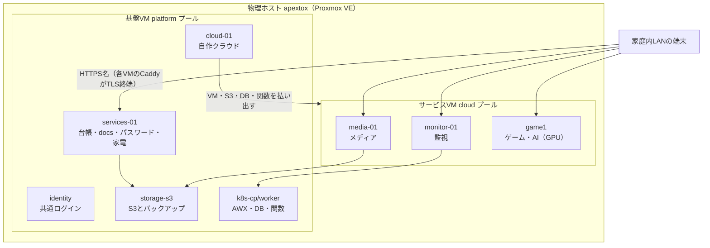

| 役割 | VM（プール） | 配分（計画。実機は台帳） | 中身 |
| --- | --- | --- | --- |
| 物理基盤 | apextox（ホスト） | Ryzen 9 8945HS 8コア/16スレッド、RAM 59.7GiB、SSD 1TB | Proxmox VE。全VMとGPUパススルー |
| 共通ログイン | identity（platform） | 2 / 4GiB / 32GiB | Authentik。SSO・招待・復旧 |
| 自作クラウド | cloud-01（platform） | 2 / 2GiB / 40GiB | shakecloud API・管理DB・ポータル |
| 台帳・docs・パスワード・家電 | services-01（platform） | 2 / 4GiB / 48GiB（計画4 / 8GiB） | NetBox・Shake Lab Docs・Homarr・Vaultwarden・Home Assistant・Eufy中継・CUPS |
| S3・バックアップ | storage-s3（platform） | 2 / 1GiB / OS16＋データ32GiB | Garage（S3互換） |
| クラスタ | k8s-cp-01・k8s-worker-01・k8s-worker-02（platform） | cp 2 / 3GiB / 32GiB、worker 4 / 8GiB / OS32＋データ64・48GiB | Kubernetes・AWX・CloudNativePG・Knative |
| メディア | media-01（cloud） | 4 / 6GiB / OS32＋データ64GiB | Nextcloud・Kavita・Navidrome・FreshRSS |
| 監視 | monitor-01（cloud） | 2 / 2GiB / OS32＋データ32GiB | Prometheus・Alertmanager・Grafana・PeaNUT・exporter |
| ゲーム・AI | game1（cloud） | 8 / 現行12GiB（16GiB候補） / 256GiB、GPUパススルー | Wolf・RomM・SFTPGo。将来OllamaとRAG |
| 復旧経路 | net-01（cloud） | 1 / 512MiB / OS10GiB | Tailscale subnet router。宅外から管理LANへ（N02） |
| 開発 | dev-a・dev-b（dev） | 各2 / 6GiB / 40GiB | Terraform・Docker・Go |
| 検証 | probe-01（lab） | 2 / 2GiB / 32GiB | 復元ドリル用（停止中） |
| 利用者VM（例） | win11pro（cloud） | 2 / 4GiB / 64GiB | APIが作る検証VM（停止中） |

VMの管理方法はプールで揃えています。**基盤VMは Terraform（`platform/terraform/hosts.yaml`）**、**cloudプールのVMは自作API・Provider（`platform/terraform/services/<name>/`）** が作り、IPはどちらも NetBox から採番します。VMID帯は platform 100–399、dev 400–499、lab 900–999、cloud 5000–5999 です（[配分と運用設計](architecture/operations.md)）。

## 2. 自作しているもの（OSSとの分担）

既製ソフトはそのまま使い、**足りない部分・運用の自動化・機器連携を自作**しています。クラウドだけではありません。

| 自作部分 | 場所 | 何をする |
| --- | --- | --- |
| shakecloud | `cloud/` | VM・S3・DB・関数を払い出すAPI、OpenAPI、CLI、Terraform Provider、ポータル（§5） |
| identityの運用自動化 | `stacks/identity/` | グループ・OIDCクライアント・招待フロー・メール復旧・Email OTP・パスキーを冪等に整える（§4） |
| Nextcloud連携アプリ | `stacks/media/nextcloud/apps/` | `shake_print`（印刷）・`shake_localsend`（送信）・`shake_tags`（タグ編集） |
| 印刷・転送の橋渡し | `stacks/print-api/`・`stacks/localsend-send/` | Nextcloud → CUPS の自作API、Nextcloud → 端末のLocalSend送信 |
| 音楽ライブラリの整理 | `stacks/music-tools/`（`tag_api.py`・`organize.py`・同期） | タグ編集API、ライブラリ整理（plan/apply/undo）、同期 |
| FreshRSSの共有タイムライン | `stacks/media/freshrss/extensions/` | 全員で1つの購読リストを共有する system 拡張 `SharedFeeds` |
| Home AssistantのSSO・配備 | `stacks/home-assistant/` | OIDC統合の版固定導入、逆プロキシ設定、バックアップ、Eufy統合の導入（§6・§8） |
| Eufy中継の運用 | `stacks/eufy-security-ws/` | 中継コンテナの構成、資格情報のSOPS受け渡し、セッション・CAPTCHA時の復旧手順 |
| 監視の設定 | `stacks/monitoring/` | Prometheusのスクレイプ・アラート、blackboxのHTTPS監視、UPS・PeaNUT連携（§9） |
| デプロイ・検証ツール | `tools/`・`tests/`・`.github/workflows/` | Terraform/k8s/devvmラッパー、実機プローブ、公開前検査、ユニットテスト（§14） |

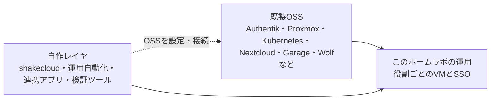

## 3. 物理ホスト（apextox）

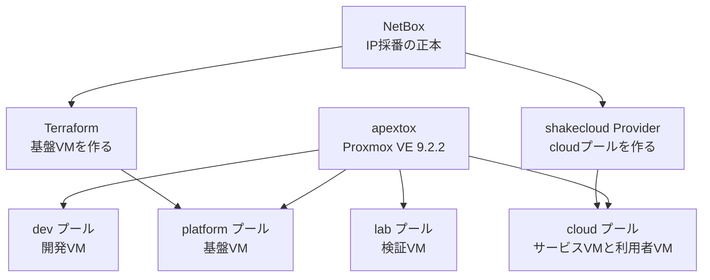

| 項目 | 実測（2026-09-12、I01。VM割当は2026-09-17再測） |
| --- | --- |
| CPU | Ryzen 9 8945HS、8コア/16スレッド |
| RAM | Proxmoxの認識で 59.7GiB（64GB公称からファーム・iGPU予約を引いた値） |
| SSD | CT1000E100SSD8 1TB。SMART PASSED、Percentage Used 0% |
| VMディスク | `local-lvm` 794.3GiBのうち使用 226.7GiB（29%）。シンプロビジョニング |
| イメージ・ISO置き場 | `local` / `cloud-images` 約94GiBのうち使用 22.0GiB |
| 稼働中VMの割当合計 | 43.6GiB（稼働11台、2026-09-17再測）。ホストの実空き 12GiB |

**GPUは game1 へパススルー**しており、ゲーム配信と将来のローカルAI・RAGで共有します（§10）。停止中も含めた全VMの割当合計は物理RAMを超えるため、全台同時起動はできません。メモリはバルーニングを前提に「ノードに4GiB残す」「ディスク実使用率85%で断る」の2つでホストを守ります。

## 4. 共通ログイン（identity・VMID 110）

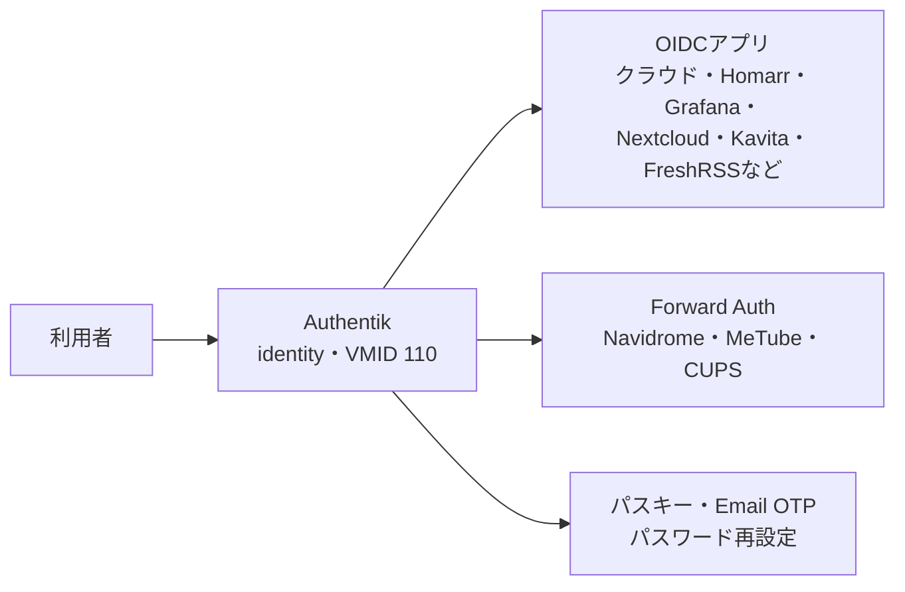

Authentik（既製）を identity VM に置き、**その設定を自作コードで冪等に整えます**。グループは `users`（一般）と `admins`（管理者）の2つだけです。

- `configure.py`: OIDCクライアントとForward Auth、`sub` は `user_uuid`、Kavita・Vaultwarden向けの検証済みメール用スコープマッピング。
- `invitations.py`: 招待専用フロー。1回限り・24時間で、ユーザー名・メール・グループは招待側が固定。SMTP（Gmail）で送り、送れなければリンクを0600で保存。
- 復旧: Email OTP とパスワード再設定フロー。パスキーを失ってもメールコードで通過できます。
- パスキー: パスワードレス有効。登録は `auth.apextox.dpdns.org` の名前に結び付きます。

| アプリ | 主な方式 |
| --- | --- |
| クラウド・Homarr・Grafana・Vaultwarden・NetBox | OIDC |
| Home Assistant | OIDC（community統合。緊急用ローカルも残す） |
| Nextcloud・Kavita・FreshRSS | 各アプリのOIDC |
| Navidrome・MeTube・CUPS | Forward Auth（APIは自前認証を分離） |

## 5. 自作クラウド shakecloud（cloud-01）

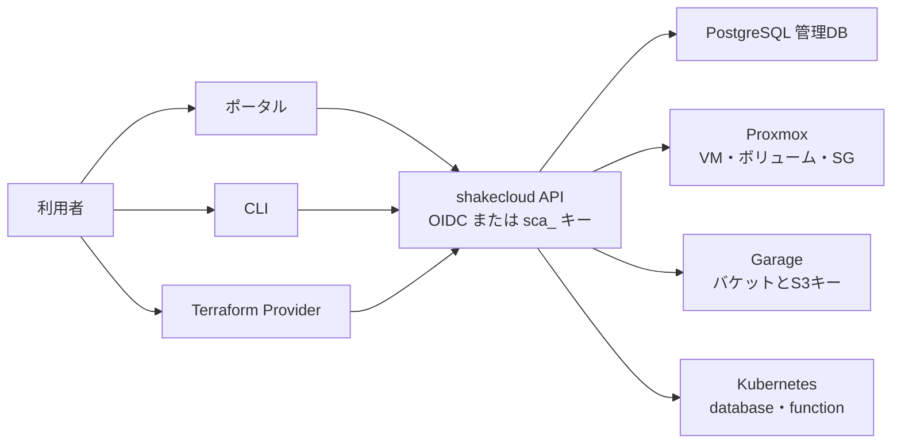

AWS の語彙・状態遷移・フィールド名に揃えた自作のプライベートクラウドです。**`cloud/openapi/shakecloud.yaml` がAPIの正本**で、Go のルート表との一致をテストが検査します。

| 部分 | 置き場所 | 中身 |
| --- | --- | --- |
| API | `cloud/api` | Go・標準 `net/http`・`pgx`・`go-oidc`。CSRFは `http.CrossOriginProtection` |
| 管理DB | `cloud/compose.yaml` | PostgreSQL。起動時にマイグレーションを適用 |
| ポータル | `cloud/api/internal/server/web` | VM・ボリューム・SG・イメージ・ISO・SSH鍵・アクセスキー・バケット・S3キー・database・function・容量・上限・履歴 |
| CLI | `cloud/cli` + `cloud/client` | 標準ライブラリのみ。instance・volume・sg・image・key・access-key・bucket・s3-key・database・function・capacity・limits・events・identity |
| Terraform Provider | `cloud/provider` | `shakecloud_*` のリソースとデータソース |
| 配備 | `platform/ansible/roles/cloud_api` | cloud-01 の `/opt/cloud-stack` |

提供する4機能はすべて API・CLI・Provider・ポータルで揃っています。

| 機能 | 実体 | できること |
| --- | --- | --- |
| VM | Proxmox | 作成・電源・コンソール・サイズ変更・削除・既存VMの引き取り。IPはNetBoxから採番 |
| ボリューム / セキュリティグループ | Proxmox | 追加ディスクの作成・接続・拡張・デタッチ、受信/送信ルール |
| バケット | Garage | バケットとS3キーの作成、キーごとの権限 |
| database | CloudNativePG | PostgreSQLクラスタの作成、接続情報の発行 |
| function | Knative | コンテナイメージからサーバレスHTTPを作成しURLを発行 |

設計上の決めごとの要点: 認証はOIDCとアクセスキー `sca_<keyid>.<secret>` の2経路。**VMは全員に見え、操作は所有者と `admins` だけ**。サイズは自由入力で、vCPU・メモリ変更は停止中のみ。イメージは12GiBまでAPIへ直接アップロード。WebコンソールはnoVNCを同梱（CDN不使用）。上限と容量は `platform/terraform/cloud.yaml` を既定に `admins` が上書きでき、「ノードに4GiB残す」「ディスク85%」の保護は常に効きます。詳細は[最小クラウドとProvider](architecture/cloud.md)にあります。

## 6. services-01（台帳・docs・パスワード・家電）

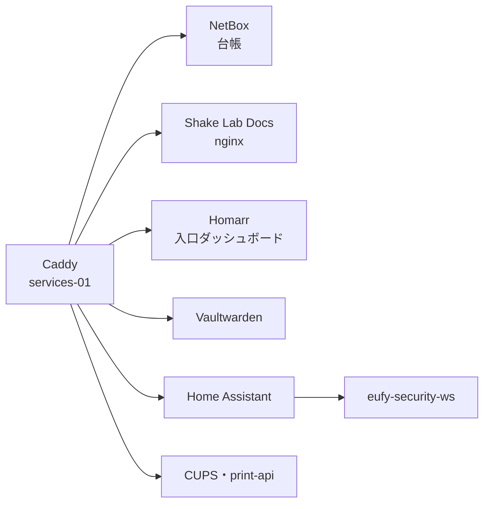

services-01 は「家の台帳と道具」を置くVMです。サービスは別々のComposeプロジェクトで、ポートは127.0.0.1に閉じ、入口は同じVMのCaddyです。

| サービス | 中身 | 認証 |
| --- | --- | --- |
| NetBox | VM・IP・タグの台帳。Ansibleの動的インベントリとクラウドAPIが読む | OIDC |
| Shake Lab Docs | この文書サイト。原稿はGitの `docs/` が正本で、Ansibleが `mkdocs --strict` で配備 | なし（LAN内） |
| Homarr | サービスの入口ダッシュボード。タイルと権限をコードから冪等反映 | OIDC（閲覧 `users`・編集 `admins`） |
| Vaultwarden | パスワード管理。一般登録と組織招待は無効 | OIDC（マスターパスワードは別） |
| Home Assistant | 家電の操作・自動化 | OIDC＋緊急用ローカル（§8） |
| eufy-security-ws | EufyクラウドとHAをつなぐWebSocket中継。LAN非公開 | HAのComposeネットワーク内だけ |
| CUPS・print-api | Canon TS8430への印刷と、Nextcloudの「印刷」を受ける自作API | 端末はIPP、`/admin` は入口で拒否 |

## 7. メディア（media-01）

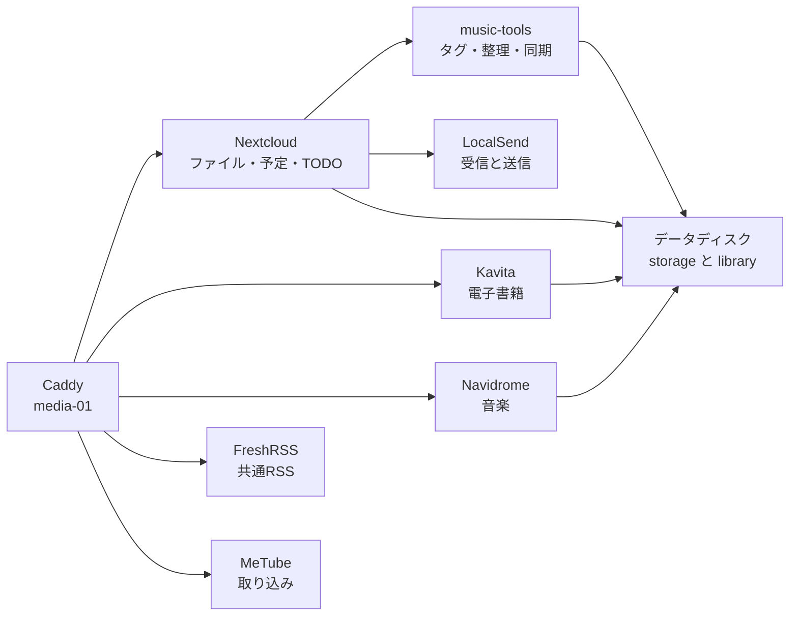

media-01 はクラウドAPIで作った `cloud` プールのVMです。データディスクを `/srv/media-stack` にマウントし、**マウントが完了するまでDockerを起動しません**（未マウントの原本領域へ書かせない）。サービスは127.0.0.1に閉じ、同じVMのCaddyがHTTPSとSSOを担います。

| サービス | 中身 | 認証 |
| --- | --- | --- |
| Nextcloud | ファイル共有に加え、Calendar・Tasks・Text。`books`・`music`・`docs`・`inbox` を共有ライブラリとして登録 | OIDC |
| Kavita | 電子書籍リーダー。原本は読み取り専用 | OIDC |
| Navidrome | 音楽ストリーミング。Subsonicクライアント用にSSOなしの入口を分離 | Forward Auth／APIは自前認証 |
| FreshRSS | 全員で1つの購読リストを共有する共通RSS。自作の `SharedFeeds` 拡張が購読を同報 | OIDC |
| MeTube | 動画・音源の取り込み | Forward Auth |
| music-tools | 変換・タグAPI・同期。`organize.py` でライブラリを整理 | タグAPIはトークン |
| LocalSend | 受信機（着地はNextcloudの `inbox`）と、Nextcloudから端末へ送る自作連携 | 端末アプリ／Nextcloudから |
| Picard | タグ編集は `shake_tags` に統合し、コンテナは撤去済み | — |

導線は「MeTubeで取り込む → Nextcloudの `music` に置く → タグを編集する → Navidromeで再生する」です（[音楽・取り込み・タグ](services/music.md)）。

## 8. 家電（Home Assistant on services-01）

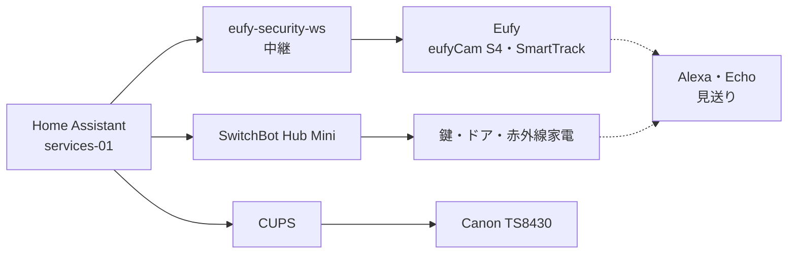

家電は services-01 の Home Assistant Container に集めています。SSOはAuthentik、遠隔操作は現状LAN内だけです。

| 対象 | 接続 | 現状 |
| --- | --- | --- |
| Home Assistant | HA 2026.9.2。設定は `/srv/services/home-assistant/config` が正本 | SSO＋緊急用ローカル。バックアップと復元試験は未完 |
| Eufy | `eufy-security-ws` とHA統合 `eufy_security` | eufyCam S4（単体・ソーラー・fw 1.1.1.2）とSmartTrackで、ログイン・デバイス一覧・Push・スナップショットは動作。イベントのHA取り込みは確認中。**ライブ映像は新WebRTC方式のため現行ソフトでは不可**（[H04](development/H04-eufy.md)） |
| SwitchBot | Hub Mini経由のSwitchBot Cloud統合 | 鍵・ドアセンサー・赤外線家電（エアコン・テレビ・照明等）のエンティティを確認。実機操作は確認待ち |
| プリンター | Canon TS8430 を IPP Everywhere でCUPSに登録 | LAN内の端末からキュー `ts8430` で印刷。Nextcloudからの印刷も動作（[プリンター](services/printer.md)） |
| Alexa / Echo | Home Assistant Cloudも独自Skillも作らない | 見送り。SwitchBotとEufyは各社のAlexaスキルで操作可能 |

## 9. 監視（monitor-01）

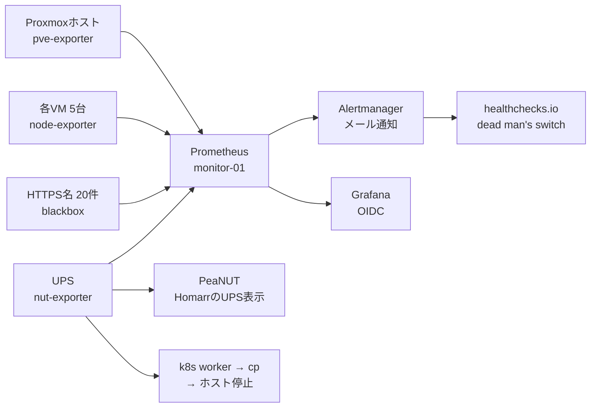

監視は monitor-01 に独立させ、物理ホスト・UPS・各VM・HTTPS名を横断して見ます。Grafanaは identity のOIDCで閲覧します（`admins`=Admin、`users`=Viewer）。**2026-09-17時点で28ターゲットを収集**（HTTPS名20・node_exporter 5台・pve-exporter・nut-exporter・Prometheus自身）。blackboxの失敗はk8s停止中によるAWXの1件だけで、他は成功しています。

| 見るもの | 方法 |
| --- | --- |
| ProxmoxホストとVM | pve-exporter、VM内は node-exporter（5台） |
| UPS | nut-exporter。低電池時は upsmon が **k8s worker → control plane → ホスト** の順で停止（猶予60秒。2026-09-16実装） |
| HTTPS名 | blackboxが疎通と証明書を確認。ログイン用のリダイレクト（302）や401/403は「生きている」とみなす |
| ノード資源 | ディスク空き15%未満・空きメモリ10%未満・OOM kill・systemd unit failed・計画外再起動 |
| バックアップ | 管理DBの最終成功時刻をメトリクス化（`backup_last_success_timestamp_seconds`）。36時間の停滞と欠測そのものを通知 |
| 通知 | AlertmanagerがGmailでメール。監視経路そのものの死活は healthchecks.io のdead man's switchで外部から見る |
| Homarr連携 | 実装済み。Proxmox連携のSystem HealthとPeaNUT経由のUPSウィジェット |

## 10. ゲームとAI（game1・GPUパススルー）

game1 は **GPUをパススルーした** `cloud` プールのVMです（8vCPU・現行12GiB、16GiB候補、256GiB）。ゲーム配信と将来のローカルAI・RAGを同じVMで動かし、**GPUを増設したら Ollama と汎用RAGを載せる予定**です（[A02](development/A02-ollama.md)・[A03](development/A03-rag.md)・[G03](development/G03-game-ai-resources.md)）。VMを停止するとゲーム・AI・Bot・ライブラリも止まります。

ゲームスタックは別の開発者が担当し、Ansible（`site.yml` と `roles/*`）が設定・Compose fragment・env を生成して `game-server-next.service` で起動する構成です。構成ファイルはまだ本リポジトリへ取り込まれていません。

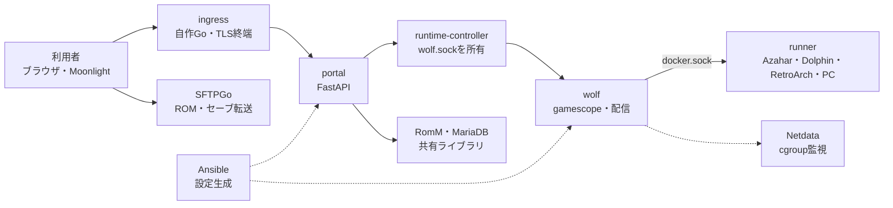

- **常駐コンテナ**: ingress（自作Go・CaddyとCloudflare DNSプラグインを自前ビルド、TLS終端と振り分け）、portal（自作FastAPIのモノリス。auth・data・runtime・portal・metricsを同梱）、runtime-controller（Wolfの `wolf.sock` を所有しHTTPで公開）、wolf（本家に独自patchを当てたビルド。gamescope/GStreamer、`docker.sock` 保持）、RomM・MariaDB（既製。共有ライブラリの権威）、SFTPGo（既製）、Netdata（既製）。
- **runner**: FedoraベースにAzahar・Dolphin・RetroArch・Lutris・Wine・Pegasusを固定版で同梱した自作イメージ。Wolfが `docker.sock` 経由で都度起動し、`RUNNER` で中身を切り替えます。起動ロジックは自作Pythonアダプタがargvを組み立てます。
- 品質の判定は [G01 Wolf](development/G01-wolf.md)・[G02 Azahar](development/G02-azahar.md)・[W07 RomM](development/W07-romm.md) で管理します。

## 11. Kubernetes（k8s-cp-01 / k8s-worker-01 / k8s-worker-02）

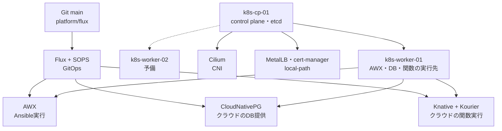

kubeadm＋Ciliumのクラスタです。**自作クラウドの「database」と「function」はここで動く**ため、worker-01 には AWX に加えて CloudNativePG と Knative が載っています。**2026-09-12時点で3台とも停止中**で、使うときは容量を確認して `tools/k8s up` で起動します（[Kubernetes クラスタ](operations/kubernetes.md)）。

| 役割 | ソフト |
| --- | --- |
| クラスタ | Kubernetes・containerd |
| CNI | Cilium（kube-proxyを置き換え） |
| 永続化 | local-path-provisioner |
| LoadBalancer | MetalLB（L2） |
| 証明書 | cert-manager（自前CAとCloudflare DNS-01） |
| GitOps | Flux + SOPS。`main` の `platform/flux` を適用 |
| Ansible実行 | AWX（ジョブテンプレートはこれから） |
| DB提供 | CloudNativePG（`databases` namespace、APIのServiceAccountは最小RBAC） |
| 関数 | Knative + Kourier（関数URLはHTTPS） |

## 12. ストレージとバックアップ（storage-s3ほか）

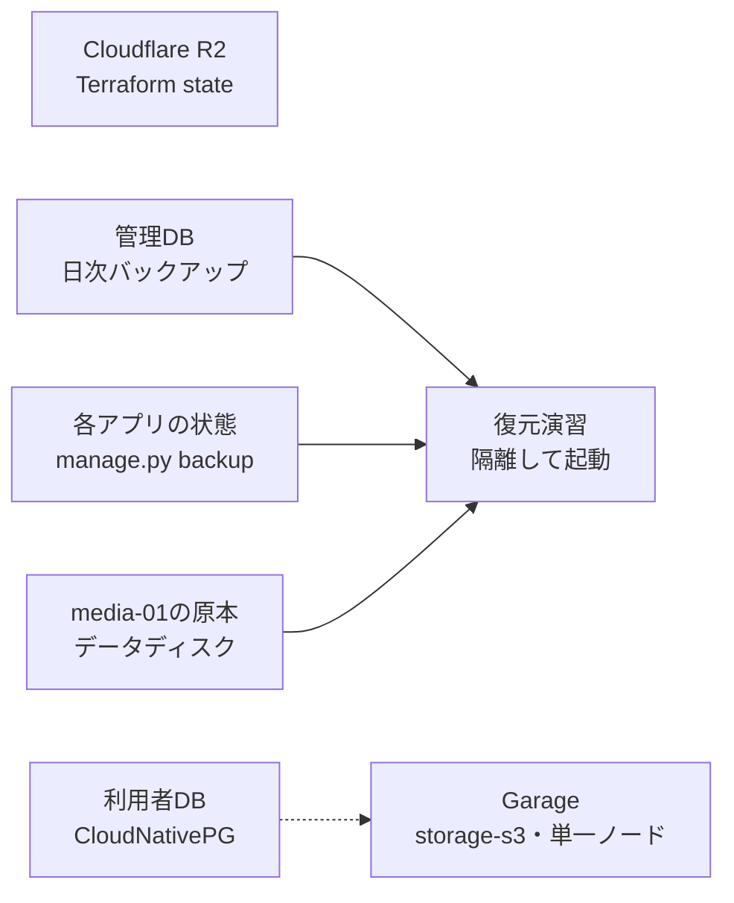

| 対象 | 実体 | 注意点 |
| --- | --- | --- |
| S3互換ストレージ | Garageをstorage-s3に単一ノードで | **冗長性なし。唯一の保存先・唯一のバックアップにしない** |
| Terraform state | Cloudflare R2 | stateには秘密値が入り得るためGitへ入れない |
| メディア原本 | media-01のデータディスク。`storage/`（設定・DB）と `library/`（books・music・docs・inbox） | volumeは `prevent_destroy`。アプリのバックアップに原本は含まない |
| 管理DB | cloud-01で毎日バックアップ（14世代）。最終成功時刻をメトリクス化し36時間停滞でアラート | 同じホストのディスクなのでディスク故障対策にならない。外部コピーは未着手 |
| 利用者DB | CloudNativePG | バックアップは未整備 |
| アプリ状態 | 各スタックの `manage.py backup` がサービスを止めて取得 | 復元は空のディレクトリへ。外部保全先の確定が前提 |

方針は「**失っても Git・外部state・バックアップから隔離復元できる**」ことです。同じSSD上のVMコピーは物理障害対策として数えません。

## 13. ネットワークと公開範囲（全VM共通）

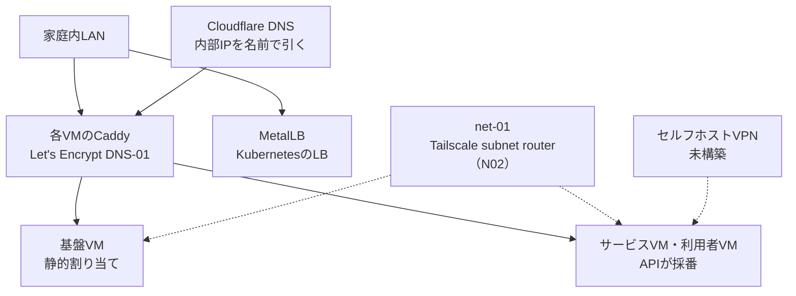

- **名前とTLS**: ゾーンは `apextox.dpdns.org`（Cloudflareに委任）。`platform/terraform/dns.yaml` が名前の正本で、**各VMのCaddy**（`stacks/tls-proxy/`）が自分の名前だけを受けて `127.0.0.1` のサービスへ中継します。証明書はDNS-01で取得。**入口を1台に集めない**のは、認証基盤を他ホストの障害に巻き込まないためです。
- **公開範囲**: Cloudflareの公開DNSに内部IPを書いており、インターネットへは公開していません。外から名前は引けますが届きません。NetBoxとdocsの直ポートは残作業で閉じます。
- **LANの外**: 公開Web入口やセルフホストVPNは未構築です。復旧経路として cloud VM `net-01` の Tailscale subnet router が管理LAN（`192.168.10.0/24`）を広告します（Tailscaleへ参加済み・ルート承認が未了）。[net-01（Tailscale subnet router）](operations/net.md)・[N02](development/N02-tailscale.md)。
- **VLAN**: 管理側はタグなしのまま、利用者VMだけをタグ付きVLANへ移す計画です。物理スイッチ・ルーターの作業待ちです（[N03](development/N03-vlan.md)）。
- **既知だった障害**: クラウドが使うレンジがルーターのDHCP配布範囲と重なり、他端末がサービスVMのIPを取得して到達不能になった実例がありました（2026-09-12、media-01）。**2026-09-14に解消済み**（ルーター側で対応。net-01 作成前に確認）。

## 14. 開発・運用の進め方（dev-a・dev-b）

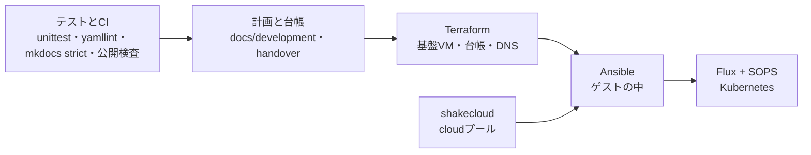

**コードで管理できるものはすべてコードにします。** 残った手作業は[初回セットアップの順番](operations/bootstrap.md)に理由付きで列挙しています。

| 対象 | 道具 | 原則 |
| --- | --- | --- |
| 基盤VM・台帳・DNS | Terraform（`platform/terraform/*.yaml`） | 秘密でない宣言はGitのYAML。`site.yaml` は実機から生成 |
| ゲストの中 | Ansible（`platform/ansible/`） | NetBoxの動的インベントリと、cloud VM用の `inventory.cloud.py`。再実行で変更ゼロを目指す |
| Kubernetes | Flux + SOPS | `main` の `platform/flux` を適用。秘密値はageで暗号化 |
| クラウド | shakecloud API・CLI・Provider | 1サービス1 state。Providerの資格情報はstateへ書かない |
| 秘密値 | SOPS + age（`platform/sops/`） | 自動生成し、復号鍵は作業機とクラスタにだけ置く |

作業は[機能別VMと並列開発計画](development/index.md)のID（W・A・G・H・N・I・M・O・D）で管理し、**仕様と進捗の正本は個別計画書、実機の配備結果は[配備台帳](operations/handover.md)** に記録します。計画の作成を配備済みとは扱いません。検査は `python3 -m unittest discover -s tests`、`yamllint`、`mkdocs build --strict`、`tools/check-publication.py`、Goの `vet`・`test`、実機E2E（`tools/verify-*.py`）をCIと同じように手元で流せます。

## 15. 既知の制約とこれから

| 項目 | 現状 | これから |
| --- | --- | --- |
| Eufyのライブ映像 | S4の新WebRTC方式に対応する公開ソフトがなく不可 | イベント・スナップショットで運用。後継SDKでの実装は保留（[H04](development/H04-eufy.md)） |
| VPN | 未構築。LANの外から常用サービスへは使えない | NetBirdを第一候補に、外部到達と認証入口を確認してから配備（[N01](development/N01-vpn.md)） |
| 復旧用Tailscale | **subnet router `net-01` を作成しTailscaleへ参加済み（2026-09-14、`100.91.7.69`）**。ルート承認・ACL・宅外DNS検証が未了 | 管理LANの範囲だけを広告し、切戻しを文書化（[N02](development/N02-tailscale.md)・[net.md](operations/net.md)） |
| VLAN分離 | 宣言と安全装置・手順は用意済み。未設定 | 物理スイッチ・ルーターとbridgeのVLAN対応が前提（[N03](development/N03-vlan.md)） |
| 管理DBの外部バックアップ | ローカルに14世代。外部コピーなし | 別ディスク・別機器への暗号化コピーと復元照合（[O01](development/O01-cloud-backup.md)） |
| CNPGのバックアップ | 未整備 | GarageへのベースバックアップとWAL（[O02](development/O02-cnpg-backup.md)） |
| 復元の合格 | ツールはあるがアプリ横断の隔離復元が未合格 | 原本・state・秘密を一組として手順を確定（[O03](development/O03-restore.md)） |
| 監視（M01） | 稼働。28ターゲットを収集しAWX（k8s停止中）以外のプローブは成功。node資源・バックアップ・dead man's switch、UPS自動停止、Homarr連携まで完了 | ダッシュボードの拡充と、外部監視の冗長化（別電源のラズパイ）（[M01](development/M01-monitoring.md)） |
| メディアのデータ移行 | media-01への配備は完了。実データ移行とログイン実測が未完 | W03〜W06の手順で移行し容量を再測定（[W06](development/W06-music-tools.md)） |
| Home Assistantの復元 | バックアップと復元試験が未完 | `manage.py backup` から隔離復元まで確認（[H01](development/H01-home-assistant.md)） |
| Kubernetesの常用 | 3台停止中。DB・関数はここに依存 | 容量を確認して起動・join（[Kubernetes](operations/kubernetes.md)） |
| 公開Web入口 | 要件検討中。未作成 | 公開要件が揃ったらcloud VMとして追加（[N04](development/N04-public-edge.md)） |
| タイムゾーンの適用残り | 宣言は`Asia/Tokyo`へ修正済み（2026-09-17）。dev-bは未適用、k8sノード・probe-01は停止中 | 次の配備・起動で適用される（UTCへ戻る事故は解消） |

## 関連ページ

- 使い方（利用者向け）: [全サービスの使い方](services/usage.md)・[クラウドの使い方](services/cloud.md)・[Nextcloudの使い方](services/nextcloud-guide.md)・[Home Assistantと家電の使い方](services/home-assistant.md)・[プリンター](services/printer.md)
- 構築・運用（管理者向け）: [サービスの置き場所とクラウドVM](operations/services.md)・[認証基盤](operations/identity.md)・[Kubernetes クラスタ](operations/kubernetes.md)・[Terraformの実行](operations/terraform.md)・[Garage](operations/garage.md)・[NetBoxの使い方](operations/netbox.md)・[電源とUPS](operations/power.md)
- 設計: [最小クラウドとProvider](architecture/cloud.md)・[ネットワーク・公開範囲・SSO](architecture/network-auth.md)・[IaCの所有境界](architecture/iac.md)・[配分と運用設計](architecture/operations.md)
