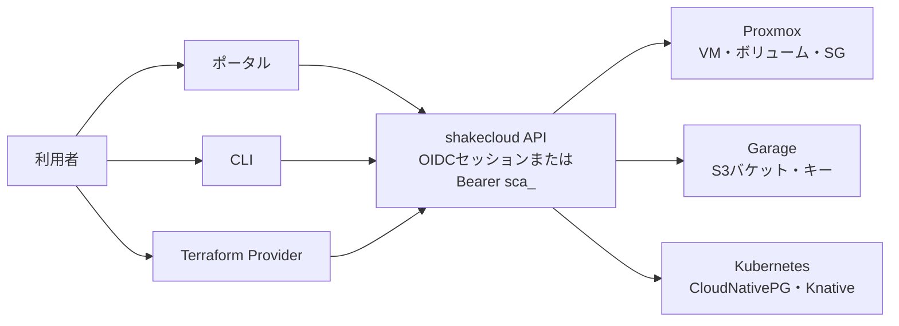

# ホームラボの全体像（詳細）

更新日: 2026-09-13

このページは、「このホームラボで何をしているのか」を1枚で伝えるための**詳細版**です。使っているツール、サービス間の連携、自作している部分、実機の構成、いまの制約までを書きます。**Proxmox VE の1台の上に役割ごとのVMを分け、自作のプライベートクラウド `shakecloud` でVM・S3・データベース・関数を払い出し、共通ログインを Authentik に集約し、常用サービス・メディア・家電・監視を家庭内LANのHTTPS名から使っています。**

- 実機のVM・IP・状態の正本: [クラウド開発の引き継ぎとTODO](operations/handover.md)（配備台帳）
- サービスを探す入口: [接続先一覧（URL・アドレス）](operations/urls.md)
- 誰が何を作るかの境界: [IaCの所有境界](architecture/iac.md)
- 作業IDごとの計画: [機能別VMと並列開発計画](development/index.md)
- 秘密値の置き場所: [秘密値の管理（SOPS + age）](operations/secrets.md)

## 1. 概要

物理ホストは Proxmox VE の1台だけで、その上に「基盤VM（`platform` プール）」と「利用者・サービスVM（`cloud` プール）」を分けて載せています。基盤VMは Terraform が作り、ゲストの中は Ansible が整え、Kubernetes のアプリは Flux と Git から配ります。自作部分の中心は `cloud/` の **shakecloud**（Go の REST API・OpenAPI・PostgreSQL の管理DB・セルフサービスポータル・CLI・Terraform Provider）で、AWS の語彙で VM・S3・database・function の4機能を操作できます。認証は identity VM の Authentik に集約し、招待・メール復旧・Email OTP・パスキーを `stacks/identity/` のコードで自動化しています。常用サービスは services-01、メディアは media-01、監視は monitor-01、ゲームとAIは game1 に分け、すべて `*.apextox.dpdns.org` のHTTPS名で家庭内LANから使います。

## 2. 全体構成図

読み方のポイントは3つです。**上から下へ「物理 → 基盤VM → 入口 → 自作クラウド → アプリ群」**の順です。**shakecloud は cloud-01 で動き、利用者VMを作る側なので `cloud` プールには置きません。** **HTTPSの入口は1台に集めず、各VMの Caddy が自分の名前だけを受けます。**

```mermaid
flowchart TB
  user["家庭内LANの端末<br/>ブラウザ・スマホアプリ・SSH"]

  subgraph pve["Proxmox VE ホスト apextox<br/>Ryzen 9 8945HS・RAM 59.7GiB・SSD 1TB"]
    subgraph platform["基盤VM platform プール"]
      identity["identity 110<br/>Authentik 共通ログイン"]
      cloud01["cloud-01 140<br/>クラウドAPIと管理DB"]
      services01["services-01 150<br/>常用サービス・台帳・文書"]
      s3["storage-s3 130<br/>Garage S3"]
      k8scp["k8s-cp-01 200<br/>control plane・etcd"]
      k8sw1["k8s-worker-01 210<br/>AWX・database・function"]
      k8sw2["k8s-worker-02 211<br/>予備・停止中"]
    end
    subgraph cloudpool["クラウドVM cloud プール"]
      media["media-01<br/>メディア一式"]
      monitor["monitor-01 5002<br/>監視一式"]
      game["game1 100<br/>ゲーム・AI・GPUパススルー"]
      win11["win11pro 5000<br/>検証・停止中"]
      holder["shakecloud-volumes 5997<br/>ボリューム保持・停止中"]
    end
  end

  subgraph entry["名前とHTTPSの入口"]
    dns["Cloudflare DNS<br/>内部IPをAレコードで登録"]
    tls["各ホストのCaddy<br/>Let's Encrypt DNS-01"]
  end

  subgraph shake["自作クラウド shakecloud"]
    api["Go REST API<br/>OpenAPIが正本"]
    portal["セルフサービスポータル"]
    cli["CLI"]
    provider["Terraform Provider"]
    adb["PostgreSQL 管理DB<br/>アカウント・監査ログ"]
    features["VM・S3・database・function"]
  end

  subgraph k8s["Kubernetes 1.36.4"]
    cilium["Cilium 1.20.1<br/>kube-proxy置換"]
    flux["Flux 2.9.5 + SOPS"]
    awx["AWX 24.6.1"]
    cnpg["CloudNativePG 1.30.0"]
    knative["Knative 1.23 + Kourier"]
    metallb["MetalLB 0.16.1"]
    certmgr["cert-manager 1.21.2"]
    localpath["local-path 永続化"]
  end

  subgraph common["services-01 の常用サービス"]
    netbox["NetBox 台帳"]
    docs["Shake Lab Docs"]
    homarr["Homarr 入口"]
    vault["Vaultwarden"]
    ha["Home Assistant 2026.9.2"]
    eufyws["eufy-security-ws 中継"]
    cups["CUPS 印刷"]
  end

  subgraph mediastack["media-01 のメディア"]
    nextcloud["Nextcloud<br/>Calendar・Tasks・Text"]
    kavita["Kavita"]
    navidrome["Navidrome<br/>Subsonic API入口"]
    freshrss["FreshRSS<br/>共有RSSタイムライン"]
    metube["MeTube・変換・タグAPI"]
    localsend["LocalSend 受信・送信"]
  end

  subgraph home["家電と印刷"]
    eufy["Eufy eufyCam S4・SmartTrack"]
    switchbot["SwitchBot Hub Mini<br/>鍵・ドア・赤外線"]
    printer["Canon TS8430"]
  end

  subgraph store["ストレージとバックアップ"]
    garage["Garage v2.4.1<br/>単一ノード RF1"]
    r2["Cloudflare R2<br/>Terraform state"]
    mediaDisk["media-01 データディスク<br/>OS32GiB＋データ64GiB"]
    adbBackup["管理DBの日次バックアップ"]
  end

  subgraph mon["監視 monitor-01"]
    prom["Prometheus"]
    alert["Alertmanager"]
    grafana["Grafana"]
    exporters["node・pve・nut・blackbox"]
    peanut["PeaNUT"]
  end

  user --> dns
  dns --> tls
  tls --> identity
  tls --> cloud01
  tls --> services01
  tls --> media
  tls --> monitor
  cloud01 --> api
  portal --> api
  cli --> api
  provider --> api
  api --> adb
  api --> features
  features --> media
  features --> monitor
  features --> game
  features --> win11
  features --> holder
  features --> garage
  features --> k8scp
  identity --> services01
  identity --> media
  identity --> monitor
  services01 --> netbox
  services01 --> docs
  services01 --> homarr
  services01 --> vault
  services01 --> ha
  services01 --> cups
  services01 --> eufyws
  k8scp --> cilium
  k8scp --> flux
  k8scp --> metallb
  k8scp --> certmgr
  k8scp --> localpath
  k8sw1 --> awx
  k8sw1 --> cnpg
  k8sw1 --> knative
  flux --> awx
  flux --> cnpg
  flux --> knative
  k8sw2 -.予備.- k8sw1
  ha --> eufyws
  ha --> eufy
  ha --> switchbot
  eufyws --> eufy
  cups --> printer
  media --> nextcloud
  media --> kavita
  media --> navidrome
  media --> freshrss
  media --> metube
  media --> localsend
  nextcloud --> cups
  nextcloud --> localsend
  media --> mediaDisk
  s3 --> garage
  adb --> adbBackup
  monitor --> prom
  monitor --> alert
  monitor --> grafana
  monitor --> exporters
  monitor --> peanut
```

補足の小さな図です。クラウドの入口は3つあり、裏のAPI・認証・アクセスキーは共通です。

## 3. 物理・仮想化

Proxmox ホストは `apextox`（Proxmox VE 9.2.2）です。管理画面は `https://pve.apextox.dpdns.org:8006`、IP直は `https://192.168.10.126:8006` です。

| 項目 | 実測（2026-09-12、I01） |
| --- | --- |
| CPU | Ryzen 9 8945HS、8コア/16スレッド |
| RAM | Proxmoxの認識で **59.7GiB**（64GB公称からファーム・iGPU予約を引いた値） |
| SSD | CT1000E100SSD8 1TB。SMART PASSED、Percentage Used 0% |
| VMディスク | `local-lvm` 794.3GiBのうち使用 226.7GiB（29%）。シンプロビジョニング |
| イメージ・ISO置き場 | `local` / `cloud-images` 約94GiBのうち使用 22.0GiB |
| 稼働中VMの割当合計 | 35.1GiB。ホストの空き 25.4GiB |

**停止中も含めた全VMの割当合計は物理RAMを超えるため、全台同時起動はできません。** メモリはバルーニングを前提に「ノードに4GiB残す」「ディスク実使用率85%で断る」の2つでホストを守ります（[配分と運用設計](architecture/operations.md)）。

VMIDの範囲は `platform/terraform/pools.yaml` が正本です。基盤 `platform` 100–399、開発 `dev` 400–499、検証 `lab` 900–999、`cloud` 5000–5999 です。`hosts.yaml` は基盤VM専用で、サービスVMは `platform/terraform/services/<name>/` の shakecloud Provider 宣言で作ります（[サービスの置き場所](operations/services.md)）。

| VMID | 名前 | IP | 役割 | 状態 |
| --- | --- | --- | --- | --- |
| 100 | game1 | 192.168.10.127 | Bazziteのゲームサーバ。GPUパススルー hostpci0/1。`cloud` プール | 稼働。APIが `shunyazhiyuan97` の `i-bec54e3a0169b3660` として引き取り済み |
| 110 | identity | 192.168.10.204 | Authentik。SSOの土台なので常時起動 | 稼働 |
| 130 | storage-s3 | 192.168.10.206 | Garage。OS16GiB＋データ32GiB | 稼働。S3 `:3900`、管理API `:3903` |
| 140 | cloud-01 | 192.168.10.205 | クラウドAPIと管理DB。利用者VMを作る側 | 稼働。ポータルは `https://cloud.apextox.dpdns.org` |
| 150 | services-01 | 192.168.10.200 | NetBox・docs・Homarr・Vaultwarden・CUPS・Home Assistant・Eufy中継 | 稼働 |
| 200 | k8s-cp-01 | 192.168.10.207 | Kubernetes control plane・etcd | 停止中（2026-09-12 12:46に正常停止） |
| 210 | k8s-worker-01 | 192.168.10.209 | AWX・CloudNativePG・Knative | 停止中 |
| 211 | k8s-worker-02 | 192.168.10.208 | 予備。OS32＋データ48GiB | 停止のまま。使うときは容量を確認して起動・join |
| 400 | dev-a | 192.168.10.202 | 開発VM | 稼働。2vCPU/6GiB（下限2GiB） |
| 401 | dev-b | 192.168.10.203 | 開発VM・自動化の実行ホスト | 稼働。2vCPU/6GiB（下限2GiB） |
| 900 | probe-01 | 192.168.10.201 | 復元ドリル用の使い捨てVM | 停止中 |
| 5000 | win11pro | 192.168.10.100 | Windows 11 の検証VM | 停止中 |
| 5002 | monitor-01 | 192.168.10.102 | Prometheus・Alertmanager・Grafana・exporter | 稼働。`https://grafana.apextox.dpdns.org` |
| API採番 | media-01 | 192.168.10.101 | Nextcloud・Kavita・Navidrome・FreshRSS・MeTube・LocalSend | 稼働。`i-a06df9a2dfd1ce6db`、4vCPU/6GiB、OS32＋データ64GiB |
| 5997 | shakecloud-volumes | — | デタッチしたボリュームの待機先。起動しない | 停止。APIが初回のボリューム作成時に作る |

タイムゾーンは **コードと実機が食い違っています**。`common` ロールの既定は `Etc/UTC` で、常用VMは手動で `Asia/Tokyo` にした状態です。次に `common` ロールを流すとUTCへ戻るため、JSTに揃える場合は先に既定値を直します（台帳の「ゲストのタイムゾーン」）。

## 4. 自作しているもの

### 4.1 shakecloud（`cloud/`）

AWS の語彙・状態遷移・フィールド名に揃えた自作のプライベートクラウドです。ワイヤ互換（SigV4や本物の `aws` CLI）は作らず、**`cloud/openapi/shakecloud.yaml` が API の正本**です。Go のルート表との一致は `routes_test.go` が検査します。

| 部分 | 置き場所 | 中身 |
| --- | --- | --- |
| API | `cloud/api` | Go 1.27・標準 `net/http`・`pgx`・`go-oidc`。OpenAPIからのコード生成はしない。CSRFは `http.CrossOriginProtection` |
| API定義 | `cloud/openapi/shakecloud.yaml` | 45パスの正本。認証・エラーコード・フィールドを定義 |
| 管理DB | `cloud/compose.yaml` | PostgreSQL 18。起動時にadvisory lock下でマイグレーション `0001`〜`0011` を適用 |
| ポータル | `cloud/api/internal/server/web` | `html/template` と素のJS。VM・ボリューム・SG・イメージ・ISO・SSH鍵・アクセスキー・バケット・S3キー・database・function・容量・上限・履歴 |
| CLI | `cloud/cli` + `cloud/client` | 標準ライブラリのみ。`instance`・`volume`・`sg`・`image`・`key`・`access-key`・`bucket`・`s3-key`・`database`・`function`・`capacity`・`limits`・`events`・`identity` |
| Terraform Provider | `cloud/provider` | terraform-plugin-framework。`shakecloud_*` の10リソースとデータソース `shakecloud_caller_identity` |
| 配備 | platform/ansible/roles/cloud_api + cloud.yml | cloud-01 の `/opt/cloud-stack`。`render_site.py` が Terraform の宣言から `site.json` を生成 |
| 監査ログ | 管理DB | 追記専用（トリガーで UPDATE/DELETE/TRUNCATE を拒否）。`GET /v1/audit-events` とポータルの「履歴」 |

**4機能**はすべて API・CLI・Provider・ポータルで揃っています。

| 機能 | 実体 | できること |
| --- | --- | --- |
| VM（EC2相当） | Proxmox | 作成・電源・コンソール・サイズ変更・削除・既存VMの引き取り。IPはNetBoxから採番 |
| ボリューム / セキュリティグループ | Proxmox | 追加ディスクの作成・接続・拡張・デタッチ、受信/送信ルール |
| バケット | Garage | バケットとS3キーの作成、キーごとの読み書き・所有者権限 |
| database | CloudNativePG | PostgreSQLクラスタの作成、接続情報の発行 |
| function | Knative | コンテナイメージからサーバレスHTTPを作成しURLを発行 |

主な設計上の決めごとです。

- **認証は2経路。** ブラウザは Authentik の OIDC。機械はポータルで発行するアクセスキー `sca_<keyid>.<secret>` を `Authorization: Bearer` で送ります。アクセスキーの発行はポータルのログインからだけで、キーでは別のキーを作れません。1アカウント5本までで、削除は行を残して無効化します。Authentikユーザー1人＝1アカウントです。
- **VMは全員に見え、操作は所有者と `admins` だけ。** 1台のホストを分け合うため、誰が何を動かしているか全員に見えます。他人のVMへの電源操作・削除は403です。
- **サイズは自由入力。** `vcpus`・`memory_mib`・`memory_min_mib`・`ballooning`・`root_disk_gib` を直接指定でき、`instance_type`（`flavors.yaml` の名前）は値を埋める近道です。vCPU・メモリの変更は停止中のみ、ディスクは稼働中も拡大のみ、変更は `admins` だけです。
- **イメージはAPIへの直接アップロード。** 1本12GiBまで。Proxmoxが長さの分からない本文を拒否するため、cloud-01 のディスクへ一度書いてから流します。WindowsはUEFI・TPM 2.0・q35で作り、ISO方式と共有イメージ方式の2経路があります（[Windows 11 ProのVMを作る](operations/windows.md)）。
- **WebコンソールはnoVNC 1.7.0を同梱**（CDN不使用）。5分有効・アカウントに結び付いたURLを発行し、ページを開くたびにProxmoxの新しいチケットを取ります。WebSocketはAPIが中継し、フレームは解釈せず双方向コピーだけします。
- **上限と容量。** 既定は `platform/terraform/cloud.yaml`（1アカウント8台・32vCPU・32GiB・ディスク1000GiB、クラウド全体のメモリ枠32GiBなど）で、`admins` が実行中に上書きできます。管理DBには管理者が変えた項目だけを入れ、読むたびに既定値と重ねます。`0` は無制限ですが、「ノードに4GiB残す」「ディスク実使用率85%」は無制限にしても効きます。
- **後始末を漏らさない。** 作成に失敗しても同じ経路で片付け、Terminateは成功するまで諦めません。外での電源変更には追従しますが、消えて見えるVMは消しません（403なら周回ごと中止）。VMIDは隔離し、プローブ用5998・5999とボリューム保持VM 5997は払い出しません。
- **ポータルのフロント。** 2026-09-12の[Web GUI監査・改善案](audits/webgui-2026-09-12.md)に沿って、送信ロック・入力保持・検索・アップロード段階表示・アクセシビリティを改善しました。新しいJSビルド基盤は増やしていません。

### 4.2 identityの運用自動化（`stacks/identity/`）

Authentik 自体は公式イメージですが、**グループ・OIDCクライアント・招待・復旧をコードで冪等に整える部分が自作**です。配備のたびに `manage.py configure` が走り、2回目はすべて `OK:` になります。

- `configure.py`: グループ `users`・`admins`、OIDCクライアント（`cloud`・`homarr`・`grafana`・`vaultwarden`・`netbox`、HA用の公開クライアント `home-assistant`、Nextcloud・Kavita・FreshRSS のクライアント、Navidrome・MeTube・CUPS のForward Auth）、`sub` は `user_uuid`。KavitaとVaultwardenが要求する「検証済みメール」用の独自スコープマッピングも作ります。
- `invitations.py`: 招待専用フロー `cloud-invitation-enrollment` の作成・発行・一覧・失効。**1回限り・24時間**で、ユーザー名・メール・所属グループは招待側が固定し、本人が決めるのは12文字以上のパスワードだけです。SMTP（Gmail `shake.notify@gmail.com`）で招待メールを送り、送れなければリンクを0600で保存します（[SMTPとメール送信](operations/smtp.md)）。
- 復旧: **メール確認コード**（Email OTP）と**パスワード再設定フロー**を用意。パスキーを失ってもメールコードでログイン検証を通過できます。`akadmin` の復旧先は `SMTP_FROM` です。
- パスキー: **パスワードレス有効**。識別ステージのWebAuthn設定で、ログイン画面にパスキーの自動入力が出ます。詳しい運用手順は[認証基盤（identity・Authentik）](operations/identity.md)。

### 4.3 Home Assistant のSSOと家電連携（`stacks/home-assistant/`）

HAコアはOIDC非対応のため、コミュニティ統合 `hass-oidc-auth` v1.2.1 を**版とSHA256を固定**して入れ、Authentikの公開クライアント（PKCE・秘密値なし）でログインを併設しています。緊急用のローカルオーナーは残します。逆プロキシの信頼設定はHA 2026.9以降 `.storage/http` が正本のため、`manage.py ensure-http-proxy` が `trusted_proxies`（compose固定サブネットのゲートウェイ `172.31.254.1`）を直接反映します。`manage.py install-integration` はEufy統合 `eufy_security` v8.2.4 の導入も行います。

### 4.4 Eufy中継（`stacks/eufy-security-ws/`）

EufyクラウドへログインしてP2Pで機器へつなぐ `bropat/eufy-security-ws` 3.1.0 を中継として動かし、HAは `eufy_security` からWebSocketで接続します。中継はLANへ公開せず、HAのComposeネットワーク内の `eufy-security-ws:3000` だけに届かせます。資格情報はSOPS（`platform/sops/eufy-security.sops.yaml`）から `.env` へ写し、2FAの信頼済み端末セッションは `/srv/services/eufy-security-ws/data` に保存します。現状の可否は「家電」の節に書きます。

### 4.5 Nextcloudの自作アプリと印刷（`stacks/media/nextcloud/apps/`）

Nextcloud のファイル一覧に、自作アプリ `shake_print`（「…」→「印刷」）・`shake_localsend`（「…」→「LocalSendで送る」）・`shake_tags`（「…」→「タグを編集」。MusicBrainz検索つき）を入れています（`1.0.5`）。イメージは固定のまま、htmlボリュームの `custom_apps` へ配備します。

印刷は media-01 → services-01 の `print-api`（`stacks/print-api/`、`:6320`、トークン認証＋送信元をmedia-01だけに限定、最大50MiB）→ CUPS `ts8430` の順で流します。タグ編集のバックエンドは music-tools の `tag_api.py` で、変更前のタグは `storage/tags/tag-backups/` に残します。

### 4.6 ドキュメントと検証ツール（`tools/`・`.github/workflows/`）

この文書サイト自体が成果物です。MkDocs のビルドを Ansible が実行し、`--strict` でリンク切れがあれば配る前に止めます。Mermaid は同梱JSでオフライン描画します（`docs/assets/js/`）。検証ツールは「文書では分からない実機の事実」を機械で確かめるために自作しています。

| ツール | 何をする |
| --- | --- |
| `tools/tf` | Terraformラッパー。SOPSの資格情報だけを環境変数で渡し、基盤モジュールと `services/*` のstateを切り替える |
| `tools/k8s` | k8s VMの起動・停止・状態表示。`hosts.yaml` から対象を読むので宣言とずれない |
| `tools/devvm` | 開発VMの電源操作とSSH。権限は VM.Audit / VM.PowerMgmt / VM.Console だけ |
| `tools/site-yaml.py` | Proxmox APIか survey 出力から `site.yaml` を生成。手書きをなくす |
| `tools/ensure-secrets.py` | 秘密値を生成してSOPSで暗号化。既存値は作り直さない |
| `tools/trim-vms.py` | 再生成できる容量（ビルドキャッシュ・apt）の回収。既定は確認のみ |
| `tools/verify-cloud.py` | Proxmox実機プローブ4つ（空き容量・ISO・プール境界・noVNC）。**絞った `cloudapi@pve` で走らせる** |
| `tools/verify-instances.py` | VM作成→SSHログイン→削除のE2E。残骸があれば失敗 |
| `tools/verify-volumes.py` | ボリューム・セキュリティグループのE2E。実際の遮断・許可まで見る |
| `tools/pve-restore-drill.sh` | Proxmoxホスト上でのバックアップ・復元ドリル。復元VMはNICを切断して起動 |
| `tools/check-publication.py` | 公開前の秘密値・禁止パス検査 |
| `tools/render-architecture-diagrams.py` | Mermaid原稿を自己完結SVGへ描画 |

## 5. 認証・台帳・ドキュメント

### 5.1 Authentik（identity・VMID 110）

共通ログインの入口は `https://auth.apextox.dpdns.org`（`:9000`・`:9443` は127.0.0.1に閉じています）。Kubernetesの外に置き、クラスタ更新中でもログインできます。グループは `users`（一般）と `admins`（管理者）の2つだけです。

| アプリ | 入口 | SSOの方式 |
| --- | --- | --- |
| クラウド | `https://cloud.apextox.dpdns.org` | OIDC |
| Homarr | `https://homarr.apextox.dpdns.org` | OIDC（閲覧 `users`・編集 `admins`） |
| Grafana | `https://grafana.apextox.dpdns.org` | OIDC（`admins`=Admin・`users`=Viewer） |
| Home Assistant | `https://ha.apextox.dpdns.org` | OIDC（`hass-oidc-auth`・公開クライアント） |
| Vaultwarden | `https://vault.apextox.dpdns.org` | OIDC |
| NetBox | `https://netbox.apextox.dpdns.org` | OIDC |
| Nextcloud | `https://nextcloud.apextox.dpdns.org` | OIDC（`user_oidc`） |
| Kavita | `https://kavita.apextox.dpdns.org` | 組み込みOIDC |
| FreshRSS | `https://freshrss.apextox.dpdns.org` | ネイティブOIDC |
| Navidrome | `https://navidrome.apextox.dpdns.org` | Forward Auth（Subsonic API用にSSOなしの `navidrome-api` を分離） |
| MeTube | `https://metube.apextox.dpdns.org` | Forward Auth |
| CUPS | `https://cups.apextox.dpdns.org` | Forward Auth（`/admin` は入口で拒否） |

AWX と Proxmox はまだSSOに接続していません。招待・復旧・パスキーの運用は[認証基盤（identity・Authentik）](operations/identity.md)、利用者向けは[共通ログインの使い方](services/identity.md)にあります。

### 5.2 NetBox（services-01・台帳）

VM・インターフェース・IP・タグの台帳です。`10-platform` が Terraform でIP Rangeとタグを作り、Ansible の動的インベントリ（`platform/ansible/inventory.netbox.yml`）とクラウドAPIが読みます。

| 用途 | トークン | 権限 |
| --- | --- | --- |
| Ansibleインベントリ | `netbox-inventory.sops.yaml` | 読み取り専用 |
| Terraform | `netbox.sops.yaml` | `dcim`・`virtualization`・`ipam`・`tenancy`・`extras` の書き込み |
| クラウドAPI | `cloudapi.sops.yaml` | `virtualization`・`ipam` |
| NetBoxのSSO | `netbox.sops.yaml` のOIDC秘密 | Authentikの `netbox` クライアントと対 |

`http://192.168.10.200:8000` はツール用に開いたままです（HTTPS名へ寄せて閉じるのは残作業）。

### 5.3 ドキュメントサイト（services-01）

`https://docs.apextox.dpdns.org` で、原稿はこのリポジトリの `docs/` が正本です。Ansible が実行側で `mkdocs build --strict` を行い、変わりないページは再配布しません（タイムスタンプを落として差分を取る）。配るのは nginx のコンテナだけで、中身はHTMLです。直アクセスの `:8090` は残作業で閉じます。

## 6. Kubernetes・自動化

Kubernetes は `k8s-cp-01` と worker で組んだ kubeadm クラスタです。データベース提供と関数実行の基盤として使い、**現在は3台とも停止しています**（電源状態は配備台帳が正本）。[Kubernetes クラスタ](operations/kubernetes.md)の手順に従い、容量を確認して `tools/k8s up` から再開します。

| 役割 | ソフト | 備考 |
| --- | --- | --- |
| クラスタ | Kubernetes 1.36.4・containerd 2.3.5 | Pod CIDR `10.244.0.0/16`、Service CIDR `10.96.0.0/12` |
| CNI | Cilium 1.20.1 | kube-proxyを置き換え。Helm導入 |
| 永続化 | local-path-provisioner v0.0.37 | PVC用 |
| LoadBalancer | MetalLB 0.16.1（L2） | `192.168.10.240–249` |
| 証明書 | cert-manager v1.21.2 | 自前CA `shakecloud-ca` とCloudflare DNS-01の `letsencrypt-dns` |
| GitOps | Flux 2.9.5 + SOPS | `main` の `platform/flux` を監視。秘密値はageで復号 |
| Ansible実行 | AWX 24.6.1（Operator 2.19.1） | `https://awx.apextox.dpdns.org`。ジョブ整備はこれから（[AWXの使い方](operations/awx.md)） |
| DB提供 | CloudNativePG 1.30.0 | `databases` namespace。APIのServiceAccountは最小RBAC |
| 関数 | Knative 1.23 + Kourier | 関数URLは `https://<name>.functions.k8s.apextox.dpdns.org`（ワイルドカード証明書） |

Flux のルート `platform/flux/kustomization.yaml` は**列挙したものだけ**を適用し、各アプリは子 Kustomization がパス指定で適用します。AWX・CNPG・Knative は Git にコミットするとFluxが反映します。`sops-age` の復号鍵だけはGitに置けないため、人がSecretとして入れます。

## 7. 常用サービス（services-01）

services-01（192.168.10.200）はホームラボの常用サービスの置き場です。各サービスは別々のComposeプロジェクトで、ポートは127.0.0.1に閉じ、入口は同じホストの Caddy です。

| サービス | 中身 | 入口・認証 |
| --- | --- | --- |
| NetBox | VM・IP・タグの台帳 | `https://netbox.apextox.dpdns.org`（OIDC。直 `:8000` も存続） |
| Shake Lab Docs | この文書サイト（nginx） | `https://docs.apextox.dpdns.org`（認証なし・LAN内） |
| Homarr | サービスの入口ダッシュボード。タイルと権限を `apps.json` から冪等反映 | `https://homarr.apextox.dpdns.org`（OIDC。ローカル管理者は復旧用） |
| Vaultwarden | パスワード管理。一般登録と組織招待は無効 | `https://vault.apextox.dpdns.org`（OIDC。`/admin` はSSH転送のみ） |
| Home Assistant | 家電の操作・自動化 | `https://ha.apextox.dpdns.org`（OIDC＋緊急用ローカル） |
| eufy-security-ws | EufyクラウドとHAのWebSocket中継 | LAN非公開。HAのComposeネットワーク内 `eufy-security-ws:3000` |
| CUPS | Canon TS8430への印刷中継。キュー `ts8430`、IPP Everywhere | 印刷は `192.168.10.200:631`（LAN/VPN）、状況は `https://cups.apextox.dpdns.org` |
| print-api | Nextcloudの「印刷」を受けてCUPSへ流す自作API | `:6320`（トークン＋media-01のみ） |
| セルフホストVPN | NetBirdを第一候補として検討中 | 未配備（[N01](development/N01-vpn.md)） |

### ゲーム・AI（game1）

game1（VMID 100、192.168.10.127）は Bazzite のゲームサーバで、GPUをパススルーしています。もとは手動で作ったVMですが、2026-09-11 に `cloud` プールへ移し、クラウドAPIが利用者のインスタンスとして引き取りました。ゲーム配信（Wolf・Azahar）は計画段階、RomM（`stacks/romm/` のComposeは実装済み・game1への配備は未実施）、共有Ollama（`stacks/pokemon-ai/ollama/` 実装済み・実機未確認）、ポケモンAI・汎用RAG・Discord Bot は外部コードとデータ待ちです。VMを停止するとゲーム・AI・Bot・ライブラリも止まります（[機能別VMと並列開発計画](development/index.md)）。

## 8. メディア（media-01）

media-01 はクラウドAPIで作った `cloud` プールのVM（`i-a06df9a2dfd1ce6db`、4vCPU/6GiB、OS32GiB＋データ64GiB）です。データディスクは `/srv/media-stack` に ext4 でマウントし、**マウントが完了するまでDockerを起動しません**（未マウントの原本領域へ書かせない）。サービスはすべて `127.0.0.1` に閉じ、同じホストの Caddy がHTTPSとSSOを担います。

| サービス | 中身 | 認証 |
| --- | --- | --- |
| Nextcloud | ファイル共有に加え、Calendar・Tasks・Text を有効化。`/books`・`/music`・`/docs`・`/inbox` を共有ライブラリとして登録 | OIDC（`user_oidc`）＋[権限手順](operations/nextcloud-permissions.md) |
| Kavita | 電子書籍リーダー。本の原本は読み取り専用。初期管理者とBooksライブラリは `bootstrap.py` が作成 | 組み込みOIDC |
| Navidrome | 音楽ストリーミング。毎時スキャン・日本語表示。Subsonicクライアント用にSSOなしの入口を分離 | Forward Auth（Web UI）／自前認証（API） |
| FreshRSS | 全員で1つの購読リストを共有する共通RSSタイムライン。同梱のSharedFeeds拡張が追加・削除を全ユーザーへ同報 | ネイティブOIDC |
| MeTube | 動画・音源の取り込み | Forward Auth |
| music-tools | 変換ワーカー・タグAPI（`:5810`）・同期。`organize.py` でライブラリを一括整理（plan/apply/undo） | タグAPIはトークン認証 |
| LocalSend | 受信機（`53317`、着地はNextcloudの `inbox`）と、Nextcloudから端末へ送る送信サービス | 受信機は端末アプリから、送信はNextcloudの「LocalSendで送る」 |
| Picard | タグ編集はNextcloudの `shake_tags` に統合し、コンテナは2026-09-13に撤去 | — |

音楽の導線は「MeTubeで取り込む → Nextcloudの `music` に置く → タグを編集する → Navidromeで再生する」です。詳しくは[音楽・取り込み・タグ](services/music.md)、移行の残りは[W03](development/W03-nextcloud.md)〜[W06](development/W06-music-tools.md)にあります。

## 9. 家電

家電の操作は services-01 の Home Assistant Container に集めています。

| 対象 | 接続 | 現状 |
| --- | --- | --- |
| Home Assistant | HA 2026.9.2 をContainerで稼働。`configuration.yaml` はVM上の `/srv/services/home-assistant/config` が正本 | SSO・ローカルオーナー併用。バックアップと復元試験は未完 |
| Eufy | `eufy-security-ws` 3.1.0 とHA統合 `eufy_security` v8.2.4 | eufyCam S4（T8172、HomeBaseなし・バッテリー、fw 1.1.1.2）と SmartTrack（T87B0）で、ログイン・デバイス一覧・Push・スナップショットは動作し、イベントのHA取り込みは確認中。**ライブ映像はS4の新WebRTC方式のため、現行の公開ソフトでは不可**（2026-09-13に実機で確定。[H04](development/H04-eufy.md)） |
| SwitchBot | Hub Mini経由のSwitchBot Cloud統合 | 鍵・ドアセンサー・赤外線家電（エアコン・テレビ・照明等）のエンティティを確認。実機操作・状態更新は確認待ち。ローカルBluetoothはUSBドングル未装着のため未使用（[H02](development/H02-switchbot.md)） |
| プリンター | Canon TS8430 を IPP Everywhere（`-m everywhere`）でCUPSに登録 | LAN/VPNの端末からキュー `ts8430` で印刷。Nextcloudからの印刷も動作（[プリンター](services/printer.md)） |
| Alexa / Echo | Home Assistant Cloudの契約も独自Skillの公開入口も作らない | **見送り（2026-09-12決定）**。SwitchBotとEufyは各社のAlexaスキルで操作できる（[H03](development/H03-echo.md)） |

## 10. ストレージとバックアップ

| 対象 | 実体 | 注意点 |
| --- | --- | --- |
| S3互換ストレージ | Garage v2.4.1 を storage-s3（VMID 130）に単一ノードで。データは専用32GiBディスクの `/srv/garage` | **replication factor 1で冗長性なし。唯一の保存先・唯一のバックアップにしない**（[Garage](operations/garage.md)） |
| Terraform state | Cloudflare R2。基盤は `shake-cloud/<module>/`、サービスは `shake-cloud/services/<name>/` | 条件付き書き込みのロックを実機確認済み。stateには秘密値が平文で入り得るのでGitへ入れない（[Terraformの実行](operations/terraform.md)） |
| media-01 の原本 | データディスク64GiBを `/srv/media-stack` にマウント。`storage/`（設定・DB）と `library/`（books・music・docs・inbox） | volumeは `prevent_destroy`。アプリのバックアップに原本は含まない |
| 管理DB | cloud-01 の `cloud-backup.timer` が毎日03:40に `manage.py backup --keep 14` を実行し `/var/backups/cloud-api` へ | **同じホストのディスクなのでディスク故障対策にならない。外部コピーは未着手**（[O01](development/O01-cloud-backup.md)） |
| 利用者DB | CloudNativePGのクラスタ | バックアップは未整備（[O02](development/O02-cnpg-backup.md)） |
| アプリ状態 | 各スタックの `manage.py backup` がサービスを止めて `state.tar`・`deployment.tar` を取る | 復元は同じCPUアーキテクチャへ、空のディレクトリへ（[O03](development/O03-restore.md)） |
| 復元演習 | `tools/pve-restore-drill.sh` が別VMIDへ戻し、NICを切断して起動する | ツールの存在だけで復元合格とは扱わない。外部保全先の確定が前提 |

方針は「**失っても Git・外部state・バックアップから隔離復元できる**」ことです。同じSSD上のVMコピーは物理障害対策として数えず、Garageをstateの唯一の保管先にもしません。

## 11. ネットワークと公開範囲

家庭内LANは `192.168.10.0/24`（ゲートウェイ `.1`）です。用途ごとにレンジを分け、管理用とクラウド用は重ねません（`platform/terraform/network.yaml` が正本）。

| レンジ | 用途 |
| --- | --- |
| `.200`–`.239` | 基盤VMの静的割り当て。`.200` services-01、`.201` probe-01、`.202`/`.203` dev-a/dev-b など |
| `.240`–`.249` | MetalLB（KubernetesのLoadBalancer） |
| `.100`–`.180` | クラウドAPIが利用者VMへ実行時に採番 |
| `.127` | game1（NetBoxに予約済みで新規VMには払い出さない） |

- **DNS。** ゾーンは `apextox.dpdns.org`（Cloudflareに委任）。`platform/terraform/dns.yaml` が名前の正本で、`20-dns` がAレコードを書きます。**Cloudflareの公開DNSに内部IPをそのまま書いており、インターネットへは公開していません。** 外から名前は引けますが届きません。ドメインを持つ目的は、Let's Encryptの証明書をDNS-01で取るためです。
- **TLS。** 各ホストの Caddy（`stacks/tls-proxy/`）が、自分のホスト宛の名前だけを受けて `127.0.0.1` のサービスへ中継します。証明書はDNS-01で取得し、CloudflareのトークンはそのゾーンのDNS編集だけに絞っています。1台に集めないのは、認証基盤を他のホストの障害に巻き込まないためです。
- **ポート。** identity・cloud-01 のサービス自身のポートは127.0.0.1に閉じています。NetBox `:8000` とdocs `:8090` はまだ開いており、HTTPS名へ寄せて閉じるのが[N05](development/N05-https.md)です。CUPSの `/admin` は入口で拒否します。
- **LANの外。** 公開Web入口は作っておらず、VPNも未構築です。復旧用に既存ラズパイのTailscale経由で管理LANへ戻る計画（[N02](development/N02-tailscale.md)）がありますが、DNSとサブネットルートは未確認です。TailscaleのCGNAT帯 `100.64.0.0/10` からはCUPSの印刷を許可しています。
- **VLAN計画。** 管理側はタグなしのまま、利用者VMだけをタグ付きVLANへ移す計画です。切替は `network.yaml` の `vlan_id` と `cloud.prefix`／レンジを埋めるだけで行い、bridgeがVLAN非対応のまま設定した場合はTerraformがplanを止めます。物理スイッチ・ルーターの作業待ちです（[VLAN 分離への切替](operations/vlan.md)）。
- **既知の障害。** クラウドの `.100`–`.180` がルーターのDHCP配布範囲と重なっており、2026-09-12に他端末が media-01 のIPを取得して到達不能になりました。VMを増やす前に解消が必要です。media-01 ではルーターのIPv6がインターネットへ通らないため、IPv6を無効化してDockerをIPv4に揃えています。

## 12. 開発・運用の進め方

**コードで管理できるものはすべてコードにします。** 手順書に一度きりのGUI操作を書いて済ませず、残った手作業は[初回セットアップの順番](operations/bootstrap.md)に理由付きで列挙しています。

| 対象 | 道具 | 原則 |
| --- | --- | --- |
| 基盤VM・台帳・DNS | Terraform（`platform/terraform/*.yaml`） | 秘密でない宣言はGitのYAML。tfvarsを使わない。`site.yaml` は実機から生成 |
| ゲストの中 | Ansible（`platform/ansible/`） | NetBoxの動的インベントリと、クラウドVM用の `inventory.cloud.py`。再実行で `changed=0` を目指す |
| Kubernetes | Flux + SOPS | `main` の `platform/flux` を監視。秘密値はageで暗号化 |
| クラウド | shakecloud API・CLI・Provider | `services/<name>/` は1サービス1 state。Providerの資格情報はstateへ書かない |
| 秘密値 | SOPS + age（`platform/sops/`） | すべて自動生成し、人に鍵を作らせない。復号鍵は作業機とクラスタにだけ置く |

検査はCIと同じものを手元で流せます。**どれも「差分なし・変更ゼロ・PASS・200」が正常です。**

| 検査 | コマンド・場所 |
| --- | --- |
| 単体テスト（46件のテストモジュール） | `python3 -m unittest discover -s tests` |
| Python構文・YAML構文 | CIで全トラッキングファイルを検査 |
| YAML Lint | `.venv/bin/yamllint -c .yamllint .` |
| ドキュメント | `.venv/bin/mkdocs build --strict` |
| 公開チェック | `python3 tools/check-publication.py` |
| Terraform | `terraform fmt -check -recursive` と各ルートの `validate`（Terraform 1.15.8） |
| Go | `gofmt -l cloud`、`cloud/api`・`cloud/client`・`cloud/cli`・`cloud/provider` の `go vet`・`go test` |
| GitHub Actions | `.github/workflows/validate.yml`（PostgreSQL 18のサービス付き） |
| 実機E2E | `tools/verify-cloud.py`・`verify-instances.py`・`verify-volumes.py` |

作業は[機能別VMと並列開発計画](development/index.md)の42件のID（W01〜W07・A01〜A05・G01〜G03・H01〜H04・N01〜N05・I01〜I06・M01・O01〜O03・D01〜D08）で管理し、**仕様と進捗の正本は個別計画書、実機の配備結果は[配備台帳](operations/handover.md)** に記録します。計画の作成を配備済みとは扱いません。

## 13. 既知の制約とこれから

| 項目 | 現状 | これから |
| --- | --- | --- |
| Eufyのライブ映像 | S4の新WebRTC方式に対応する公開ソフトがなく不可と確定 | イベント・スナップショットでの運用を維持。フル実装は工数大のため保留（[H04](development/H04-eufy.md)） |
| VPN | 未構築。LANの外からは使えない | NetBirdを第一候補に、外部到達と認証入口を確認してから配備（[N01](development/N01-vpn.md)） |
| 復旧用Tailscale | ラズパイ経由の経路はあるが、DNSとサブネットルートの合格が未確認 | 管理LANの範囲だけを広告し、設定の退避・切戻しを文書化（[N02](development/N02-tailscale.md)） |
| VLAN分離 | 宣言と安全装置・手順は用意済み。`vlan_id` は未設定 | 物理スイッチ・ルーターとbridgeのVLAN対応が前提（[N03](development/N03-vlan.md)） |
| 管理DBの外部バックアップ | ローカルに14世代。外部コピーなし | 別ディスク・別機器への暗号化コピーと復元照合（[O01](development/O01-cloud-backup.md)） |
| CNPGのバックアップ | 未整備 | GarageへのベースバックアップとWAL、外部コピー（[O02](development/O02-cnpg-backup.md)） |
| 復元の合格 | ツールはあるが、アプリ横断の隔離復元は未合格 | 原本・state・秘密を一組として復元手順を確定（[O03](development/O03-restore.md)） |
| 監視（M01） | Prometheus・Grafana・exporterは稼働。全24ターゲットup・メール通知1通を確認 | 低電池シャットダウンとダッシュボード拡充（[M01](development/M01-monitoring.md)） |
| メディアのデータ移行 | media-01への配備は完了。実データの移行とブラウザでのログイン実測が未完 | W03〜W06の手順で移行し、容量を再測定（[W06](development/W06-music-tools.md)） |
| LocalSendの実送受信 | 受信機は配備済み。端末アプリからの実送受信が未確認 | 公式アプリで送受信を確認（[D06](development/D06-localsend.md)） |
| Home Assistantの復元 | バックアップと復元試験が未完 | `manage.py backup` から隔離復元まで確認（[H01](development/H01-home-assistant.md)） |
| NetBox/docsの直ポート | NetBox `:8000` とdocs `:8090` をツール用に開いたまま | HTTPS名へ寄せて閉じる（[N05](development/N05-https.md)） |
| AWXの運用 | 本体は配備済み。ジョブテンプレートは未登録 | NetBoxインベントリ・EE・ジョブを整備（[I06](development/I06-awx.md)） |
| 公開Web入口 | 要件検討中。public-edgeは未作成 | 公開要件が揃ったらcloud VMとして追加（[N04](development/N04-public-edge.md)） |
| DHCP範囲の重なり | クラウドの `.100`–`.180` がルーターの配布範囲と重複 | VMを増やす前にルーター側を除外するかレンジを移す |
| タイムゾーン | 宣言は `Etc/UTC`、実機は手動で `Asia/Tokyo` | `common` ロールの既定を直してから配備しないとUTCへ戻る |
| パスキー | 有効。ドメイン名に結び付く | `auth.apextox.dpdns.org` を変える場合は登録し直し |
| 無料ドメイン | `apextox.dpdns.org` の更新・取消規則は未確認 | 使えなくなった場合は有料ドメインへ移行（候補 `ruruthegeek.org`） |

## 関連ページ

- 使い方（利用者向け）: [全サービスの使い方](services/usage.md)・[クラウドの使い方](services/cloud.md)・[Nextcloudの使い方](services/nextcloud-guide.md)・[Home Assistantと家電の使い方](services/home-assistant.md)・[プリンター](services/printer.md)・[共通RSSタイムライン](services/rss.md)
- 構築・運用（管理者向け）: [サービスの置き場所とクラウドVM](operations/services.md)・[認証基盤](operations/identity.md)・[Kubernetes クラスタ](operations/kubernetes.md)・[Flux にアプリを足す](operations/flux-apps.md)・[Terraformの実行](operations/terraform.md)・[Garage](operations/garage.md)・[NetBoxの使い方](operations/netbox.md)・[電源とUPS](operations/power.md)
- 設計: [最小クラウドとProvider](architecture/cloud.md)・[ネットワーク・公開範囲・SSO](architecture/network-auth.md)・[IaCの所有境界](architecture/iac.md)・[配分と運用設計](architecture/operations.md)
