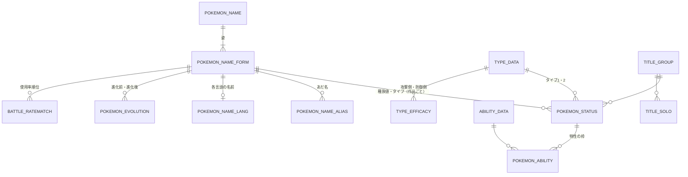

# ポケモンDBの取扱説明書

> **更新日** 2026-10-04 ・ **区分** リファレンス ・ **読む人** 利用者・開発者・AI

**このページだけで、ポケモンDBの全部の表に対してSQLを組み立てられること**を目的にしています。表・列・件数は 2026-10-04 に実DBから取り、SQLの例はすべて実行して結果を確かめています。置き場所とバックアップは[運用手順](../operations/pkdb.md)です。

## 接続

| 項目 | 値 |
| --- | --- |
| ホスト | `pkdb.apextox.dpdns.org:5432`（LAN のみ） |
| データベース | `sleepy_pkdb` |
| スキーマ | `pokemondb`（`search_path` に入っていないので、`SET search_path = pokemondb;` するかスキーマ名を付ける） |
| 読み取り用ロール | `pkdb_reader`（全表 `SELECT` のみ）。パスワードは管理者から受け取る |
| 書き込み用ロール | `pkdb_editor` |
| 版 | PostgreSQL 15 |
| 画面 | <https://adminer.apextox.dpdns.org>（Authentik の `admins` のみ。「サーバ」は `db`、ユーザ名とパスワードはDBのロール） |

## 書き方の決まり

1. **表名と列名は大文字で、必ず二重引用符で囲む。** `"POKEMON_STATUS"."BASESTATS_H"` と書く。引用符が無いと小文字に読み替えられて「存在しない」になる。例外は一部のビューの列（`official_name`・`aliases`・`is_move`）で、これは小文字。
2. **図鑑番号は4桁の文字列。** `"NDEX_NUMBER" = '0025'`。数値の `25` とは一致しない。
3. **ポケモンは「図鑑番号＋フォーム」で1匹。** `"FORM_ID"` は2桁の文字列で、`'00'` が基本の姿。メガシンカ・リージョンフォーム・フォルム違いが `'01'` 以降。
4. **作品は `"TITLE_GROUP_ID"`（3桁の文字列）。** 文字列のまま大小比較すると発売順になる（下の表）。
5. **値は日本語。** タイプ名（`'ほのお'`）、わざの分類（`'物理'`・`'特殊'`・`'変化'`）、進化段階、地方など。
6. 以下のSQLは `SET search_path = pokemondb;` 済みとして書いている。

## 全体像



## 作品（TITLE_GROUP_ID）

| ID | 作品 | 世代 | 地方 | | ID | 作品 | 世代 | 地方 |
| --- | --- | --- | --- | --- | --- | --- | --- | --- |
| `010` | RGB | 1 | カントー | | `070` | SM | 7 | アローラ |
| `011` | ピカチュウ | 1 | カントー | | `071` | USUM | 7 | アローラ |
| `020` | GS | 2 | ジョウト | | `072` | LPLE | 7 | カントー |
| `021` | クリスタル | 2 | ジョウト | | `080` | SWSH | 8 | ガラル |
| `030` | RS | 3 | ホウエン | | `081` | 鎧の孤島 | 8 | ガラル |
| `031` | FRLE | 3 | カントー | | `082` | 冠の雪原 | 8 | ガラル |
| `032` | RSE | 3 | ホウエン | | `083` | BDSP | 8 | シンオウ |
| `040` | DP | 4 | シンオウ | | `084` | PLA | 8 | ヒスイ |
| `041` | プラチナ | 4 | シンオウ | | `090` | SV | 9 | パルデア |
| `042` | HGSS | 4 | ジョウト | | `091` | 碧の仮面 | 9 | パルデア |
| `050` | BW | 5 | イッシュ | | `092` | 藍の円盤 | 9 | パルデア |
| `051` | B2W2 | 5 | イッシュ | | `093` | PLZA | 9 | カロス |
| `060` | XY | 6 | カロス | | `094` | M次元ラッシュ | 9 | カロス |
| `061` | ORAS | 6 | ホウエン | | `095` | ポケモンチャンピオンズ | 9 | （空） |

`000` は「未設定」です。

## 「今の値」の出し方（いちばん大事）

**`"POKEMON_STATUS"` は、種族値やタイプが変わった作品にだけ行があります。** 毎作品ぶんの行はありません。ライチュウ（`0026`・`00`）はこうです。

| TITLE_GROUP_ID | 作品 | H | A | B | C | D | S |
| --- | --- | --- | --- | --- | --- | --- | --- |
| `010` | RGB | 60 | 90 | 55 | 90 | **90** | 100 |
| `020` | GS | 60 | 90 | 55 | 90 | **80** | 100 |
| `030` | RS | 60 | 90 | 55 | 90 | 80 | 100 |
| `050` | BW | 60 | 90 | 55 | 90 | 80 | 100 |
| `060` | XY | 60 | 90 | 55 | 90 | 80 | **110** |

そのまま結合すると1匹が複数行になります。次のどちらかで1行に絞ります。

### 最新の値

ポケモンごとに `"TITLE_GROUP_ID"` がいちばん大きい行を取ります。PostgreSQL では `DISTINCT ON` が簡単です。

```sql
SELECT DISTINCT ON (s."NDEX_NUMBER", s."FORM_ID")
       s."NDEX_NUMBER", s."FORM_ID", n."NAME", f."FORM_NAME",
       t1."NAME" AS type_1, t2."NAME" AS type_2,
       s."BASESTATS_H", s."BASESTATS_A", s."BASESTATS_B",
       s."BASESTATS_C", s."BASESTATS_D", s."BASESTATS_S",
       s."TITLE_GROUP_ID"
FROM "POKEMON_STATUS" s
JOIN "POKEMON_NAME" n ON n."NDEX_NUMBER" = s."NDEX_NUMBER"
JOIN "POKEMON_NAME_FORM" f
  ON f."NDEX_NUMBER" = s."NDEX_NUMBER" AND f."FORM_ID" = s."FORM_ID"
JOIN "TYPE_DATA" t1 ON t1."TYPE_ID" = s."TYPE_1_ID"
LEFT JOIN "TYPE_DATA" t2 ON t2."TYPE_ID" = s."TYPE_2_ID"   -- 単タイプは NULL
WHERE s."NDEX_NUMBER" = '0026'
ORDER BY s."NDEX_NUMBER", s."FORM_ID", s."TITLE_GROUP_ID" DESC;
```

`ORDER BY` の先頭は `DISTINCT ON` と同じ列にし、その後ろに `"TITLE_GROUP_ID" DESC` を置きます。これで各ポケモンの最新の1行だけが残ります。

### ある作品の時点の値

「その作品以前で、いちばん新しい行」を取ります。条件を1つ足すだけです。

```sql
SELECT DISTINCT ON (s."NDEX_NUMBER", s."FORM_ID")
       n."NAME", t1."NAME" AS type_1, t2."NAME" AS type_2,
       s."BASESTATS_D", s."TITLE_GROUP_ID"
FROM "POKEMON_STATUS" s
JOIN "POKEMON_NAME" n ON n."NDEX_NUMBER" = s."NDEX_NUMBER"
JOIN "TYPE_DATA" t1 ON t1."TYPE_ID" = s."TYPE_1_ID"
LEFT JOIN "TYPE_DATA" t2 ON t2."TYPE_ID" = s."TYPE_2_ID"
WHERE s."TITLE_GROUP_ID" <= '040'            -- DP の時点
  AND s."NDEX_NUMBER" IN ('0035', '0026')
ORDER BY s."NDEX_NUMBER", s."FORM_ID", s."TITLE_GROUP_ID" DESC;
```

ピッピは DP の時点ではノーマルタイプ（フェアリーになるのは `060` XY）、ライチュウの行は `030` のものが返ります。

### 用意済みの近道

`"MV_LATEST_POKEMON_STATUS"` は、上の「最新の値」にタイプ名と特性名を付けたマテリアライズドビューです（1匹1行、1,277行）。検索はこれを起点にすると結合が要りません。**元の表を直した後は `REFRESH MATERIALIZED VIEW` するまで古いまま**です（下の「マテリアライズドビュー」）。

## よく使う結合

### 名前で探す（あだ名を含む）

正式な名前は `"POKEMON_NAME"."NAME"`（種の名前）と `"POKEMON_NAME_FORM"."FORM_NAME"`（姿の名前）に分かれています。あだ名は `"POKEMON_NAME_ALIAS"` にあり、`"NAME_ALIAS"` が主キーなので1つのあだ名は1匹だけを指します。

```sql
SELECT f."NDEX_NUMBER", f."FORM_ID", n."NAME", f."FORM_NAME"
FROM "POKEMON_NAME_ALIAS" al
JOIN "POKEMON_NAME_FORM" f
  ON f."NDEX_NUMBER" = al."NDEX_NUMBER" AND f."FORM_ID" = al."FORM_ID"
JOIN "POKEMON_NAME" n ON n."NDEX_NUMBER" = f."NDEX_NUMBER"
WHERE al."NAME_ALIAS" = 'リザX';      -- → 0006 / 01 / リザードン / メガリザードンＸ
```

表示用の1つの名前が欲しいときは `"MV_QUIZ_STATUS"."official_name"` を使います（`ライチュウ（アローラのすがた）` のように組み立て済み）。

### 特性

特性は `"POKEMON_ABILITY"`（どの枠にどの特性か）と `"ABILITY_DATA"`（特性の名前と説明）の2段です。**どちらも作品ごとに行があるので、種族値と同じ `"TITLE_GROUP_ID"` で結びます。**

```sql
WITH latest AS (
  SELECT DISTINCT ON ("NDEX_NUMBER", "FORM_ID") *
  FROM "POKEMON_STATUS"
  ORDER BY "NDEX_NUMBER", "FORM_ID", "TITLE_GROUP_ID" DESC
)
SELECT n."NAME", f."FORM_NAME", pa."SLOT", a."NAME" AS ability, a."DESCRIPTION"
FROM latest s
JOIN "POKEMON_NAME" n ON n."NDEX_NUMBER" = s."NDEX_NUMBER"
JOIN "POKEMON_NAME_FORM" f
  ON f."NDEX_NUMBER" = s."NDEX_NUMBER" AND f."FORM_ID" = s."FORM_ID"
JOIN "POKEMON_ABILITY" pa
  ON pa."NDEX_NUMBER" = s."NDEX_NUMBER" AND pa."FORM_ID" = s."FORM_ID"
 AND pa."TITLE_GROUP_ID" = s."TITLE_GROUP_ID"
JOIN "ABILITY_DATA" a
  ON a."ABILITY_ID" = pa."ABILITY_ID" AND a."TITLE_GROUP_ID" = pa."TITLE_GROUP_ID"
WHERE s."NDEX_NUMBER" = '0006'
ORDER BY s."FORM_ID", pa."SLOT";
```

`"SLOT"` は `'1'`（第一特性）・`'2'`（第二特性）・`'H'`（隠れ特性）です。最新の行に特性がまだ入っていないポケモンが20匹います（特性の欄が空になる）。

### タイプ相性（弱点）

`"TYPE_EFFICACY"` は「攻撃タイプ → 防御タイプ」1対1の倍率です。複合タイプは2つの倍率を掛けます。

```sql
SELECT atk."NAME" AS attack_type,
       e1."MULTIPLIER" * COALESCE(e2."MULTIPLIER", 1) AS multiplier
FROM "MV_LATEST_POKEMON_STATUS" p
JOIN "TYPE_DATA" d1 ON d1."NAME" = p."TYPE_1"
LEFT JOIN "TYPE_DATA" d2 ON d2."NAME" = p."TYPE_2"
CROSS JOIN "TYPE_DATA" atk
JOIN "TYPE_EFFICACY" e1
  ON e1."ATTACK_TYPE_ID" = atk."TYPE_ID" AND e1."DEFEND_TYPE_ID" = d1."TYPE_ID"
LEFT JOIN "TYPE_EFFICACY" e2
  ON e2."ATTACK_TYPE_ID" = atk."TYPE_ID" AND e2."DEFEND_TYPE_ID" = d2."TYPE_ID"
WHERE p."NDEX_NUMBER" = '0006' AND p."FORM_ID" = '00'
  AND e1."MULTIPLIER" * COALESCE(e2."MULTIPLIER", 1) > 1
ORDER BY multiplier DESC, atk."TYPE_ID";    -- リザードン → いわ 4、みず 2、でんき 2
```

ビュー `"POKEMON_TYPE"` は同じ計算を横持ち（列が `"NORMAL"`〜`"FAIRY"` の18個）にしたものです。

### 条件で探す

```sql
SELECT q."official_name", p."TYPE_1", p."TYPE_2", p."BASESTATS_S"
FROM "MV_LATEST_POKEMON_STATUS" p
JOIN "MV_QUIZ_STATUS" q USING ("NDEX_NUMBER", "FORM_ID")
WHERE 'はがね' IN (p."TYPE_1", p."TYPE_2")
  AND p."BASESTATS_S" >= 100
ORDER BY p."BASESTATS_S" DESC;
```

合計種族値などの計算は列を足すだけです（`p."BASESTATS_A" + p."BASESTATS_C" >= 200`）。

### 進化の系列

`"POKEMON_EVOLUTION"` は「進化前 → 進化後」の1段ぶんです。系列全体は再帰でたどります。

```sql
WITH RECURSIVE line AS (
  SELECT "BEFORE_NDEX_NUMBER", "BEFORE_FORM_ID",
         "AFTER_NDEX_NUMBER", "AFTER_FORM_ID", 1 AS step
  FROM "POKEMON_EVOLUTION"
  WHERE "BEFORE_NDEX_NUMBER" = '0004' AND "BEFORE_FORM_ID" = '00'
  UNION ALL
  SELECT e."BEFORE_NDEX_NUMBER", e."BEFORE_FORM_ID",
         e."AFTER_NDEX_NUMBER", e."AFTER_FORM_ID", line.step + 1
  FROM "POKEMON_EVOLUTION" e
  JOIN line ON e."BEFORE_NDEX_NUMBER" = line."AFTER_NDEX_NUMBER"
           AND e."BEFORE_FORM_ID" = line."AFTER_FORM_ID"
)
SELECT line.step, b."NAME" AS before, a."NAME" AS after
FROM line
JOIN "POKEMON_NAME" b ON b."NDEX_NUMBER" = line."BEFORE_NDEX_NUMBER"
JOIN "POKEMON_NAME" a ON a."NDEX_NUMBER" = line."AFTER_NDEX_NUMBER"
ORDER BY line.step;                          -- ヒトカゲ → リザード → リザードン
```

進化段階（`進化前`・`中間進化`・`最終進化`・`無進化`）は `"MV_QUIZ_STATUS"."EVOLUTION_STAGE"` に計算済みです。

### 対戦の使用率順位

```sql
SELECT r."BATTLE_RANKING", n."NAME", f."FORM_NAME"
FROM "BATTLE_RATEMATCH" r
JOIN "POKEMON_NAME" n ON n."NDEX_NUMBER" = r."NDEX_NUMBER"
JOIN "POKEMON_NAME_FORM" f
  ON f."NDEX_NUMBER" = r."NDEX_NUMBER" AND f."FORM_ID" = r."FORM_ID"
WHERE r."TITLE_GROUP_ID" = '090' AND r."BATTLE_TYPE" = 'シングル'
  AND r."BATTLE_SEASON" = (SELECT max("BATTLE_SEASON") FROM "BATTLE_RATEMATCH"
                           WHERE "TITLE_GROUP_ID" = '090' AND "BATTLE_TYPE" = 'シングル')
ORDER BY r."BATTLE_RANKING"
LIMIT 10;
```

入っているのは `070`（SM、シーズン2〜18）・`071`（USUM、7〜18）・`080`（SWSH、1〜36）・`090`（SV、1〜41）で、`"BATTLE_TYPE"` は `'シングル'` と `'ダブル'` です。SWSH と SV は150位まで。

### わざ

`"MOVE_DATA"` も作品ごとに行があります（世代の代表作 `010`・`020`…`090` と `095`）。最新は種族値と同じ絞り方です。

```sql
SELECT DISTINCT ON (m."MOVE_ID")
       m."NAME", m."TYPE", m."CATEGORY", m."POWER", m."ACCURACY", m."PP"
FROM "MOVE_DATA" m
WHERE m."NAME" = 'じしん'
ORDER BY m."MOVE_ID", m."TITLE_GROUP_ID" DESC;
```

## 表の一覧

件数は 2026-10-04 時点。**太字**は主キーです。

### ポケモンの名前と姿

| 表 | 件数 | 1行の意味 | 列 |
| --- | --- | --- | --- |
| `POKEMON_NAME` | 1,025 | 種 | **`NDEX_NUMBER`**、`NAME`（日本語の正式名称） |
| `POKEMON_NAME_FORM` | 1,608 | 姿 | **`NDEX_NUMBER`**、**`FORM_ID`**、`GENDER`（`m`・`f`・空）、`FORM_NAME`（姿の名前。基本の姿は空のことが多い） |
| `POKEMON_NAME_ALIAS` | 886 | あだ名 | `NDEX_NUMBER`、`FORM_ID`、**`NAME_ALIAS`** |
| `POKEMON_NAME_LANG` | 1,025 | 各言語の名前 | **`NDEX_NUMBER`**、**`FORM_ID`**（全行 `'00'`）、`JPN`・`ENG`・`FRA`・`GER`・`ITA`・`KOR`・`SPA`・`CHS`（簡体字）・`CHT`（繁体字）、`ROMAJI_TRADEMARKED`、`ROMAJI_HEPBURN` |
| `POKEMON_RDEXNUMBER` | 1,025 | 地方図鑑の番号 | `NDEX_NUMBER`、`FORM_ID`（全行空）、地方図鑑ごとの列（`KANTO`・`JOHTO`・`HOENN`・`SINNOH`・`UNOVA`・`GALAR`・`HISUI`・`PALDEA`・`KITAKAMI`・`BLUEBERRY` など30列余り）。値は3桁の文字列で、載っていなければ空 |

`POKEMON_NAME_FORM` の1,608行のうち、種族値（`POKEMON_STATUS`）を持つのは1,277です。残りの331は、オスメスの見た目違いやキョダイマックスなど、種族値が基本の姿と同じものです。

### 種族値・タイプ・特性

| 表 | 件数 | 1行の意味 | 列 |
| --- | --- | --- | --- |
| `POKEMON_STATUS` | 2,405 | ある姿の、ある作品での値 | **`NDEX_NUMBER`**、**`FORM_ID`**、**`TITLE_GROUP_ID`**、`BASESTATS_H`・`_A`・`_B`・`_C`・`_D`・`_S`（HP・こうげき・ぼうぎょ・とくこう・とくぼう・すばやさ）、`TYPE_1_ID`、`TYPE_2_ID`（単タイプは空） |
| `POKEMON_ABILITY` | 3,877 | 特性の枠 | **`NDEX_NUMBER`**、**`FORM_ID`**、**`TITLE_GROUP_ID`**、**`SLOT`**（`1`・`2`・`H`）、`ABILITY_ID` |
| `ABILITY_DATA` | 5,055 | ある作品での特性 | **`ABILITY_ID`**、**`TITLE_GROUP_ID`**、`NAME`、`ENGLISH_NAME`、`DESCRIPTION`（その作品での説明文） |
| `TYPE_DATA` | 18 | タイプ | **`TYPE_ID`**（1 ノーマル〜18 フェアリー）、`NAME` |
| `TYPE_EFFICACY` | 324 | 相性 | **`ATTACK_TYPE_ID`**、**`DEFEND_TYPE_ID`**、`MULTIPLIER`（0・0.5・1・2） |

### わざ

| 表 | 件数 | 1行の意味 | 列 |
| --- | --- | --- | --- |
| `MOVE_DATA` | 5,847 | ある作品でのわざ | **`MOVE_ID`**、**`TITLE_GROUP_ID`**、`NAME`、`ENGLISH_NAME`、`TYPE`（日本語のタイプ名）、`CATEGORY`（`物理`・`特殊`・`変化`）、`POWER`、`ACCURACY`、`PP`、`PRIORITY`、`TARGET`（`1体選択`・`自分`・`相手全体` など）、`EFFECT_CHANCE`、`DESCRIPTION`、`NOTES` |
| `MOVE_LEARN_METHOD` | 6 | 覚え方 | **`METHOD_ID`**、`METHOD_NAME`（レベルアップ・わざマシン・タマゴ技・技教え・イベント・技思い出し）、`POKEAPI_NAME`、`DESCRIPTION` |
| `POKEMON_MOVE_LEARN` | **1** | 覚えるわざ | **`LEARN_ID`**、`NDEX_NUMBER`、`FORM_ID`、`TITLE_GROUP_ID`、`MOVE_ID`、`METHOD_ID`、`LEVEL_LEARNED_AT`、`LEARN_ORDER`、`SOURCE_VERSION_GROUP_NAME`、`NOTES`、`CREATED_AT`、`UPDATED_AT` |

### 進化・図鑑・対戦

| 表 | 件数 | 1行の意味 | 列 |
| --- | --- | --- | --- |
| `POKEMON_EVOLUTION` | 684 | 進化1段 | **`BEFORE_NDEX_NUMBER`**、**`BEFORE_FORM_ID`**、**`AFTER_NDEX_NUMBER`**、**`AFTER_FORM_ID`**、`METHOD_ID`（全行空）、`TITLE_GROUP_ID`（ほぼ空） |
| `POKEMON_POKEDEX` | **0** | 図鑑の情報 | **`NDEX_NUMBER`**、**`FORM_ID`**、`TITLE_GROUP_ID`、`CATEGORY`（分類）、`HEIGHT`、`WEIGHT`、`GENDER_RATIO`、`EGG_GROUP_1`・`_2`、`LEVELING_RATE`、`CARCH_RATE`（被捕獲度。綴りはこのまま）、`EVYIELD_H`〜`_S`（努力値） |
| `EGG_GROUP` | 15 | タマゴグループ | **`EGG_GROUP_ID`**、`EGG_GROUP_NAME` |
| `BATTLE_RATEMATCH` | 47,685 | あるシーズンの順位 | **`TITLE_GROUP_ID`**、**`BATTLE_SEASON`**、**`BATTLE_TYPE`**、**`NDEX_NUMBER`**、**`FORM_ID`**、`BATTLE_RANKING` |

### 作品

| 表 | 件数 | 1行の意味 | 列 |
| --- | --- | --- | --- |
| `TITLE_GROUP` | 29 | 作品のまとまり | **`TITLE_GROUP_ID`**、`TITLE_NAME`、`GENERATION`、`REGION` |
| `TITLE_SOLO` | 44 | 作品1本 | **`TITLE_ID`**（4桁。`0100` 赤、`0101` 緑）、`TITLE_NAME`、`TITLE_GROUP_ID`、`RELEASE_YEAR`・`RELEASE_MONTH`・`RELEASE_DATE`（発売の年・月・日） |

### 読み物

この2つだけ列名が日本語です。

| 表 | 件数 | 列 |
| --- | --- | --- |
| `POKEMON_CALENDAR` | 221 | `日付`、`できごと`、`関連ポケモン`、`関連リンク`、`プロパティ`（`記念日` など） |
| `POKEMON_SENRYU` | 578 | `ポケモン川柳`、`登場ポケモン`、`出典`、`登場作品`、`チェック` |

## マテリアライズドビュー

結合と計算を済ませた結果を保存したものです。速く、SQLが短くなりますが、**元の表を直しても自動では変わりません。** 直した後は依存の順に作り直します。

```sql
REFRESH MATERIALIZED VIEW "MV_LATEST_POKEMON_STATUS";
REFRESH MATERIALIZED VIEW "MV_QUIZ_STATUS";
REFRESH MATERIALIZED VIEW "MV_BSQUIZ_STATUS";
REFRESH MATERIALIZED VIEW "MV_POKEMON_SHIRITORI_STATUS";
REFRESH MATERIALIZED VIEW "MV_SHIRITORI_WORDS";
REFRESH MATERIALIZED VIEW "MV_LANG_QUIZ";
```

| ビュー | 件数 | 中身 |
| --- | --- | --- |
| `MV_LATEST_POKEMON_STATUS` | 1,277 | 1匹1行の最新の値。`NDEX_NUMBER`、`FORM_ID`、`TYPE_1`・`TYPE_2`（タイプ名）、`ABILITY_1`・`ABILITY_2`・`ABILITY_H`（特性名）、`BASESTATS_H`〜`_S`、`TITLE_GROUP_ID`（その値になった作品） |
| `MV_QUIZ_STATUS` | 1,277 | 1匹1行の名前と分類。`NAME`、`FORM_NAME`、`official_name`（表示用の名前）、`NAME_ALIAS`（あだ名をカンマ区切り）、`TYPE_1`・`TYPE_2`、`BEFORE_NDEX_NUMBER`・`BEFORE_FORM_ID`・`AFTER_NDEX_NUMBER`・`AFTER_FORM_ID`（進化前後）、`REGION`（初登場の地方）、`EVOLUTION_STAGE` |
| `MV_BSQUIZ_STATUS` | 1,182 | 種族値の組ごとに1行。`H`・`A`・`B`・`C`・`D`・`S`、`TOTAL`、`ANSWER_COUNT`（同じ種族値の匹数）、`POKEMON_ANSWERS`（該当ポケモンの JSON 配列。`official_name`・`ndex_number`・`type1`・`type2`・`region`・`evoStage`・`aliases`） |
| `MV_POKEMON_SHIRITORI_STATUS` | 1,277 | `MV_QUIZ_STATUS` に、タイプごとの被ダメージ倍率18列（`NORMAL`〜`FAIRY`）を足したもの |
| `MV_SHIRITORI_WORDS` | 2,196 | しりとり用の語（ポケモンとわざ）。`official_name`、`aliases`、`TYPE_1`・`TYPE_2`、倍率18列、`CATEGORY`、`is_move`（わざなら真） |
| `MV_LANG_QUIZ` | 1,025 | `POKEMON_NAME_LANG` の各言語の名前 |

ふつうのビューは2つです。`POKEMON_TYPE`（タイプの組ごとの被ダメージ倍率）と `QUIZ_BASE_VIEW`（`NDEX_NUMBER`・`NAME`・`BASESTATS_H`・`BASESTATS_A`・`TYPE_1`）。

## まだ入っていないデータ

- **覚えるわざ**（`POKEMON_MOVE_LEARN`）は1行だけ。「じしんを覚えるポケモン」はまだ引けません。
- **図鑑の情報**（`POKEMON_POKEDEX`）は0行。高さ・重さ・タマゴグループ・努力値はまだ引けません。
- **進化の方法**（`POKEMON_EVOLUTION."METHOD_ID"`）は全行が空。「どうやって進化するか」はまだ引けません。
- **`095`（ポケモンチャンピオンズ）の特性**は192件で、他の作品（307件）より少ない。
