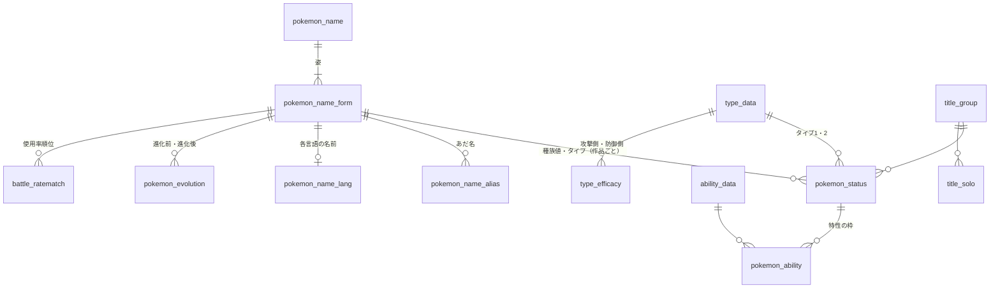

# ポケモンDBの取扱説明書

> **更新日** 2026-10-05 ・ **区分** リファレンス ・ **読む人** 利用者・開発者・AI

**このページだけで、ポケモンDBの全部の表に対してSQLを組み立てられること**を目的にしています。表・列・件数は 2026-10-04 に実DBから取り、SQLの例はすべて実行して結果を確かめています。置き場所とバックアップは[運用手順](../operations/pkdb.md)です。

## 接続

| 項目 | 値 |
| --- | --- |
| ホスト | `pkdb.apextox.dpdns.org:5432`（LAN のみ） |
| データベース | `sleepy_pkdb` |
| スキーマ | `pokemondb`（データベースの `search_path` に入れてあるので、スキーマ名は省ける） |
| 読み取り用ロール | `pkdb_reader`（全表 `SELECT` のみ）。パスワードは管理者から受け取る |
| 書き込み用ロール | `pkdb_editor` |
| 版 | PostgreSQL 15 |
| 画面 | <https://adminer.apextox.dpdns.org>（Authentik の `admins` のみ。「サーバ」は `db`、ユーザ名とパスワードはDBのロール） |

## 書き方の決まり

1. **表名と列名はすべて小文字で、引用符は要らない。** `SELECT basestats_h FROM pokemon_status` と書ける。大文字で書いても同じ意味になる。
2. **図鑑番号は4桁の文字列。** `ndex_number = '0025'`。数値の `25` とは一致しない。
3. **ポケモンは「図鑑番号＋フォーム」で1匹。** `form_id` は2桁の文字列で、`'00'` が基本の姿。メガシンカ・リージョンフォーム・フォルム違いが `'01'` 以降。
4. **作品は `title_group_id`（3桁の文字列）。** 文字列のまま大小比較すると発売順になる（下の表）。
5. **値は日本語。** タイプ名（`'ほのお'`）、わざの分類（`'物理'`・`'特殊'`・`'変化'`）、進化段階、地方など。
6. カレンダーと川柳の2表だけ列名が日本語（`日付` など）。これも引用符なしで書ける。

2026-10-04 に、大文字の名前（`"POKEMON_STATUS"."BASESTATS_H"`）から改名しました。**旧ホスト（shakeserver）のDBは大文字のまま**なので、そちらを見ているアプリのSQLは、接続先を切り替えるときに小文字へ直します。

## 全体像



## 作品（TITLE_GROUP_ID）

| ID | 作品 | 世代 | 地方 | | ID | 作品 | 世代 | 地方 |
| --- | --- | --- | --- | --- | --- | --- | --- | --- |
| `010` | RGB | 1 | カントー | | `070` | SM | 7 | アローラ |
| `011` | ピカチュウ | 1 | カントー | | `071` | USUM | 7 | アローラ |
| `020` | GS | 2 | ジョウト | | `072` | LPLE | 7 | カントー |
| `021` | クリスタル | 2 | ジョウト | | `080` | SWSH | 8 | ガラル |
| `030` | RS | 3 | ホウエン | | `081` | 鎧の孤島 | 8 | ガラル |
| `031` | FRLE | 3 | カントー | | `082` | 冠の雪原 | 8 | ガラル |
| `032` | RSE | 3 | ホウエン | | `083` | BDSP | 8 | シンオウ |
| `040` | DP | 4 | シンオウ | | `084` | PLA | 8 | ヒスイ |
| `041` | プラチナ | 4 | シンオウ | | `090` | SV | 9 | パルデア |
| `042` | HGSS | 4 | ジョウト | | `091` | 碧の仮面 | 9 | パルデア |
| `050` | BW | 5 | イッシュ | | `092` | 藍の円盤 | 9 | パルデア |
| `051` | B2W2 | 5 | イッシュ | | `093` | PLZA | 9 | カロス |
| `060` | XY | 6 | カロス | | `094` | M次元ラッシュ | 9 | カロス |
| `061` | ORAS | 6 | ホウエン | | `095` | ポケモンチャンピオンズ | 9 | （空） |

`000` は「未設定」です。

## 「今の値」の出し方（いちばん大事）

**`pokemon_status` は、種族値やタイプが変わった作品にだけ行があります。** 毎作品ぶんの行はありません。ライチュウ（`0026`・`00`）はこうです。

| TITLE_GROUP_ID | 作品 | H | A | B | C | D | S |
| --- | --- | --- | --- | --- | --- | --- | --- |
| `010` | RGB | 60 | 90 | 55 | 90 | **90** | 100 |
| `020` | GS | 60 | 90 | 55 | 90 | **80** | 100 |
| `030` | RS | 60 | 90 | 55 | 90 | 80 | 100 |
| `050` | BW | 60 | 90 | 55 | 90 | 80 | 100 |
| `060` | XY | 60 | 90 | 55 | 90 | 80 | **110** |

そのまま結合すると1匹が複数行になります。次のどちらかで1行に絞ります。

### 最新の値

ポケモンごとに `title_group_id` がいちばん大きい行を取ります。PostgreSQL では `DISTINCT ON` が簡単です。

```sql
SELECT DISTINCT ON (s.ndex_number, s.form_id)
       s.ndex_number, s.form_id, n.name, f.form_name,
       t1.name AS type_1, t2.name AS type_2,
       s.basestats_h, s.basestats_a, s.basestats_b,
       s.basestats_c, s.basestats_d, s.basestats_s,
       s.title_group_id
FROM pokemon_status s
JOIN pokemon_name n ON n.ndex_number = s.ndex_number
JOIN pokemon_name_form f
  ON f.ndex_number = s.ndex_number AND f.form_id = s.form_id
JOIN type_data t1 ON t1.type_id = s.type_1_id
LEFT JOIN type_data t2 ON t2.type_id = s.type_2_id   -- 単タイプは NULL
WHERE s.ndex_number = '0026'
ORDER BY s.ndex_number, s.form_id, s.title_group_id DESC;
```

`ORDER BY` の先頭は `DISTINCT ON` と同じ列にし、その後ろに `title_group_id DESC` を置きます。これで各ポケモンの最新の1行だけが残ります。

### ある作品の時点の値

「その作品以前で、いちばん新しい行」を取ります。条件を1つ足すだけです。

```sql
SELECT DISTINCT ON (s.ndex_number, s.form_id)
       n.name, t1.name AS type_1, t2.name AS type_2,
       s.basestats_d, s.title_group_id
FROM pokemon_status s
JOIN pokemon_name n ON n.ndex_number = s.ndex_number
JOIN type_data t1 ON t1.type_id = s.type_1_id
LEFT JOIN type_data t2 ON t2.type_id = s.type_2_id
WHERE s.title_group_id <= '040'            -- DP の時点
  AND s.ndex_number IN ('0035', '0026')
ORDER BY s.ndex_number, s.form_id, s.title_group_id DESC;
```

ピッピは DP の時点ではノーマルタイプ（フェアリーになるのは `060` XY）、ライチュウの行は `030` のものが返ります。

### 用意済みの近道

`mv_latest_pokemon_status` は、上の「最新の値」にタイプ名と特性名を付けたマテリアライズドビューです（1匹1行、1,277行）。検索はこれを起点にすると結合が要りません。**元の表を直した後は `REFRESH MATERIALIZED VIEW` するまで古いまま**です（下の「マテリアライズドビュー」）。

## よく使う結合

### 名前で探す（あだ名を含む）

正式な名前は `pokemon_name.name`（種の名前）と `pokemon_name_form.form_name`（姿の名前）に分かれています。あだ名は `pokemon_name_alias` にあり、`name_alias` が主キーなので1つのあだ名は1匹だけを指します。

```sql
SELECT f.ndex_number, f.form_id, n.name, f.form_name
FROM pokemon_name_alias al
JOIN pokemon_name_form f
  ON f.ndex_number = al.ndex_number AND f.form_id = al.form_id
JOIN pokemon_name n ON n.ndex_number = f.ndex_number
WHERE al.name_alias = 'リザX';      -- → 0006 / 01 / リザードン / メガリザードンＸ
```

表示用の1つの名前が欲しいときは `mv_quiz_status."official_name"` を使います（`ライチュウ（アローラのすがた）` のように組み立て済み）。

### 特性

特性は `pokemon_ability`（どの枠にどの特性か）と `ability_data`（特性の名前と説明）の2段です。**どちらも作品ごとに行があるので、種族値と同じ `title_group_id` で結びます。**

```sql
WITH latest AS (
  SELECT DISTINCT ON (ndex_number, form_id) *
  FROM pokemon_status
  ORDER BY ndex_number, form_id, title_group_id DESC
)
SELECT n.name, f.form_name, pa.slot, a.name AS ability, a.description
FROM latest s
JOIN pokemon_name n ON n.ndex_number = s.ndex_number
JOIN pokemon_name_form f
  ON f.ndex_number = s.ndex_number AND f.form_id = s.form_id
JOIN pokemon_ability pa
  ON pa.ndex_number = s.ndex_number AND pa.form_id = s.form_id
 AND pa.title_group_id = s.title_group_id
JOIN ability_data a
  ON a.ability_id = pa.ability_id AND a.title_group_id = pa.title_group_id
WHERE s.ndex_number = '0006'
ORDER BY s.form_id, pa.slot;
```

`slot` は `'1'`（第一特性）・`'2'`（第二特性）・`'H'`（隠れ特性）です。最新の行に特性がまだ入っていないポケモンが20匹います（特性の欄が空になる）。

### タイプ相性（弱点）

`type_efficacy` は「攻撃タイプ → 防御タイプ」1対1の倍率です。複合タイプは2つの倍率を掛けます。

```sql
SELECT atk.name AS attack_type,
       e1.multiplier * COALESCE(e2.multiplier, 1) AS multiplier
FROM mv_latest_pokemon_status p
JOIN type_data d1 ON d1.name = p.type_1
LEFT JOIN type_data d2 ON d2.name = p.type_2
CROSS JOIN type_data atk
JOIN type_efficacy e1
  ON e1.attack_type_id = atk.type_id AND e1.defend_type_id = d1.type_id
LEFT JOIN type_efficacy e2
  ON e2.attack_type_id = atk.type_id AND e2.defend_type_id = d2.type_id
WHERE p.ndex_number = '0006' AND p.form_id = '00'
  AND e1.multiplier * COALESCE(e2.multiplier, 1) > 1
ORDER BY multiplier DESC, atk.type_id;    -- リザードン → いわ 4、みず 2、でんき 2
```

ビュー `pokemon_type` は同じ計算を横持ち（列が `normal`〜`fairy` の18個）にしたものです。

### 条件で探す

```sql
SELECT q."official_name", p.type_1, p.type_2, p.basestats_s
FROM mv_latest_pokemon_status p
JOIN mv_quiz_status q USING (ndex_number, form_id)
WHERE 'はがね' IN (p.type_1, p.type_2)
  AND p.basestats_s >= 100
ORDER BY p.basestats_s DESC;
```

合計種族値などの計算は列を足すだけです（`p.basestats_a + p.basestats_c >= 200`）。

### 進化の系列

`pokemon_evolution` は「進化前 → 進化後」の1段ぶんです。系列全体は再帰でたどります。

```sql
WITH RECURSIVE line AS (
  SELECT before_ndex_number, before_form_id,
         after_ndex_number, after_form_id, 1 AS step
  FROM pokemon_evolution
  WHERE before_ndex_number = '0004' AND before_form_id = '00'
  UNION ALL
  SELECT e.before_ndex_number, e.before_form_id,
         e.after_ndex_number, e.after_form_id, line.step + 1
  FROM pokemon_evolution e
  JOIN line ON e.before_ndex_number = line.after_ndex_number
           AND e.before_form_id = line.after_form_id
)
SELECT line.step, b.name AS before, a.name AS after
FROM line
JOIN pokemon_name b ON b.ndex_number = line.before_ndex_number
JOIN pokemon_name a ON a.ndex_number = line.after_ndex_number
ORDER BY line.step;                          -- ヒトカゲ → リザード → リザードン
```

進化段階（`進化前`・`中間進化`・`最終進化`・`無進化`）は `mv_quiz_status.evolution_stage` に計算済みです。

### 対戦の使用率順位

```sql
SELECT r.battle_ranking, n.name, f.form_name
FROM battle_ratematch r
JOIN pokemon_name n ON n.ndex_number = r.ndex_number
JOIN pokemon_name_form f
  ON f.ndex_number = r.ndex_number AND f.form_id = r.form_id
WHERE r.title_group_id = '090' AND r.battle_type = 'シングル'
  AND r.battle_season = (SELECT max(battle_season) FROM battle_ratematch
                           WHERE title_group_id = '090' AND battle_type = 'シングル')
ORDER BY r.battle_ranking
LIMIT 10;
```

入っているのは `070`（SM、シーズン2〜18）・`071`（USUM、7〜18）・`080`（SWSH、1〜36）・`090`（SV、1〜41）で、`battle_type` は `'シングル'` と `'ダブル'` です。SWSH と SV は150位まで。

### わざ

`move_data` も作品ごとに行があります（世代の代表作 `010`・`020`…`090` と `095`）。最新は種族値と同じ絞り方です。

```sql
SELECT DISTINCT ON (m.move_id)
       m.name, m.type, m.category, m.power, m.accuracy, m.pp
FROM move_data m
WHERE m.name = 'じしん'
ORDER BY m.move_id, m.title_group_id DESC;
```

## 表の一覧

件数は 2026-10-04 時点。**太字**は主キーです。

### ポケモンの名前と姿

| 表 | 件数 | 1行の意味 | 列 |
| --- | --- | --- | --- |
| `pokemon_name` | 1,025 | 種 | **`ndex_number`**、`name`（日本語の正式名称） |
| `pokemon_name_form` | 1,608 | 姿 | **`ndex_number`**、**`form_id`**、`gender`（`m`・`f`・空）、`form_name`（姿の名前。基本の姿は空のことが多い） |
| `pokemon_name_alias` | 886 | あだ名 | `ndex_number`、`form_id`、**`name_alias`** |
| `pokemon_name_lang` | 1,025 | 各言語の名前 | **`ndex_number`**、**`form_id`**（全行 `'00'`）、`jpn`・`eng`・`fra`・`ger`・`ita`・`kor`・`spa`・`chs`（簡体字）・`cht`（繁体字）、`romaji_trademarked`、`romaji_hepburn` |
| `pokemon_rdexnumber` | 1,025 | 地方図鑑の番号 | `ndex_number`、`form_id`（全行空）、地方図鑑ごとの列（`kanto`・`johto`・`hoenn`・`sinnoh`・`unova`・`galar`・`hisui`・`paldea`・`kitakami`・`blueberry` など30列余り）。値は3桁の文字列で、載っていなければ空 |

`pokemon_name_form` の1,608行のうち、種族値（`pokemon_status`）を持つのは1,277です。残りの331は、オスメスの見た目違いやキョダイマックスなど、種族値が基本の姿と同じものです。

### 種族値・タイプ・特性

| 表 | 件数 | 1行の意味 | 列 |
| --- | --- | --- | --- |
| `pokemon_status` | 2,405 | ある姿の、ある作品での値 | **`ndex_number`**、**`form_id`**、**`title_group_id`**、`basestats_h`・`_a`・`_b`・`_c`・`_d`・`_s`（HP・こうげき・ぼうぎょ・とくこう・とくぼう・すばやさ）、`type_1_id`、`type_2_id`（単タイプは空） |
| `pokemon_ability` | 3,877 | 特性の枠 | **`ndex_number`**、**`form_id`**、**`title_group_id`**、**`slot`**（`1`・`2`・`h`）、`ability_id` |
| `ability_data` | 5,055 | ある作品での特性 | **`ability_id`**、**`title_group_id`**、`name`、`english_name`、`description`（その作品での説明文） |
| `type_data` | 18 | タイプ | **`type_id`**（1 ノーマル〜18 フェアリー）、`name` |
| `type_efficacy` | 324 | 相性 | **`attack_type_id`**、**`defend_type_id`**、`multiplier`（0・0.5・1・2） |

### わざ

| 表 | 件数 | 1行の意味 | 列 |
| --- | --- | --- | --- |
| `move_data` | 5,847 | ある作品でのわざ | **`move_id`**、**`title_group_id`**、`name`、`english_name`、`type`（日本語のタイプ名）、`category`（`物理`・`特殊`・`変化`）、`power`、`accuracy`、`pp`、`priority`、`target`（`1体選択`・`自分`・`相手全体` など）、`effect_chance`、`description`、`notes` |
| `move_learn_method` | 6 | 覚え方 | **`method_id`**、`method_name`（レベルアップ・わざマシン・タマゴ技・技教え・イベント・技思い出し）、`pokeapi_name`、`description` |
| `pokemon_move_learn` | **1** | 覚えるわざ | **`learn_id`**、`ndex_number`、`form_id`、`title_group_id`、`move_id`、`method_id`、`level_learned_at`、`learn_order`、`source_version_group_name`、`notes`、`created_at`、`updated_at` |

### 進化・図鑑・対戦

| 表 | 件数 | 1行の意味 | 列 |
| --- | --- | --- | --- |
| `pokemon_evolution` | 684 | 進化1段 | **`before_ndex_number`**、**`before_form_id`**、**`after_ndex_number`**、**`after_form_id`**、`method_id`（全行空）、`title_group_id`（ほぼ空） |
| `pokemon_pokedex` | **0** | 図鑑の情報 | **`ndex_number`**、**`form_id`**、`title_group_id`、`category`（分類）、`height`、`weight`、`gender_ratio`、`egg_group_1`・`_2`、`leveling_rate`、`carch_rate`（被捕獲度。綴りはこのまま）、`evyield_h`〜`_s`（努力値） |
| `egg_group` | 15 | タマゴグループ | **`egg_group_id`**、`egg_group_name` |
| `battle_ratematch` | 47,685 | あるシーズンの順位 | **`title_group_id`**、**`battle_season`**、**`battle_type`**、**`ndex_number`**、**`form_id`**、`battle_ranking` |

### 作品

| 表 | 件数 | 1行の意味 | 列 |
| --- | --- | --- | --- |
| `title_group` | 29 | 作品のまとまり | **`title_group_id`**、`title_name`、`generation`、`region` |
| `title_solo` | 44 | 作品1本 | **`title_id`**（4桁。`0100` 赤、`0101` 緑）、`title_name`、`title_group_id`、`release_year`・`release_month`・`release_date`（発売の年・月・日） |

### 読み物

この2つだけ列名が日本語です（引用符なしで書けます）。

| 表 | 件数 | 列 |
| --- | --- | --- |
| `pokemon_calendar` | 221 | `日付`、`できごと`、`関連ポケモン`、`関連リンク`、`プロパティ`（`記念日` など） |
| `pokemon_senryu` | 578 | `ポケモン川柳`、`登場ポケモン`、`出典`、`登場作品`、`チェック` |

## マテリアライズドビュー

結合と計算を済ませた結果を保存したものです。速く、SQLが短くなりますが、**元の表を直しても自動では変わりません。** 直した後は依存の順に作り直します。

```sql
REFRESH MATERIALIZED VIEW mv_latest_pokemon_status;
REFRESH MATERIALIZED VIEW mv_quiz_status;
REFRESH MATERIALIZED VIEW mv_bsquiz_status;
REFRESH MATERIALIZED VIEW mv_pokemon_shiritori_status;
REFRESH MATERIALIZED VIEW mv_shiritori_words;
REFRESH MATERIALIZED VIEW mv_lang_quiz;
```

| ビュー | 件数 | 中身 |
| --- | --- | --- |
| `mv_latest_pokemon_status` | 1,277 | 1匹1行の最新の値。`ndex_number`、`form_id`、`type_1`・`type_2`（タイプ名）、`ability_1`・`ability_2`・`ability_h`（特性名）、`basestats_h`〜`_s`、`title_group_id`（その値になった作品） |
| `mv_quiz_status` | 1,277 | 1匹1行の名前と分類。`name`、`form_name`、`official_name`（表示用の名前）、`name_alias`（あだ名をカンマ区切り）、`type_1`・`type_2`、`before_ndex_number`・`before_form_id`・`after_ndex_number`・`after_form_id`（進化前後）、`region`（初登場の地方）、`evolution_stage` |
| `mv_bsquiz_status` | 1,182 | 種族値の組ごとに1行。`h`・`a`・`b`・`c`・`d`・`s`、`total`、`answer_count`（同じ種族値の匹数）、`pokemon_answers`（該当ポケモンの JSON 配列。`official_name`・`ndex_number`・`type1`・`type2`・`region`・`evoStage`・`aliases`） |
| `mv_pokemon_shiritori_status` | 1,277 | `mv_quiz_status` に、タイプごとの被ダメージ倍率18列（`normal`〜`fairy`）を足したもの |
| `mv_shiritori_words` | 2,196 | しりとり用の語（ポケモンとわざ）。`official_name`、`aliases`、`type_1`・`type_2`、倍率18列、`category`、`is_move`（わざなら真） |
| `mv_lang_quiz` | 1,025 | `pokemon_name_lang` の各言語の名前 |

ふつうのビューは2つです。`pokemon_type`（タイプの組ごとの被ダメージ倍率）と `quiz_base_view`（`ndex_number`・`name`・`basestats_h`・`basestats_a`・`type_1`）。

## データを足す

新しいポケモンや新作での値は、表へ直接 `INSERT` せず、関数で足します。関係する表（名前・姿・各言語名・種族値・特性・進化・あだ名）へまとめて入り、マテリアライズドビューも作り直されます。画面は <https://pkdb-entry.apextox.dpdns.org> です（[運用手順](../operations/pkdb.md)）。

```sql
-- 新しい作品（世代）
SELECT register_title('登録者', '100', '作品名', 10, '地方名');

-- ポケモン（登録者, 図鑑番号, 名前, フォーム番号, 姿の名前, 作品, タイプ1, タイプ2,
--           H, A, B, C, D, S, 特性1, 特性2, 隠れ特性, 英語名, 進化前の図鑑番号, 進化前のフォーム, あだ名）
SELECT register_pokemon('登録者', '1026', 'なまえ', '00', '', '100', 'ほのお', 'はがね',
                        80, 90, 100, 110, 120, 130, 'もうか', '', '', 'Name', '', '00',
                        ARRAY['あだ名']);
```

- すでにある図鑑番号に別のフォーム番号を渡すと新しい姿、同じ姿に別の作品を渡すと「その作品で変わった値」になる。
- 実行できるのは `pkdb_editor` と、登録画面用の `pkdb_entry`。
- 登録の記録は `entry_log`（`created_at`・`actor`・`action`・`detail`）に残る。

## まだ入っていないデータ

- **覚えるわざ**（`pokemon_move_learn`）は1行だけ。「じしんを覚えるポケモン」はまだ引けません。
- **図鑑の情報**（`pokemon_pokedex`）は0行。高さ・重さ・タマゴグループ・努力値はまだ引けません。
- **進化の方法**（`POKEMON_EVOLUTION.method_id`）は全行が空。「どうやって進化するか」はまだ引けません。
- **`095`（ポケモンチャンピオンズ）の特性**は192件で、他の作品（307件）より少ない。
